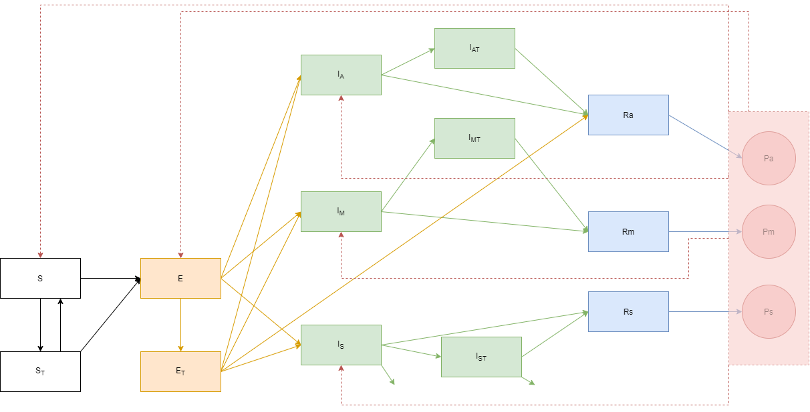

```{r setup, include=FALSE}
knitr::opts_chunk$set(echo = TRUE)
require(IDDynamicsClass)
library(deSolve)
library(truncnorm)
library(knitr)
library(kableExtra)
library(ggplot2)
library(dplyr)
library(tidyr)
library(truncnorm)
```

# Model 1. 

Assume the following compartmental model.

```{r, echo=FALSE, out.width = "70%"}

```

The $S$ compartment is susceptibles; here, we assume that it's composed of general public and a healthcare workers compartment. The healthcare workers are assumed to have a higher number of contacts than the general public. $E$ is the exposed compartment. Infectious individuals are supposed to be split between $I_A$ (infectious asymptomatic), $I_M$ (infectious with mild symptoms), and $I_S$ (infectious with severe symptoms). $R$ is the recovered compartment. Plasma can be given to the susceptible population, in which case indivudals move to $S_T$ compartment; to exposed individuals as post-exposure prophylaxis (with individuals moving from $E$ to $E_T$ compartment), and to infectious people, who would then move to either $I_{AT}$, $I_{MT}$, or $I_{ST}$ compartment, depending on the compartment of origin. Note that because only a portion of plasma is "effective" (has a level of titer that's high enough), some individuals will remain in the  untreated compartment even if they received plasma.  

We expect excess mortality due to COVID; it is assumed to only occur among severe cases ($I_S$). Excess mortality among infectious treated individuals with severe presentation is expected to be reduced.    
P represents the plasma compartments (number of units of plasma available at a given time).

## Population and Contact matrix

We assume population consisting of general public and health care workers.
We assume increased contacts for healthcare workers. 

```{r, echo=FALSE}
# initialize population; let general population = 600,000 and healthworkers = 6,000
pop = c(600000, 6000)

# get number of compartments
Ncomp = length(pop)

# set contact matrix
Winit = matrix(c(1, 0.2, 5, 3), nrow = Ncomp, ncol = Ncomp, byrow = TRUE)
W = Winit
colnames(Winit) = c("general", "healthcare")
rownames(Winit) = c("general", "healthcare")

# rescale the matrix
A = matrix(0, Ncomp, Ncomp)
for (ii in 1:Ncomp){
  for (jj in 1:Ncomp){
    A[ii, jj] = W[ii, jj]*pop[ii] / pop[jj]
  }
}
r = eigen(A)
lam = r$values
alpha = max(Re(lam))
W = W / alpha

```

We take `r pop[1]` people in the general population compartment, and `r pop[2]` healthworkers. 
The initial contact matrix is assumed to be `r Winit`. 


## Set up the SEAIR model


```{r, echo=FALSE}

### SEIR function
## inputs:
## ICs = initial conditions (individuals in each compartment)


seir_step = function(stoch.init = FALSE, ICs = InCs, sd.dw = 0.00, 
                     params = parameters, plasma = plasma_params, 
                     SIA_r = SIA_rates,
                     init.min = 10, init.max = 100 ) {
  
  N = params$N
  W = params$W
  beta = params$beta
  gamma = params$gamma
  sigma = params$sigma
  time = params$time
  delta.t = params$delta.t
  v = params$v
  mu = params$mu
  v_I = params$v_I
  
gamma_t = plasma$gamma_t
prop_ef = plasma$prop_ef
ef_est = plasma$ef_est
prop_eti = plasma$prop_eti
SIA_s = SIA_r$SIA_s
SIA_e = SIA_r$SIA_e
SIA_ia = SIA_r$SIA_ia
SIA_im = SIA_r$SIA_im
SIA_is = SIA_r$SIA_is

p0 = plasma$p0
p_s = plasma$p_s
p_e = plasma$p_e
p_ia = plasma$p_ia
p_im = plasma$p_im
p_is = plasma$p_is
p_use = plasma$p_use
rate_p = plasma$rate_p
p_give = plasma$p_give
  
  # set up matrix to store values
  x = matrix(NA, nrow = length(time), ncol = Ncomp * length(ICs))
  x[1, ]=round(ICs)

  # set initial conditions
  if(stoch.init==TRUE){
    Ninit = sample(init.min:init.max, 1)
    pinit = N / sum(N)
    Ninit_bygroup = rmultinom(1, Ninit, prob = pinit)[,1]
    Ninit_asy = Ninit_bygroup * p_asym
    Ninit_mild = Ninit_bygroup * p_mild
    Ninit_severe = Ninit_bygroup * p_severe
    ICs = c(S = N,           
          E = rep(0, Ncomp),
          A = Ninit_asy,
          Im = Ninit_mild,
          Is = Ninit_severe,
          R = rep(0, Ncomp),
          incid_I = rep(0, Ncomp),
         incid_deaths = rep(0, Ncomp),
         incid_plasma = rep(0, Ncomp))
    x[1,] <- round(ICs)
  }else{ x[1,] <- round(ICs) }
  
  S = x[, 1:Ncomp] 
  St = x[, (Ncomp+1):(2*Ncomp)]
  E = x[, (2*Ncomp+1):(3*Ncomp)] 
  Et = x[, (3*Ncomp+1):(4*Ncomp)]
  A = x[, (4*Ncomp+1):(5*Ncomp)]
  At = x[, (5*Ncomp+1):(6*Ncomp)]
  Im = x[, (6*Ncomp+1):(7*Ncomp)]
  Imt = x[, (7*Ncomp+1):(8*Ncomp)]
  Is = x[, (8*Ncomp+1):(9*Ncomp)]
  Ist = x[, (9*Ncomp+1):(10*Ncomp)]
  R =  x[, (10*Ncomp+1):(11*Ncomp)]
  
  P = matrix(NA, nrow = length(time), ncol = 1)
  P[1, 1] = p0

  # incidence
  incid_A = x[, (11*Ncomp+1):(12*Ncomp)]
  incid_Im = x[, (12*Ncomp+1):(13*Ncomp)]
  incid_Is = x[, (13*Ncomp+1):(14*Ncomp)]
  incid_deaths = x[, (14*Ncomp+1):(15*Ncomp)]
  incid_plasma = x[, (15*Ncomp+1):(16*Ncomp)]
  
  sd.dw = sd.dw
  

  for (it in 1:(length(time) - 1)) {
    WI = W %*% (A[it,]+At[it,]+Im[it, ]+Imt[it,]+Is[it,]+Ist[it,])
    births = rep(0, Ncomp)
    births[1] = mu
    deaths = rep(v, Ncomp)
    deaths_I = rep(v_I, Ncomp)
    deaths_It = rep(v_It, Ncomp)
    
    dw = rtruncnorm(Ncomp, a =0, mean = 1, sd = sd.dw)

  # transitions
  foi_prob <- 1 - exp( - beta* WI / N * dw * delta.t)
  exposed_prob <- 1 - exp( - sigma * delta.t)    
  inf_prob <- 1 - exp( - gamma * delta.t)   
  death_prob <- 1 - exp( - deaths * delta.t)
  death_prob_I <- 1 - exp( - deaths_I * delta.t)
  inf_prob_t <- 1 - exp(- gamma_t * delta.t * (1-prop_eti))
  inf_prob_et <- 1 - exp( - sigma * delta.t * prop_eti)
  death_prob_It <- 1 - exp( - deaths_It * delta.t)
  foi_prob_St <- 1 - exp( - ef_est * beta* WI / N * dw * delta.t)
  #exposed_prob_t <- 1 - exp( - sigma * delta.t * ef_est)   
 
    new_St = rep(NA, Ncomp)
      for(i in (1:Ncomp)){
        new_St[i] = ifelse(P[it] * p_use * p_s[i] + SIA_s[it, i]>S[it,i],  S[it, i] * prop_ef, P[it] * p_use * p_s[i] * prop_ef + SIA_s[it, i] * prop_ef)
      }
      p_St = ifelse(new_St == 0, 0, new_St / S[it, ])
      
      new_Et = rep(NA, Ncomp)
      for(i in (1:Ncomp)){
        new_Et[i] = ifelse(P[it] * p_use * p_e[i] + SIA_e[it, i]>E[it,i],  E[it, i] * prop_ef, P[it] * p_use * p_e[i] * prop_ef + SIA_e[it, i] * prop_ef)
      }      
      p_Et = ifelse(new_Et ==0, 0, new_Et / E[it, ])
      
      new_Iat = rep(NA, Ncomp)
      for(i in (1:Ncomp)){
        new_Iat[i] = ifelse(P[it] * p_use * p_ia[i] + SIA_ia[it, i]>A[it,i],  A[it, i] * prop_ef, P[it] * p_use * p_ia[i] * prop_ef + SIA_ia[it, i] * prop_ef)
      } 
      p_Iat = ifelse(new_Iat ==0, 0, new_Iat / A[it, ])
      
      new_Imt = rep(NA, Ncomp)
      for(i in (1:Ncomp)){
        new_Imt[i] = ifelse(P[it] * p_use * p_im[i] + SIA_im[it, i]>Im[it,i],  Im[it, i] * prop_ef, P[it] * p_use * p_im[i] * prop_ef + SIA_im[it, i] * prop_ef)
      }  
      p_Imt = ifelse(new_Imt ==0, 0, new_Imt / Im[it, ])
      
      new_Ist = rep(NA, Ncomp)
      for(i in (1:Ncomp)){
        new_Ist[i] = ifelse(P[it] * p_use * p_is[i] + SIA_is[it, i]>Is[it,i],  Is[it, i] * prop_ef, P[it] * p_use * p_is[i] * prop_ef + SIA_is[it, i] * prop_ef)
      }  
      p_Ist = ifelse(new_Ist ==0, 0, new_Ist / Is[it, ])
    
 ### transitions out of S compartment     
      new_exp = rep(NA, Ncomp)
      delta_St = rep(NA, Ncomp)
      for (i in (1:Ncomp)){
        size = S[it, i]
        delta_S = rmultinom(1, size, prob = c(p_St[i], foi_prob[i], max(0, 1-p_St[i]-foi_prob[i])))
        delta_St[i] = delta_S[1]
        new_exp[i] = delta_S[2]
      }
      #new_exp <- rbinom(n = Ncomp, size = round(S[it,]), prob = foi_prob)
      
 ### transitions out of E compartment --- can go to IA, IM, IS, or Et
      new_infA = rep(NA, Ncomp)
      new_infM = rep(NA, Ncomp)
      new_infS = rep(NA, Ncomp)
      delta_Et = rep(NA, Ncomp)
      for (i in (1:Ncomp)){
        size = E[it, i]
        d_E = rmultinom(1, size, 
                            prob = c(exposed_prob * p_asym, exposed_prob * p_mild, exposed_prob * p_severe, p_Et[i], max(0, 1-p_Et[i]-exposed_prob)))
        new_infA[i] = d_E[1]
        new_infM[i] = d_E[2]
        new_infS[i] = d_E[3]
        delta_Et[i] = d_E[4]
      }      
      #new_inf <- rbinom(n = Ncomp, size = round(E[it,]) , prob = exposed_prob)
      #new_infA = new_inf * p_asym
      #new_infM = new_inf * p_mild
      #new_infS = new_inf * p_severe
      
  #### transition out of IA  --- either recover or go to IAT
      # prob of recovery = inf_prob
      # prob of getting plasma = p_Iat
      new_recA = rep(NA, Ncomp)
      delta_Iat = rep(NA, Ncomp)
      for (i in (1:Ncomp)){
        size = A[it, i]
        delta_A = rmultinom(1, size, prob = c(inf_prob, p_Iat[i], max(0, 1-p_Iat[i]-inf_prob)))
        new_recA[i] = delta_A[1]
        delta_Iat[i] = delta_A[2]
      }
      #new_recA = rbinom(n = Ncomp, size = round(A[it,]), prob = inf_prob)
      
  ### transition out of IM ---- either recover or go to IMT
       # prob of recovery = inf_prob
      # prob of getting plasma = p_Imt
      new_recM = rep(NA, Ncomp)
      delta_Imt = rep(NA, Ncomp)
      for (i in (1:Ncomp)){
        size = Im[it, i]
        delta_Im = rmultinom(1, size, prob = c(inf_prob, p_Imt[i], max(0, 1-p_Imt[i]-inf_prob)))
        new_recM[i] = delta_Im[1]
        delta_Imt[i] = delta_Im[2]
      }     
      #new_recM = rbinom(n = Ncomp, size = round(Im[it,]), prob = inf_prob)
      
      #### transitions out of IS --- either recover, go to IST, or die from COVID
      # probability of recovery - inf_prob_t
      # probability of receiving plasma - p_Ist
      # probability of dying - death_prob_I
      new_recS = rep(NA, Ncomp)
      delta_Ist = rep(NA, Ncomp)
      new_deaths_I = rep(NA, Ncomp)
      for (i in (1:Ncomp)){
        size = Is[it, i]
        delta_Is = rmultinom(1, size, prob = c(inf_prob, p_Ist[i], death_prob_I, max(0, 1-p_Ist[i]-inf_prob-death_prob_I)))
        new_recS[i] = delta_Is[1]
        delta_Ist[i] = delta_Is[2]
        new_deaths_I[i] = delta_Is[3]
      }     
      #new_recS = rbinom(n = Ncomp, size = round(Is[it,]), prob = inf_prob)
      #new_deaths_I = rbinom(n = Ncomp, size = round(Is[it,]), prob = death_prob_I)
      
      new_expSt <- rbinom(n = Ncomp, size = round(St[it,]), prob = foi_prob_St)
      new_rec_at = rbinom(n = Ncomp, size = round(At[it, ]), prob = inf_prob_t)  
      new_rec_mt = rbinom(n = Ncomp, size = round(Imt[it, ]), prob = inf_prob_t)     
    
      #### transitions from Ist compartment - either die from covid or recover
      new_rec_st = rep(NA, Ncomp)
      new_deaths_Ist = rep(NA, Ncomp)
      for (i in (1:Ncomp)){
        size = Ist[it, i]
        delta_Is = rmultinom(1, size, prob = c(inf_prob_t, death_prob_It, max(0, 1-death_prob_It-inf_prob)))
        new_rec_st[i] = delta_Is[1]
        new_deaths_Ist[i] = delta_Is[2]
      }     
      #new_rec_st = rbinom(n = Ncomp, size = round(Ist[it, ]), prob = inf_prob_t)      
      #new_deaths_Ist = rbinom(n = Ncomp, size = round(Ist[it,]), prob = death_prob_It)
      
      
      #### transitions from Et - could go to R, or Ia, Im, Is
      # prob of moving to recovered - inf_prob_t
      # prob of moving to Ia - inf_prob_et * p_asym
      # prob of moving to Im - inf_prob_et * p_mild
      # prob of moving to Is - inf_prob_et * p_severe
      new_rec_Et = rep(NA, Ncomp)
      new_A_Et = rep(NA, Ncomp)
      new_M_Et = rep(NA, Ncomp)
      new_S_Et = rep(NA, Ncomp)
      for (i in (1:Ncomp)){
        size = Et[it, i]
        d_Et = rmultinom(1, size, prob = c(inf_prob_t, inf_prob_et * p_asym, inf_prob_et * p_mild, inf_prob_et * p_severe, max(0, 1-inf_prob_et-inf_prob_t)))
        new_rec_Et[i] = d_Et[1]
        new_A_Et[i] = d_Et[2]
        new_M_Et[i] = d_Et[3]
        new_S_Et[i] = d_Et[4]
      }     
      #new_rec_Et = rbinom(n = Ncomp, size = round(Et[it, ]), prob = inf_prob_t)
      #new_inf_Et = rbinom(n = Ncomp, size = round(Et[it,]) , prob = inf_prob_et)
      #new_A_Et = new_inf_Et * p_asym
      #new_M_Et = new_inf_Et * p_mild
      #new_S_Et = new_inf_Et * p_severe
      
  ### don't worry about natural deaths for now - will have to integrate them into multinomial draws
      S[it+1, ]= S[it,] - delta_St - new_exp 
      St[it+1, ]=St[it,] + delta_St - new_expSt  
      E[it+1, ] = E[it,] + new_exp + new_expSt - (new_infA + new_infM + new_infS) - delta_Et
      Et[it+1, ] = Et[it, ]+ delta_Et - new_rec_Et - (new_A_Et + new_M_Et + new_S_Et)
      A[it+1, ] = A[it,] + new_infA - new_recA - delta_Iat + new_A_Et 
      At[it+1, ] = At[it, ] + delta_Iat - new_rec_at 
      Im[it+1, ] = Im[it,] + new_infM - new_recM - delta_Imt + new_M_Et 
      Imt[it+1, ] = Imt[it, ] + delta_Imt - new_rec_mt 
      Is[it+1, ] = Is[it,] + new_infS - new_recS - delta_Ist + new_S_Et - new_deaths_I
      Ist[it+1, ] = Ist[it, ] + delta_Ist - new_rec_st  - new_deaths_Ist
      R[it+1, ] = R[it, ]+ new_recA + new_recM + new_recS + new_rec_at + new_rec_mt + new_rec_st + new_rec_Et
      P[it+1, ] = P[it, ] - sum(delta_St + delta_Et + delta_Iat + delta_Imt + delta_Ist) / prop_ef + sum(R[it, ]) * p_give * rate_p
      

      incid_A[it, ] = new_infA + new_A_Et
      incid_Im[it, ] = new_infM + new_M_Et
      incid_Is[it, ] = new_infS + new_S_Et
      incid_deaths[it, ] = new_deaths_I + new_deaths_Ist
      incid_plasma[it, ] = (new_St + new_Et + new_Iat + new_Imt + new_Ist) / prop_ef
      
      ## if any compartments are negative, set them equal to 0
      # S[it+1, ][S[it+1, ]<0]<-0
      # St[it+1, ][St[it+1, ]<0]<-0
      # E[it+1, ][E[it+1, ]<0]<-0
      # Et[it+1, ][Et[it+1, ]<0]<-0
      # A[it+1, ][A[it+1, ]<0]<-0
      # At[it+1, ][At[it+1, ]<0]<-0
      # Im[it+1, ][Im[it+1, ]<0]<-0
      # Imt[it+1, ][Imt[it+1, ]<0]<-0    
      # Is[it+1, ][Is[it+1, ]<0]<-0
      # Ist[it+1, ][Ist[it+1, ]<0]<-0      
      # R[it+1, ][R[it+1, ]<0]<-0
}
  
  out = data.frame(cbind(time, S, St, E, Et, A, At, Im, Imt, Is, Ist, R, incid_A, incid_Im, incid_Is, incid_deaths, incid_plasma, P))
  names(out) = c("time", names(ICs), "plasma_units")
  return(out)
}
```

Initial conditions and assumptions are as follows:
  

-Everybody in the population is susceptible    
-100 people infected in general population; 0 in healthcare workers (this is editable in the function if stochasticity in initial seeding of infectious people is desirable)  
-R0 = 2.5  
-$\gamma$ = recovery rate = 1 / (6.5days)  
-$\sigma$ = 1 / (5.2 days)  
-natural death rate = 0   
-birth rate = 0  
-mortality rate from infection = 0.1 / (3*7), where 3 weeks = median number of days from symptoms to death; case fatality rate is 10%

  
For plasma, we assume
-proportion of plasma that's functional (with high enough titer) is 70%  
-Among those susceptibles that receive functional plasma, transmission coefficient is reduced by 50%  
-$\gamma_t$ = 1 / 4 (duration of time to recovery is reduced from 6.5 days to 4 days)    
-mortality rate from infection for treated individuals is  = 0.05 / (3*7) (half of mortality for untreated people)    
-proportion of exposed individuals treated with effective plasma that move on to infected compartment is $prop_{ETI}$ = 0.1  
  


We set the following parameters:  
-p0 = number of units of plasma available at day 1 (default, 2000)
-$p_{use}$ = proportion of plasma available to be used (default, 0.8)
-$p_s$ = proportion of plasma allocated to be administered to susceptible individuals  
-$p_e$ = proportion of plasma allocated to be administered to exposed individuals  
-$p_ia$ = proportion of plasma allocated to be administered to infected individuals (asymptomatic)  
-$p_im$ = proportion of plasma allocated to be administered to infected individuals (mild)  
-$p_is$ = proportion of plasma allocated to be administered to infected individuals (severe)  
-$rate_p$ = rate at which plasma is donated; assumed to be 3.5 units / 14 days (assuming each person that donates gives 3.5 units)  
-$p_{give}$ = proportion of recovered individuals that give plasma (default: 0.1)

We assume that all individuals in exposed compartment will move to either asymptomatic (20%), mild (60%), or severe (20%) compartments. We assume that there is no excess death from COVID-19 in either asymptomatic or mild individuals. We assume rates of recovery to be the same from the three compartments.  

We seed 2 asymptomatic infectious individual, 2 mild infectious individuals, and 1 severe infectious individuals. 


## Scenarios

Scenario 1: no plasma is administered


<!-- ## Multiple simulations -->

```{r, echo=FALSE}


multiple_runs <- function(IC = InCs, Ncomp2 = Ncomp, plasma_p = plasma_params, paramt = parameters, SIA_r = SIA_rates, nsims = 100){
  

  all_sim <- matrix(NA,1,(length(IC))+2+1) 
  
  
  colnames(all_sim) <- c('run_index', 'time',                         
                         names(IC), 'plasma_units') 
  for(n in 1:nsims){    
    ## run the simulation one time    
  
  single.sim =seir_step(stoch.init = FALSE, ICs = IC, sd.dw = 0.00, 
                     params = paramt, plasma = plasma_p,
                     SIA_r = SIA_r,
                     init.min = 10, init.max = 100 ) 

    #add on a value for the run_index (simulation number)    
    run_index = rep(n, nrow(single.sim))    
    single.sim <- cbind(run_index, single.sim)    
    all_sim <- rbind(all_sim, single.sim)  
  }
  
  
  all_sim <- all_sim[-1,]
  
  # create cumulative vars
  
  xx <- all_sim %>% select(starts_with("incid_A")) %>% rowSums()
  all_sim = cbind(all_sim, incid_A=xx)
  
    xx <- all_sim %>% select(starts_with("incid_Im")) %>% rowSums()
  all_sim = cbind(all_sim, incid_Im=xx)
  
    xx <- all_sim %>% select(starts_with("incid_Is")) %>% rowSums()
  all_sim = cbind(all_sim, incid_Is=xx)
  
  xx <- all_sim %>% select(starts_with("incid_deaths")) %>% rowSums()
  all_sim = cbind(all_sim, incid_deaths=xx)
  
  all_sim <- all_sim %>% 
    arrange(run_index, time) %>%
    group_by(run_index) %>%
    mutate(cum_infA = cumsum(incid_A),
           cum_infM = cumsum(incid_Im),
           cum_infS = cumsum(incid_Is),
           incid_I = incid_A + incid_Im + incid_Is,
           cum_inf = cum_infA + cum_infM + cum_infS,
           cum_deaths = cumsum(incid_deaths)
    ) %>%
    ungroup()

  return(all_sim)
}


```

<!-- ## First, run simulations for no plasma treatments -->
```{r, echo=FALSE}
# run with no plasma treatment

InCs <- c(S = pop, 
         St = rep(0, Ncomp),
          E = rep(0, Ncomp),
         Et = rep(0, Ncomp),
          A = c(2, 0),
         At = rep(0, Ncomp),
         Im = c(2, 0),
         Imt = rep(0, Ncomp),
         Is = c(1, 0),
         Ist = rep(0, Ncomp),
          R = rep(0, Ncomp),
          incid_A = rep(0, Ncomp),
         incid_Im = rep(0, Ncomp),
         incid_Is = rep(0, Ncomp),
         incid_deaths = rep(0, Ncomp),
         incid_plasma = rep(0, Ncomp))

N = pop
R0 = 2.5
gamma = 1 / 6.5
sigma = 1 / 5.2
time_max = 200
delta.t = 1
time = seq(0, time_max, delta.t)
v = 0  ### death rate
mu = 0 ### birth rate
v_I = 0.1 / (3* 7) ### mortality from infection; median time to death is assumed to be 3 weeks (from WHO CHINA joint mission report)
p_asym = 0.2 # proportion asymptomatic
p_mild = 0.6 # proportion mild
p_severe = 0.2 # proportion severe

#plasma parameters --- first, set all the treatment rates to 0
#r_st = c(0, 0)
#ef_st = 0.7
#r_et = c(0, 0)
#ef_et = 0.7
#r_it = 0
#ef_it = 0.7
gamma_t = 1 / 4
v_It = 0.05 / (3*7)
ef_est = 0.5
prop_ef = 0.7
prop_eti = 0.1

p0 = 2000   # number of units of plasma available at day 1
p_s = c(0, 0)     # proportion of plasma used allocated to susceptible 
p_e = c(0, 0)     # proportion of plasma used allocated to exposed
p_ia = c(0, 0)    # proportion of plasma used allocated for treatment of infected asymptomatic
p_im = c(0, 0)  # proportion of plasma used allocated for treatment of infected mild
p_is = c(0, 0) # proportion of plasma used allocated for treatment of infected severe
p_use = 0   # proportion of available plasma that's used 
rate_p = 3.5 / 14 # rate at which recovered give units of blood; assume each person gives 3.5 units; 14 days after recovery
p_give = 0.1 # proportion of recovered people that donate plasma


parameters <- list(N=N, W=W, beta = R0 * gamma, gamma=gamma, sigma=sigma, time=time, delta.t=delta.t, v = v, mu = mu, v_I = v_I, p_asym = p_asym, p_mild = p_mild, p_severe = p_severe)

plasma_params <- list(#r_st = r_st, 
                      #ef_st = ef_st, 
                      #r_et = r_et, #ef_et = ef_et, 
                      #r_it = r_it, #ef_it = ef_it, 
                      gamma_t = gamma_t, v_It = v_It,
                      ef_est = ef_est, prop_ef = prop_ef, 
                      prop_eti = prop_eti,
                      p0 = p0, p_s = p_s, p_e = p_e, 
                      p_ia = p_ia, p_im = p_im, p_is = p_is,
                      p_use = p_use, rate_p = rate_p, p_give = p_give)


# set up a mass campaign
# initialize a time vector

t_SIA_s = 1   # time when SIA for susceptibles is administered
val_SIA_s = c(0, 0) # number of people that are vaccinated during the campaign
blank = matrix(0, nrow=length(time), ncol = Ncomp)
SIA_s = blank
SIA_s[t_SIA_s, ] = val_SIA_s

t_SIA_e = 1
val_SIA_e = c(0, 0)
SIA_e = blank
SIA_e[t_SIA_e, ] = val_SIA_e

t_SIA_ia = 1
val_SIA_ia = c(0, 0)
SIA_ia = blank
SIA_ia[t_SIA_ia, ] = val_SIA_ia

t_SIA_im = 1
val_SIA_im = c(0, 0)
SIA_im = blank
SIA_im[t_SIA_im, ] = val_SIA_im

t_SIA_is = 1
val_SIA_is = c(0, 0)
SIA_is = blank
SIA_is[t_SIA_is, ] = val_SIA_is


SIA_rates <- list(SIA_s = SIA_s, SIA_e = SIA_e, SIA_ia = SIA_ia, SIA_im = SIA_im, SIA_is = SIA_is)


num_sims = 100
all_sim_run1 = suppressWarnings(multiple_runs(nsims = num_sims))
```


```{r, include=FALSE, fig.width=9}
# Plot new infections and deaths 
summ_days_run1 = all_sim_run1 %>% drop_na() %>% group_by(time) %>%
summarise(mean_inf = mean(incid_I, na.rm=TRUE),
ll_inf= quantile(incid_I, prob=c(.025), na.rm=TRUE),
ul_inf = quantile(incid_I, prob=c(.975), na.rm = TRUE),
mean_deaths = mean(incid_deaths, na.rm=TRUE),
ll_deaths = quantile(incid_deaths, prob = c(.025), na.rm=TRUE),
ul_deaths = quantile(incid_deaths, prob = c(.975), na.rm=TRUE)
)

colors = c("New infections" = "blue")
new_inf_plot<-ggplot(data=summ_days_run1, aes(x=time)) +
geom_line(aes(y = mean_inf, color = "New infections")) +
geom_ribbon(aes(ymin=ll_inf, ymax=ul_inf), fill="blue", linetype=2, alpha=0.1) +
ggtitle("New infections") +   theme_classic() +
scale_color_manual(values = colors)+
labs(y = "Daily cases", x = "Day", color="Legend")
#new_inf_plot


colors = c("New deaths" = "blue")
new_deaths_plot<-ggplot(data=summ_days_run1, aes(x=time)) +
geom_line(aes(y = mean_deaths, color = "New deaths")) +
geom_ribbon(aes(ymin=ll_deaths, ymax=ul_deaths), fill="blue", linetype=2, alpha=0.1) +
ggtitle("New deaths") +   theme_classic() +
scale_color_manual(values = colors)+
labs(y = "Daily cases", x = "Day", color="Legend")
#new_deaths_plot

gridExtra::grid.arrange(new_inf_plot, new_deaths_plot, nrow = 1)
```


<!-- # Look at final size, severe infections, and deaths from `r num_sims` simulations --> 

```{r, include=FALSE}
summ_ <- all_sim_run1 %>% group_by(run_index) %>% 
  summarise(final_size = max(cum_inf, na.rm=TRUE),
            final_deaths = max(cum_deaths, na.rm=TRUE),
            final_plasma = max(cumsum(incid_plasma1)+cumsum(incid_plasma2), na.rm=TRUE))

final_size_all <- summ_ %>%
  summarise(mean = mean(final_size, na.rm=TRUE),
            median = median(final_size, na.rm=TRUE),
            ll = quantile(final_size, prob=c(.025)),
            ul = quantile(final_size, prob=c(.975)))

final_deaths_all <- summ_ %>%
  summarise(mean = mean(final_deaths, na.rm=TRUE),
            median = median(final_deaths, na.rm=TRUE),
            ll = quantile(final_deaths, prob=c(.025)),
            ul = quantile(final_deaths, prob=c(.975)))

final_plasma_all <- summ_ %>%
  summarise(mean = mean(final_plasma, na.rm=TRUE),
            median = median(final_plasma, na.rm=TRUE),
            ll = quantile(final_plasma, prob=c(.025)),
            ul = quantile(final_plasma, prob=c(.975)))

# make a table
table = data.frame(t(round(final_size_all)), t(round(final_deaths_all)))
rownames(table) = c("Mean", "Median", "lower 95% CI limit", "upper 95% CI limit")
colnames(table) = c("Final infection size", "Final deaths from COVID")
table %>% kable() %>% kable_styling(c("basic", "scale_down"))

```


Scenario 2 - assume we are only treating individuals in I; (100% of available plasma goes to severe infectious people - 0.9 to general pop, 0.1 to healthcare workers)
```{r, echo=FALSE}
#plasma parameters --- update proportion of plasma only


p0 = 2000   # number of units of plasma available at day 1
p_s = c(0, 0)     # proportion of plasma used allocated to susceptible 
p_e = c(0, 0)     # proportion of plasma used allocated to exposed
p_ia = c(0, 0)   # proportion of plasma used allocated for treatment of infected asymptomatic
p_im = c(0, 0)   # proportion of plasma used allocated for treatment of infected mild
p_is = c(0.9, 0.1) # proportion of plasma used allocated for treatment of infected severe
p_use = 0.8   # proportion of available plasma that's used 
rate_p = 3.5 / 14 # rate at which recovered give units of blood; assume each person gives 3.5 units; 14 days after recovery
p_give = 0.1 # proportion of recovered people that donate plasma


plasma_params <- list(#r_st = r_st, 
                      #ef_st = ef_st, 
                      #r_et = r_et, #ef_et = ef_et, 
                      #r_it = r_it, #ef_it = ef_it, 
                      gamma_t = gamma_t, v_It = v_It,
                      ef_est = ef_est, prop_ef = prop_ef, 
                      prop_eti = prop_eti,
                      p0 = p0, p_s = p_s, p_e = p_e, 
                      p_ia = p_ia, p_im = p_im, p_is = p_is,
                      p_use = p_use, rate_p = rate_p, p_give = p_give)

all_sim_run2 = suppressWarnings(multiple_runs(nsims = num_sims, plasma_p = plasma_params))

```

```{r, include=FALSE, fig.width=9}
# Plot new infections and deaths 
summ_days_run2 = all_sim_run2 %>% drop_na() %>% group_by(time) %>%
summarise(mean_inf = mean(incid_I, na.rm=TRUE),
ll_inf= quantile(incid_I, prob=c(.025)),
ul_inf = quantile(incid_I, prob=c(.975)),
mean_deaths = mean(incid_deaths, na.rm=TRUE),
ll_deaths = quantile(incid_deaths, prob = c(.025)),
ul_deaths = quantile(incid_deaths, prob = c(.975))
)

colors = c("New infections" = "blue")
new_inf_plot2<-ggplot(data=summ_days_run2, aes(x=time)) +
geom_line(aes(y = mean_inf, color = "New infections")) +
geom_ribbon(aes(ymin=ll_inf, ymax=ul_inf), fill="blue", linetype=2, alpha=0.1) +
ggtitle("New infections") +   theme_classic() +
scale_color_manual(values = colors)+
labs(y = "Daily cases", x = "Day", color="Legend")
#new_inf_plot2


colors = c("New deaths" = "blue")
new_deaths_plot2<-ggplot(data=summ_days_run2, aes(x=time)) +
geom_line(aes(y = mean_deaths, color = "New deaths")) +
geom_ribbon(aes(ymin=ll_deaths, ymax=ul_deaths), fill="blue", linetype=2, alpha=0.1) +
ggtitle("New deaths") +   theme_classic() +
scale_color_manual(values = colors)+
labs(y = "Daily cases", x = "Day", color="Legend")
#new_deaths_plot2

gridExtra::grid.arrange(new_inf_plot2, new_deaths_plot2, nrow = 1)
```

```{r, echo=FALSE}
summ_2 <- all_sim_run2 %>% group_by(run_index) %>% 
  summarise(final_size = max(cum_inf, na.rm=TRUE),
            final_deaths = max(cum_deaths, na.rm=TRUE),
            final_plasma = max(cumsum(incid_plasma1)+cumsum(incid_plasma2), na.rm=TRUE))

final_size_all_2 <- summ_2 %>%
  summarise(mean = mean(final_size, na.rm=TRUE),
            median = median(final_size, na.rm=TRUE),
            ll = quantile(final_size, prob=c(.025)),
            ul = quantile(final_size, prob=c(.975)))

final_deaths_all_2 <- summ_2 %>%
  summarise(mean = mean(final_deaths, na.rm=TRUE),
            median = median(final_deaths, na.rm=TRUE),
            ll = quantile(final_deaths, prob=c(.025)),
            ul = quantile(final_deaths, prob=c(.975)))

final_plasma_all_2 <- summ_2 %>%
  summarise(mean = mean(final_plasma, na.rm=TRUE),
            median = median(final_plasma, na.rm=TRUE),
            ll = quantile(final_plasma, prob=c(.025)),
            ul = quantile(final_plasma, prob=c(.975)))

```

Scenario 3 - assume we are only giving plasma only to healthworkers (in susceptible compartment) 


```{r, echo=FALSE}
#plasma parameters --- update S only


p0 = 2000   # number of units of plasma available at day 1
p_s = c(0, 0.2)     # proportion of plasma used allocated to susceptible 
p_e = c(0, 0)     # proportion of plasma used allocated to exposed
p_ia = c(0, 0) *p_asym  # proportion of plasma used allocated for treatment of infected asymptomatic
p_im = c(0, 0) * p_mild  # proportion of plasma used allocated for treatment of infected mild
p_is = c(0, 0) * p_severe # proportion of plasma used allocated for treatment of infected severe
p_use = 0.8   # proportion of available plasma that's used 
rate_p = 3.5 / 14 # rate at which recovered give units of blood; assume each person gives 3.5 units; 14 days after recovery
p_give = 0.1 # proportion of recovered people that donate plasma


plasma_params <- list(#r_st = r_st, 
                      #ef_st = ef_st, 
                      #r_et = r_et, #ef_et = ef_et, 
                      #r_it = r_it, #ef_it = ef_it, 
                      gamma_t = gamma_t, v_It = v_It,
                      ef_est = ef_est, prop_ef = prop_ef, 
                      prop_eti = prop_eti,
                      p0 = p0, p_s = p_s, p_e = p_e, 
                      p_ia = p_ia, p_im = p_im, p_is = p_is,
                      p_use = p_use, rate_p = rate_p, p_give = p_give)


all_sim_run3 = suppressWarnings(multiple_runs(nsims = num_sims, plasma_p = plasma_params, paramt = parameters))

```

```{r, include=FALSE, fig.width=9}
# Plot new infections and deaths 
summ_days_run3 = all_sim_run3 %>% drop_na() %>% group_by(time) %>%
summarise(mean_inf = mean(incid_I, na.rm=TRUE),
ll_inf= quantile(incid_I, prob=c(.025)),
ul_inf = quantile(incid_I, prob=c(.975)),
mean_deaths = mean(incid_deaths, na.rm=TRUE),
ll_deaths = quantile(incid_deaths, prob = c(.025)),
ul_deaths = quantile(incid_deaths, prob = c(.975))
)

colors = c("New infections" = "blue")
new_inf_plot3<-ggplot(data=summ_days_run3, aes(x=time)) +
geom_line(aes(y = mean_inf, color = "New infections")) +
geom_ribbon(aes(ymin=ll_inf, ymax=ul_inf), fill="blue", linetype=2, alpha=0.1) +
ggtitle("New infections") +   theme_classic() +
scale_color_manual(values = colors)+
labs(y = "Daily cases", x = "Day", color="Legend")
#new_inf_plot2


colors = c("New deaths" = "blue")
new_deaths_plot3<-ggplot(data=summ_days_run3, aes(x=time)) +
geom_line(aes(y = mean_deaths, color = "New deaths")) +
geom_ribbon(aes(ymin=ll_deaths, ymax=ul_deaths), fill="blue", linetype=2, alpha=0.1) +
ggtitle("New deaths") +   theme_classic() +
scale_color_manual(values = colors)+
labs(y = "Daily cases", x = "Day", color="Legend")
#new_deaths_plot2

gridExtra::grid.arrange(new_inf_plot3, new_deaths_plot3, nrow = 1)
```

```{r, echo=FALSE}
summ_3 <- all_sim_run3 %>% group_by(run_index) %>% 
  summarise(final_size = max(cum_inf, na.rm=TRUE),
            final_deaths = max(cum_deaths, na.rm=TRUE),
            final_plasma = max(cumsum(incid_plasma1)+cumsum(incid_plasma2), na.rm=TRUE))


final_size_all_3 <- summ_3 %>%
  summarise(mean = mean(final_size, na.rm=TRUE),
            median = median(final_size, na.rm=TRUE),
            ll = quantile(final_size, prob=c(.025)),
            ul = quantile(final_size, prob=c(.975)))

final_deaths_all_3 <- summ_3 %>%
  summarise(mean = mean(final_deaths, na.rm=TRUE),
            median = median(final_deaths, na.rm=TRUE),
            ll = quantile(final_deaths, prob=c(.025)),
            ul = quantile(final_deaths, prob=c(.975)))

final_plasma_all_3 <- summ_3 %>%
  summarise(mean = mean(final_plasma, na.rm=TRUE),
            median = median(final_plasma, na.rm=TRUE),
            ll = quantile(final_plasma, prob=c(.025)),
            ul = quantile(final_plasma, prob=c(.975)))

```


```{r, echo=FALSE}
# make a combined table
table = data.frame(t(round(final_size_all)), t(round(final_deaths_all)), t(round(final_plasma_all)), 
                   t(round(final_size_all_2)), t(round(final_deaths_all_2)), t(round(final_plasma_all_2)),
                   t(round(final_size_all_3)), t(round(final_deaths_all_3)), t(round(final_plasma_all_3)))
rownames(table) = c("Mean", "Median", "lower 95% CI limit", "upper 95% CI limit")
colnames(table) = c("Final infection size", "Final deaths from COVID", "Number receiving plasma",
                    "Final infection size", "Final deaths from COVID", "Number receiving plasma",
                    "Final infection size", "Final deaths from COVID", "Number receiving plasma")
table %>% kable() %>% kable_styling(c("basic", "scale_down")) %>%
  add_header_above(c(" " = 1, "Scenario 1" = 3, "Scenario 2" = 3, "Scenario 3" = 3)) %>%
  footnote(general = "Scenario 1 = no plasma intervention; \n 
           Scenario 2 = plasma treatment to infectious compartment only; \n
           Scenario 3 = plasma treatment to susceptible health workers only")

```


```{r, echo=FALSE, fig.width = 9}
# combine the scenarios on a plot

colors = c("Scenario 1" = "blue",
           "Scenario 2" = "red", 
           "Scenario 3" = "green")
new_inf_plot_combo<-ggplot(data = NULL, aes(x=time)) + 
geom_line(data = summ_days_run1, aes(y = mean_inf, color = "Scenario 1")) +
geom_ribbon(data = summ_days_run1, aes(ymin=ll_inf, ymax=ul_inf), fill="blue", linetype=2, alpha=0.1) +
  geom_line(data = summ_days_run2, aes(y = mean_inf, color = "Scenario 2")) +
geom_ribbon(data = summ_days_run2, aes(ymin=ll_inf, ymax=ul_inf), fill="red", linetype=2, alpha=0.1) +
    geom_line(data = summ_days_run3, aes(y = mean_inf, color = "Scenario 3")) +
geom_ribbon(data = summ_days_run3, aes(ymin=ll_inf, ymax=ul_inf), fill="green", linetype=2, alpha=0.1) +
ggtitle("New infections") +   theme_classic() +
scale_color_manual(values = colors)+
labs(y = "Daily cases", x = "Day", color="Legend")
#new_inf_plot_combo


new_deaths_plot_combo<-ggplot(data=NULL, aes(x=time)) +
geom_line(data = summ_days_run1, aes(y = mean_deaths, color = "Scenario 1")) +
geom_ribbon(data = summ_days_run1, aes(ymin=ll_deaths, ymax=ul_deaths), fill="blue", linetype=2, alpha=0.1) +
geom_line(data = summ_days_run2, aes(y = mean_deaths, color = "Scenario 2")) +
geom_ribbon(data = summ_days_run2, aes(ymin=ll_deaths, ymax=ul_deaths), fill="red", linetype=2, alpha=0.1) + 
geom_line(data = summ_days_run3, aes(y = mean_deaths, color = "Scenario 3")) +
geom_ribbon(data = summ_days_run3, aes(ymin=ll_deaths, ymax=ul_deaths), fill="green", linetype=2, alpha=0.1) +
ggtitle("New deaths") +   theme_classic() +
scale_color_manual(values = colors)+
labs(y = "Daily cases", x = "Day", color="Legend")

gridExtra::grid.arrange(new_inf_plot_combo, new_deaths_plot_combo, nrow = 1)

```

```{r, echo=FALSE, fig.width = 9}
# combine the scenarios on a plot

colors = c("Scenario 1" = "blue",
           "Scenario 2" = "red", 
           "Scenario 3" = "green")
new_inf_plot_combo123<-ggplot(data = NULL, aes(x=time)) + 
geom_line(data = summ_days_run1, aes(y = mean_inf, color = "Scenario 1")) +
geom_ribbon(data = summ_days_run1, aes(ymin=ll_inf, ymax=ul_inf), fill="blue", linetype=2, alpha=0.1) +
  geom_line(data = summ_days_run2, aes(y = mean_inf, color = "Scenario 2")) +
geom_ribbon(data = summ_days_run2, aes(ymin=ll_inf, ymax=ul_inf), fill="red", linetype=2, alpha=0.1) +
    geom_line(data = summ_days_run3, aes(y = mean_inf, color = "Scenario 3")) +
geom_ribbon(data = summ_days_run3, aes(ymin=ll_inf, ymax=ul_inf), fill="green", linetype=2, alpha=0.1) +
ggtitle("New infections") +   theme_classic() +
scale_color_manual(values = colors)+
labs(y = "Daily cases", x = "Day", color="Legend")
#new_inf_plot_combo


new_deaths_plot_combo123<-ggplot(data=NULL, aes(x=time)) +
geom_line(data = summ_days_run1, aes(y = mean_deaths, color = "Scenario 1")) +
geom_ribbon(data = summ_days_run1, aes(ymin=ll_deaths, ymax=ul_deaths), fill="blue", linetype=2, alpha=0.1) +
geom_line(data = summ_days_run2, aes(y = mean_deaths, color = "Scenario 2")) +
geom_ribbon(data = summ_days_run2, aes(ymin=ll_deaths, ymax=ul_deaths), fill="red", linetype=2, alpha=0.1) + 
geom_line(data = summ_days_run3, aes(y = mean_deaths, color = "Scenario 3")) +
geom_ribbon(data = summ_days_run3, aes(ymin=ll_deaths, ymax=ul_deaths), fill="green", linetype=2, alpha=0.1) +
ggtitle("New deaths") +   theme_classic() +
scale_color_manual(values = colors)+
labs(y = "Daily cases", x = "Day", color="Legend")


gridExtra::grid.arrange(new_inf_plot_combo123, new_deaths_plot_combo123,
                        nrow = 2)

```
<!--
Scenario 4 - assume we are only giving plasma to exposed healthworkers


```{r, echo=FALSE}
#plasma parameters --- update E only


p0 = 2000   # number of units of plasma available at day 1
p_s = c(0, 0)     # proportion of plasma used allocated to susceptible 
p_e = c(0, 1.0)     # proportion of plasma used allocated to exposed
p_ia = c(0, 0) *p_asym  # proportion of plasma used allocated for treatment of infected asymptomatic
p_im = c(0, 0) * p_mild  # proportion of plasma used allocated for treatment of infected mild
p_is = c(0, 0) * p_severe # proportion of plasma used allocated for treatment of infected severe
p_use = 0.8   # proportion of available plasma that's used 
rate_p = 3.5 / 14 # rate at which recovered give units of blood; assume each person gives 3.5 units; 14 days after recovery
p_give = 0.1 # proportion of recovered people that donate plasma


plasma_params <- list(#r_st = r_st, 
                      #ef_st = ef_st, 
                      #r_et = r_et, #ef_et = ef_et, 
                      #r_it = r_it, #ef_it = ef_it, 
                      gamma_t = gamma_t, v_It = v_It,
                      ef_est = ef_est, prop_ef = prop_ef, 
                      prop_eti = prop_eti,
                      p0 = p0, p_s = p_s, p_e = p_e, 
                      p_ia = p_ia, p_im = p_im, p_is = p_is,
                      p_use = p_use, rate_p = rate_p, p_give = p_give)


all_sim_run4 = suppressWarnings(multiple_runs(nsims = num_sims, plasma_p = plasma_params))

```

```{r, include=FALSE, fig.width=9}
# Plot new infections and deaths 
summ_days_run4 = all_sim_run4 %>% drop_na() %>% group_by(time) %>%
summarise(mean_inf = mean(incid_I, na.rm=TRUE),
ll_inf= quantile(incid_I, prob=c(.025)),
ul_inf = quantile(incid_I, prob=c(.975)),
mean_deaths = mean(incid_deaths, na.rm=TRUE),
ll_deaths = quantile(incid_deaths, prob = c(.025)),
ul_deaths = quantile(incid_deaths, prob = c(.975))
)

colors = c("New infections" = "blue")
new_inf_plot4<-ggplot(data=summ_days_run4, aes(x=time)) +
geom_line(aes(y = mean_inf, color = "New infections")) +
geom_ribbon(aes(ymin=ll_inf, ymax=ul_inf), fill="blue", linetype=2, alpha=0.1) +
ggtitle("New infections") +   theme_classic() +
scale_color_manual(values = colors)+
labs(y = "Daily cases", x = "Day", color="Legend")
#new_inf_plot2


colors = c("New deaths" = "blue")
new_deaths_plot4<-ggplot(data=summ_days_run4, aes(x=time)) +
geom_line(aes(y = mean_deaths, color = "New deaths")) +
geom_ribbon(aes(ymin=ll_deaths, ymax=ul_deaths), fill="blue", linetype=2, alpha=0.1) +
ggtitle("New deaths") +   theme_classic() +
scale_color_manual(values = colors)+
labs(y = "Daily cases", x = "Day", color="Legend")
#new_deaths_plot2

gridExtra::grid.arrange(new_inf_plot4, new_deaths_plot4, nrow = 1)
```

```{r, echo=FALSE}
summ_4 <- all_sim_run4 %>% group_by(run_index) %>% 
  summarise(final_size = max(cum_inf, na.rm=TRUE),
            final_deaths = max(cum_deaths, na.rm=TRUE),
            final_plasma = max(cumsum(incid_plasma1)+cumsum(incid_plasma2), na.rm=TRUE))


final_size_all_4 <- summ_4 %>%
  summarise(mean = mean(final_size, na.rm=TRUE),
            median = median(final_size, na.rm=TRUE),
            ll = quantile(final_size, prob=c(.025)),
            ul = quantile(final_size, prob=c(.975)))

final_deaths_all_4 <- summ_4 %>%
  summarise(mean = mean(final_deaths, na.rm=TRUE),
            median = median(final_deaths, na.rm=TRUE),
            ll = quantile(final_deaths, prob=c(.025)),
            ul = quantile(final_deaths, prob=c(.975)))

final_plasma_all_4 <- summ_4 %>%
  summarise(mean = mean(final_plasma, na.rm=TRUE),
            median = median(final_plasma, na.rm=TRUE),
            ll = quantile(final_plasma, prob=c(.025)),
            ul = quantile(final_plasma, prob=c(.975)))

```


```{r, include=FALSE}
# make a combined table
table = data.frame(t(round(final_size_all)), t(round(final_deaths_all)), t(round(final_plasma_all)), 
                   t(round(final_size_all_2)), t(round(final_deaths_all_2)), t(round(final_plasma_all_2)),
                   t(round(final_size_all_3)), t(round(final_deaths_all_3)), t(round(final_plasma_all_3)),
                   t(round(final_size_all_4)), t(round(final_deaths_all_4)), t(round(final_plasma_all_4)))
rownames(table) = c("Mean", "Median", "lower 95% CI limit", "upper 95% CI limit")
colnames(table) = c("Final infection size", "Final deaths from COVID", "Number receiving plasma",
                    "Final infection size", "Final deaths from COVID", "Number receiving plasma",
                    "Final infection size", "Final deaths from COVID", "Number receiving plasma",
                    "Final infection size", "Final deaths from COVID", "Number receiving plasma")
table %>% kable() %>% kable_styling(c("basic", "scale_down")) %>%
  add_header_above(c(" " = 1, "Scenario 1" = 3, "Scenario 2" = 3, "Scenario 3" = 3, "Scenario 4" = 3)) %>%
  footnote(general = "Scenario 1 = no plasma intervention;
           Scenario 2 = plasma treatment to infectious compartment only;
           Scenario 3 = plasma treatment to susceptible health workers only (constant rate);   
           Scenario 4 = plasma treatment to exposed health workers only")

```

```{r, include=FALSE, fig.width = 9}
# combine the scenarios on a plot

colors = c("Scenario 1" = "blue",
           "Scenario 2" = "red", 
           "Scenario 3" = "green",
           "Scenario 4" = "purple")
new_inf_plot_combo<-ggplot(data = NULL, aes(x=time)) + 
geom_line(data = summ_days_run1, aes(y = mean_inf, color = "Scenario 1")) +
geom_ribbon(data = summ_days_run1, aes(ymin=ll_inf, ymax=ul_inf), fill="blue", linetype=2, alpha=0.1) +
  geom_line(data = summ_days_run2, aes(y = mean_inf, color = "Scenario 2")) +
geom_ribbon(data = summ_days_run2, aes(ymin=ll_inf, ymax=ul_inf), fill="red", linetype=2, alpha=0.1) +
    geom_line(data = summ_days_run3, aes(y = mean_inf, color = "Scenario 3")) +
geom_ribbon(data = summ_days_run3, aes(ymin=ll_inf, ymax=ul_inf), fill="green", linetype=2, alpha=0.1) +
    geom_line(data = summ_days_run4, aes(y = mean_inf, color = "Scenario 4")) +
geom_ribbon(data = summ_days_run4, aes(ymin=ll_inf, ymax=ul_inf), fill="purple", linetype=2, alpha=0.1) +

ggtitle("New infections") +   theme_classic() +
scale_color_manual(values = colors)+
labs(y = "Daily cases", x = "Day", color="Legend")
#new_inf_plot_combo


new_deaths_plot_combo<-ggplot(data=NULL, aes(x=time)) +
geom_line(data = summ_days_run1, aes(y = mean_deaths, color = "Scenario 1")) +
geom_ribbon(data = summ_days_run1, aes(ymin=ll_deaths, ymax=ul_deaths), fill="blue", linetype=2, alpha=0.1) +
geom_line(data = summ_days_run2, aes(y = mean_deaths, color = "Scenario 2")) +
geom_ribbon(data = summ_days_run2, aes(ymin=ll_deaths, ymax=ul_deaths), fill="red", linetype=2, alpha=0.1) + 
geom_line(data = summ_days_run3, aes(y = mean_deaths, color = "Scenario 3")) +
geom_ribbon(data = summ_days_run3, aes(ymin=ll_deaths, ymax=ul_deaths), fill="green", linetype=2, alpha=0.1) +
  geom_line(data = summ_days_run4, aes(y = mean_deaths, color = "Scenario 4")) +
geom_ribbon(data = summ_days_run4, aes(ymin=ll_deaths, ymax=ul_deaths), fill="purple", linetype=2, alpha=0.1) +
ggtitle("New deaths") +   theme_classic() +
scale_color_manual(values = colors)+
labs(y = "Daily cases", x = "Day", color="Legend")

gridExtra::grid.arrange(new_inf_plot_combo, new_deaths_plot_combo, nrow = 1)

```

Scenario 5 - assume we are giving plasma at day 1 to 2000 susceptible health workers only 
```{r, echo=FALSE}
blank = matrix(0, nrow=length(time), ncol = Ncomp)
t_SIA_s = c(1)# time when SIA for susceptibles is administered
val_SIA_s = c(0, 2000)
SIA_s = blank
for (i in 1:length(t_SIA_s)){
  SIA_s[t_SIA_s[i], ] = val_SIA_s
}


SIA_rates <- list(SIA_s = SIA_s, SIA_e = SIA_e, SIA_ia = SIA_ia, SIA_im = SIA_im, SIA_is = SIA_is)

#plasma parameters --- all at 0


p0 = 2000   # number of units of plasma available at day 1
p_s = c(0, 0.0)     # proportion of plasma used allocated to susceptible 
p_e = c(0, 0)     # proportion of plasma used allocated to exposed
p_ia = c(0, 0) *p_asym  # proportion of plasma used allocated for treatment of infected asymptomatic
p_im = c(0, 0) * p_mild  # proportion of plasma used allocated for treatment of infected mild
p_is = c(0, 0) * p_severe # proportion of plasma used allocated for treatment of infected severe
p_use = 1   # proportion of available plasma that's used 
rate_p = 3.5 / 14 # rate at which recovered give units of blood; assume each person gives 3.5 units; 14 days after recovery
p_give = 0.1 # proportion of recovered people that donate plasma


plasma_params <- list(#r_st = r_st, 
                      #ef_st = ef_st, 
                      #r_et = r_et, #ef_et = ef_et, 
                      #r_it = r_it, #ef_it = ef_it, 
                      gamma_t = gamma_t, v_It = v_It,
                      ef_est = ef_est, prop_ef = prop_ef, 
                      prop_eti = prop_eti,
                      p0 = p0, p_s = p_s, p_e = p_e, 
                      p_ia = p_ia, p_im = p_im, p_is = p_is,
                      p_use = p_use, rate_p = rate_p, p_give = p_give)


all_sim_run5 = suppressWarnings(multiple_runs(nsims = num_sims, plasma_p = plasma_params, SIA_r = SIA_rates))

```

```{r, include=FALSE, fig.width=9}
# Plot new infections and deaths 
summ_days_run5 = all_sim_run5 %>% drop_na() %>% group_by(time) %>%
summarise(mean_inf = mean(incid_I, na.rm=TRUE),
ll_inf= quantile(incid_I, prob=c(.025)),
ul_inf = quantile(incid_I, prob=c(.975)),
mean_deaths = mean(incid_deaths, na.rm=TRUE),
ll_deaths = quantile(incid_deaths, prob = c(.025)),
ul_deaths = quantile(incid_deaths, prob = c(.975))
)

colors = c("New infections" = "blue")
new_inf_plot5<-ggplot(data=summ_days_run5, aes(x=time)) +
geom_line(aes(y = mean_inf, color = "New infections")) +
geom_ribbon(aes(ymin=ll_inf, ymax=ul_inf), fill="blue", linetype=2, alpha=0.1) +
ggtitle("New infections") +   theme_classic() +
scale_color_manual(values = colors)+
labs(y = "Daily cases", x = "Day", color="Legend")
#new_inf_plot2


colors = c("New deaths" = "blue")
new_deaths_plot5<-ggplot(data=summ_days_run5, aes(x=time)) +
geom_line(aes(y = mean_deaths, color = "New deaths")) +
geom_ribbon(aes(ymin=ll_deaths, ymax=ul_deaths), fill="blue", linetype=2, alpha=0.1) +
ggtitle("New deaths") +   theme_classic() +
scale_color_manual(values = colors)+
labs(y = "Daily cases", x = "Day", color="Legend")
#new_deaths_plot2

gridExtra::grid.arrange(new_inf_plot5, new_deaths_plot5, nrow = 1)
```

```{r, echo=FALSE}
summ_5 <- all_sim_run5 %>% group_by(run_index) %>% 
  summarise(final_size = max(cum_inf, na.rm=TRUE),
            final_deaths = max(cum_deaths, na.rm=TRUE),
            final_plasma = max(cumsum(incid_plasma1)+cumsum(incid_plasma2), na.rm=TRUE))


final_size_all_5 <- summ_5 %>%
  summarise(mean = mean(final_size, na.rm=TRUE),
            median = median(final_size, na.rm=TRUE),
            ll = quantile(final_size, prob=c(.025)),
            ul = quantile(final_size, prob=c(.975)))

final_deaths_all_5 <- summ_5 %>%
  summarise(mean = mean(final_deaths, na.rm=TRUE),
            median = median(final_deaths, na.rm=TRUE),
            ll = quantile(final_deaths, prob=c(.025)),
            ul = quantile(final_deaths, prob=c(.975)))

final_plasma_all_5 <- summ_5 %>%
  summarise(mean = mean(final_plasma, na.rm=TRUE),
            median = median(final_plasma, na.rm=TRUE),
            ll = quantile(final_plasma, prob=c(.025)),
            ul = quantile(final_plasma, prob=c(.975)))

```

```{r, echo=FALSE}
# make a combined table
table = data.frame(t(round(final_size_all)), t(round(final_deaths_all)), t(round(final_plasma_all)), 
                   t(round(final_size_all_2)), t(round(final_deaths_all_2)), t(round(final_plasma_all_2)),
                   t(round(final_size_all_3)), t(round(final_deaths_all_3)), t(round(final_plasma_all_3)),
                   t(round(final_size_all_4)), t(round(final_deaths_all_4)), t(round(final_plasma_all_4)),
                   t(round(final_size_all_5)), t(round(final_deaths_all_5)), t(round(final_plasma_all_5)))
rownames(table) = c("Mean", "Median", "lower 95% CI limit", "upper 95% CI limit")
colnames(table) = c("Final infection size", "Final deaths from COVID", "Number receiving plasma",
                    "Final infection size", "Final deaths from COVID", "Number receiving plasma",
                    "Final infection size", "Final deaths from COVID", "Number receiving plasma",
                    "Final infection size", "Final deaths from COVID", "Number receiving plasma",
                    "Final infection size", "Final deaths from COVID", "Number receiving plasma")
table %>% kable() %>% kable_styling(c("basic", "scale_down")) %>%
  add_header_above(c(" " = 1, "Scenario 1" = 3, "Scenario 2" = 3, "Scenario 3" = 3, "Scenario 4" = 3, "Scenario 5" = 3)) %>%
  footnote(general = "Scenario 1 = no plasma intervention;
           Scenario 2 = plasma treatment to infectious compartment only;
           Scenario 3 = plasma treatment to susceptible health workers only (constant rate);   
           Scenario 4 = plasma treatment to exposed health workers only;  
           Scenario 5 = plasma treament to susceptible health workers at t=1 day and treatment of exposed after that")

```

```{r, echo=FALSE, fig.width = 9}
# combine the scenarios on a plot

colors = c("Scenario 1" = "blue",
           "Scenario 2" = "red", 
           "Scenario 3" = "green",
           "Scenario 4" = "purple",
           "Scenario 5" = "orange")
new_inf_plot_combo123<-ggplot(data = NULL, aes(x=time)) + 
geom_line(data = summ_days_run1, aes(y = mean_inf, color = "Scenario 1")) +
geom_ribbon(data = summ_days_run1, aes(ymin=ll_inf, ymax=ul_inf), fill="blue", linetype=2, alpha=0.1) +
  geom_line(data = summ_days_run2, aes(y = mean_inf, color = "Scenario 2")) +
geom_ribbon(data = summ_days_run2, aes(ymin=ll_inf, ymax=ul_inf), fill="red", linetype=2, alpha=0.1) +
    geom_line(data = summ_days_run3, aes(y = mean_inf, color = "Scenario 3")) +
geom_ribbon(data = summ_days_run3, aes(ymin=ll_inf, ymax=ul_inf), fill="green", linetype=2, alpha=0.1) +
ggtitle("New infections") +   theme_classic() +
scale_color_manual(values = colors)+
labs(y = "Daily cases", x = "Day", color="Legend")
#new_inf_plot_combo


new_inf_plot_combo145<-ggplot(data = NULL, aes(x=time)) + 
geom_line(data = summ_days_run1, aes(y = mean_inf, color = "Scenario 1")) +
geom_ribbon(data = summ_days_run1, aes(ymin=ll_inf, ymax=ul_inf), fill="blue", linetype=2, alpha=0.1) +
    geom_line(data = summ_days_run4, aes(y = mean_inf, color = "Scenario 4")) +
geom_ribbon(data = summ_days_run4, aes(ymin=ll_inf, ymax=ul_inf), fill="purple", linetype=2, alpha=0.1) +
  geom_line(data = summ_days_run5, aes(y = mean_inf, color = "Scenario 5")) +
geom_ribbon(data = summ_days_run5, aes(ymin=ll_inf, ymax=ul_inf), fill="orange", linetype=2, alpha=0.1) +

ggtitle("New infections") +   theme_classic() +
scale_color_manual(values = colors)+
labs(y = "Daily cases", x = "Day", color="Legend")
#new_inf_plot_combo


new_deaths_plot_combo123<-ggplot(data=NULL, aes(x=time)) +
geom_line(data = summ_days_run1, aes(y = mean_deaths, color = "Scenario 1")) +
geom_ribbon(data = summ_days_run1, aes(ymin=ll_deaths, ymax=ul_deaths), fill="blue", linetype=2, alpha=0.1) +
geom_line(data = summ_days_run2, aes(y = mean_deaths, color = "Scenario 2")) +
geom_ribbon(data = summ_days_run2, aes(ymin=ll_deaths, ymax=ul_deaths), fill="red", linetype=2, alpha=0.1) + 
geom_line(data = summ_days_run3, aes(y = mean_deaths, color = "Scenario 3")) +
geom_ribbon(data = summ_days_run3, aes(ymin=ll_deaths, ymax=ul_deaths), fill="green", linetype=2, alpha=0.1) +
ggtitle("New deaths") +   theme_classic() +
scale_color_manual(values = colors)+
labs(y = "Daily cases", x = "Day", color="Legend")


new_deaths_plot_combo145<-ggplot(data=NULL, aes(x=time)) +
geom_line(data = summ_days_run1, aes(y = mean_deaths, color = "Scenario 1")) +
geom_ribbon(data = summ_days_run1, aes(ymin=ll_deaths, ymax=ul_deaths), fill="blue", linetype=2, alpha=0.1) +
  geom_line(data = summ_days_run4, aes(y = mean_deaths, color = "Scenario 4")) +
geom_ribbon(data = summ_days_run4, aes(ymin=ll_deaths, ymax=ul_deaths), fill="purple", linetype=2, alpha=0.1) +
  geom_line(data = summ_days_run5, aes(y = mean_deaths, color = "Scenario 5")) +
geom_ribbon(data = summ_days_run5, aes(ymin=ll_deaths, ymax=ul_deaths), fill="orange", linetype=2, alpha=0.1) +
ggtitle("New deaths") +   theme_classic() +
scale_color_manual(values = colors)+
labs(y = "Daily cases", x = "Day", color="Legend")

gridExtra::grid.arrange(new_inf_plot_combo123, new_deaths_plot_combo123,
                        new_inf_plot_combo145, new_deaths_plot_combo145,
                        nrow = 2)

```
--> 