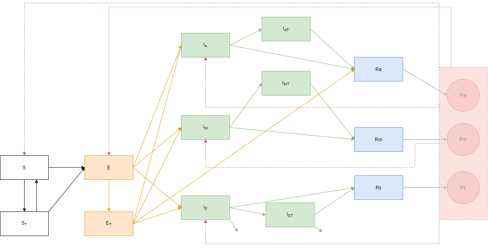

```{r setup, include=FALSE}
knitr::opts_chunk$set(echo = TRUE)
require(IDDynamicsClass)
library(deSolve)
library(truncnorm)
library(knitr)
library(kableExtra)
library(ggplot2)
library(dplyr)
library(tidyr)
library(truncnorm)
library(socialmixr)
library(EpiEstim)
library(matrixStats)

chunk_ev = FALSE
```

# Model 1. 

Assume the following compartmental model.

```{r, echo=FALSE, out.width = "70%"}

```

The $S$ compartment is susceptibles; here, we assume that it's composed of general public and a healthcare workers compartment. The healthcare workers are assumed to have a higher number of contacts than the general public. $E$ is the exposed compartment. Infectious individuals are supposed to be split between $I_A$ (infectious asymptomatic), $I_M$ (infectious with mild symptoms), and $I_S$ (infectious with severe symptoms). $R_A$, $R_M$, and $R_S$ are the recovered compartments for individuals that recovered from asymptomatic, mild, and severe infectious presentations, respectably. Some of the recovered individuals proceed to give plasma and advance to $P_A$, $P_M$, and $P_S$ compartments. Plasma can be given to the susceptible population, in which case indivudals move from $S$ to $S_T$ compartment; to exposed individuals as post-exposure prophylaxis (with individuals moving from $E$ to $E_T$ compartment), and to infectious people, who would then move to either $I_{AT}$, $I_{MT}$, or $I_{ST}$ compartment, depending on the compartment of origin. Note that because only a portion of plasma is "effective" (has a level of titer that's high enough), some individuals will remain in the  untreated compartment even if they received plasma.  

We expect excess mortality due to COVID; it is assumed to only occur among severe cases ($I_S$). Excess mortality among infectious treated individuals with severe presentation is expected to be reduced.    
  
## Population and Contact matrix

We assume population consisting of general public and health care workers.
We assume increased contacts for healthcare workers. 

Here, we use population structure for Washington DC, with age groups broken up in 0-19 years old, 20-44 years old, 45-54 years old, 55-74 years old, and 75 and greater years old. In addition, we have a healthcare worker compartment and a homeless compartment, with an estimated 6,000 healthcare workers. We set homeless compartment to 1 for the purposes of this simulation (essentially 0).  

The contact matrix used is from Polymod for UK; contacts for healthcare workers and individuals experiencing homelessness are assumed to be the same as for the 45-54 year old category.


```{r, echo=TRUE}
# initialize population; use WASH DC population
# assume 6,000 healthcare workers and 0 individuals experiencing homelessness (put 1 to avoid any issues)
pop = c(103095, 322685, 75453, 119406, 36199, 6000, 1)

# get number of compartments
Ncomp = length(pop)


# set up polymod
age.limits = c(0, 20, 45, 55, 75)


make_polymod_matrix <- function(age.limits, hcw.mix="45,55", hml.mix="45,55"){
  data(polymod)
  age_mix <- contact_matrix(polymod, countries="United Kingdom", age.limits = age.limits)$matrix
  
  # assume same mixing for homeless and healthcare workers as 45-55 year olds
  W <- matrix(NA,nrow(age_mix)+2, ncol(age_mix)+2)
  rownames(W) <- c(rownames(age_mix), 'healthcare', 'homeless') 
  colnames(W) <- c(colnames(age_mix), 'healthcare', 'homeless')
  W[1:nrow(age_mix),1:ncol(age_mix)] <- age_mix
  
  W[nrow(age_mix)+1,] = W[grep(hcw.mix, rownames(W)),] ## healthcare
  W[nrow(age_mix)+2,] = W[grep(hml.mix, rownames(W)),] ## homeless
  W[,nrow(age_mix)+1] = W[,grep(hcw.mix, rownames(W))] ## healthcare
  W[,nrow(age_mix)+2] = W[,grep(hml.mix, rownames(W))] ## homeless
  return(W)
}


# rescale the mixing matrix so that the maximum eigenvalue is 1
rescale_age_matrix <- function(Ncomp, W, pop, c_scale_vec){
  A <- matrix(0,Ncomp,Ncomp) 
  for (ii in 1:Ncomp){
    for (jj in 1:Ncomp){
      A[ii, jj] = W[ii, jj]*pop[ii] / pop[jj]
    }
  }
  
  r = eigen(A)
  lam = r$values
  alpha = max(Re(lam))
  W = W / alpha
  
  C <- matrix(c_scale_vec,nrow(W),ncol(W)) ## a special contact matrix to be used to rescale health facility worker contact rates - when set to 1, it is turned off
  return(list(W = W, C = C))
}

```


## Set up the SEAIR model


Initial conditions and assumptions are as follows:
  

-Everybody in the population is susceptible    
-15 people infected in general population (1 in each compartment for asymptomatic, mild, and severe); 0 in healthcare workers  
-$\gamma$ = recovery rate = 1 / (6.5days)  
-$\sigma$ = 1 / (5.2 days)  
-natural death rate = 0   
-birth rate = 0  
-mortality rate from infection = probability of death among hospitalized / (3*7), where 3 weeks = median number of days from symptoms to death

  
For plasma, we assume
-proportion of plasma that's functional (with high enough titer) is 70%  
-Among those susceptibles that receive functional plasma, transmission coefficient is reduced by 50%  
-$\gamma_t$ = 1 / 4 (duration of time to recovery is reduced from 6.5 days to 4 days)    
-mortality rate from infection for treated individuals is  = (half of mortality  for untreated people)    
-proportion of exposed individuals treated with effective plasma that move on to infected compartment is $prop_{ETI}$ = 0.1  
  


We set the following parameters:  
-p0 = number of units of plasma available at day 1 
-$p_{use}$ = proportion of plasma available to be used (for example, not diverted towards hyperimmune globulin)  
-$p_s$ = proportion of plasma allocated to be administered to susceptible individuals  
-$p_e$ = proportion of plasma allocated to be administered to exposed individuals  
-$p_ia$ = proportion of plasma allocated to be administered to infected individuals (asymptomatic)  
-$p_im$ = proportion of plasma allocated to be administered to infected individuals (mild)  
-$p_is$ = proportion of plasma allocated to be administered to infected individuals (severe)  
-$rate_p$ = rate at which plasma is donated; assumed to be 3.5 units / 14 days (assuming each person that donates gives 3.5 units)  
-$p_{give}$ = proportion of recovered individuals that give plasma (default: 0.1 for recovered individuals who were asymptomatic; 0.2 for recovered individuals who had mild disease; and 0.05 for recovered individuals who had severe disease in period of time when plasma is being collected)

We assume that all individuals in exposed compartment will move to either asymptomatic, mild, or severe compartments. We assume that there is no excess death from COVID-19 in either asymptomatic or mild individuals. Probability of becoming symptomatic and progressing to severe disease is based on CDC data [CDC](https://www.cdc.gov/mmwr/volumes/69/wr/mm6912e2.htm#T1_down). 
  
We assume rates of recovery to be the same from the three levels of different severity.  

```{r, echo=TRUE}

### set up SEIR function (get W and C matrices, as well as probabilities for asymptomatic, mild, and severe infections)

setup_seir_age = function(c_scale_vec=1, prop_sym, p_hosp, hcw.mix="45,55", hml.mix="45,55", 
                          pop = pop_data, age.limits = c(0, 20, 45, 55, 75)){
  pop = pop_data
  Ncomp = length(pop)
  W <- make_polymod_matrix(age.limits, hcw.mix = hcw.mix, hml.mix = hml.mix)
  rescale_mixing <- rescale_age_matrix(Ncomp, W, pop, c_scale_vec)
  W <- rescale_mixing$W
  C <- rescale_mixing$C
  
  # set up initial conditions
  
  InCs <- c(S = pop, 
            St = rep(0, Ncomp),
            E = rep(0, Ncomp),
            Et = rep(0, Ncomp),
            A = c(rep(1, Ncomp-1), 0),   ### for now, assign 0 infected to homeless compartment because we have no homeless population
            At = rep(0, Ncomp),
            Im = c(rep(1, Ncomp-1), 0), 
            Imt = rep(0, Ncomp),
            Is = c(rep(1, Ncomp-1), 0), 
            Ist = rep(0, Ncomp),
            Ra = rep(0, Ncomp),
            Rm = rep(0, Ncomp),
            Rs = rep(0, Ncomp),
            Pa = rep(0, Ncomp),
            Pm = rep(0, Ncomp),
            Ps = rep(0, Ncomp),
            incid_deaths = rep(0, Ncomp),
            incid_A = rep(0, Ncomp),
            incid_Im = rep(0, Ncomp),
            incid_Is = rep(0, Ncomp),
            incid_plasma = rep(0, Ncomp))
  
  
  # 2% death rate data from CDC 
  symptomatic_2<- c(123,705,429,838,354,429,429)
  hosp_2<- c(3.08,146.64,121.41,307.05,224.5,121.41,121.41)
  
  num_sym = symptomatic_2
  p_hosp = hosp_2 / symptomatic_2
  
  prop_sym = num_sym / 1000
  p_asym = 1 - prop_sym    # proportion asymptomatic
  p_severe = prop_sym * p_hosp # proportion severe
  p_mild = prop_sym * (1-p_hosp) # proportion mild
  
  
  #ICU_2<-c(0,29.61,44.62,124.94,106.86,44.62,44.62)
dead_ICU_2<- c(0, 0.58,1.465,11.095,16.435,1.465,1.465)
  p_death = dead_ICU_2 / hosp_2
  
  
  return(list(W = W, C = C, ICs = InCs, Ncomp = Ncomp,
              p_asym = p_asym, p_severe = p_severe, p_mild = p_mild,
              p_death = p_death))
}


```


## Approach allowing for time-variable R0 and plasma administration parameters

Let's assume that we have the following timeline of implementing interventions:  
- First cases detected March 7; no intervention until March 13-16, when schools were closed, restaurants and bars transitioned to carryout and delivery only, large businesses closed, social distancing was recommended
- March 24: all nonessential businesses close  
- March 30: stay at home order  
- May 29: Phase I  
- June 22: Phase II   

We represent this through R0 as follows:  
- No intervention scenario for the first 20 days (R0 = 2.5) (Note: while time from first case to closure of schools etc was 9 days, we can assume that there was delay in detection of cases) 
- Moderate social distancing for the next 14 days (R0 = 1.73)  
- Stay-at-home order for next 60 days (R0 = 0.96)     
- Phase I reopening for the next 21 days (R0 = 1.04)  
- Phase II reopening for the next 40 days (R0 = 1.3) with no administration of plasma  
- Phase II reopening continued, with administration of plasma (here, we look at 360 days).
  
We allow the following parameters to vary over time:  R0 and plasma parameters. We assume that no plasma is collected until Phase I reopening (p_{give}=0 during the first three phases, and p_{give}=0.1, 0.2, and 0.05 of recovered individuals who were asymptomatic, mild, and severe, respectively, otherwise).


```{r, echo=TRUE}
seir_step_age_timevar = function(stoch.init = FALSE, stoch = TRUE, Ncomp = Ncomp, ICs = InCs, sd.dw = 0.00, 
                         params = parameters, plasma = plasma_params, 
                         SIA_r = SIA_rates,
                         init.min = 10, init.max = 100) {
  
  C = params$C
  W = params$W
  
  
  N = params$N
  
  beta = params$beta
  gamma = params$gamma
  sigma = params$sigma
  time = params$time
  delta.t = params$delta.t
  v = params$v
  mu = params$mu
  v_I = params$v_I
  
  p_asym = params$p_asym
  p_severe = params$p_severe
  p_mild = params$p_mild
  
  gamma_t = plasma$gamma_t
  prop_ef = plasma$prop_ef
  ef_est = plasma$ef_est
  prop_eti = plasma$prop_eti
  SIA_s = SIA_r$SIA_s
  SIA_e = SIA_r$SIA_e
  SIA_ia = SIA_r$SIA_ia
  SIA_im = SIA_r$SIA_im
  SIA_is = SIA_r$SIA_is
  
  p0 = plasma$p0
  p_s = plasma$p_s
  p_e = plasma$p_e
  p_ia = plasma$p_ia
  p_im = plasma$p_im
  p_is = plasma$p_is
  p_use = plasma$p_use
  rate_p = plasma$rate_p
  p_giveA = plasma$p_giveA
  p_giveM = plasma$p_giveM
  p_giveS = plasma$p_giveS
  waning_St = plasma$waning_St
  
  # set up matrix to store values
  x = matrix(NA, nrow = length(time), ncol = Ncomp * length(ICs))
  x[1, ]=round(ICs)
  
  # set initial conditions
  if(stoch.init==TRUE){
    Ninit = sample(init.min:init.max, 1)
    pinit = N / sum(N)
    Ninit_bygroup = rmultinom(1, Ninit, prob = pinit)[,1]
    Ninit_asy = Ninit_bygroup * p_asym
    Ninit_mild = Ninit_bygroup * p_mild
    Ninit_severe = Ninit_bygroup * p_severe
    ICs = c(S = N,           
            E = rep(0, Ncomp),
            A = Ninit_asy,
            Im = Ninit_mild,
            Is = Ninit_severe,
            Ra = rep(0, Ncomp),
            Rm = rep(0, Ncomp),
            Rs = rep(0, Ncomp),
            Pa = rep(0, Ncomp),
            Pm = rep(0, Ncomp),
            Ps = rep(0, Ncomp),
            incid_I = rep(0, Ncomp),
            incid_deaths = rep(0, Ncomp),
            incid_plasma = rep(0, Ncomp))
    x[1,] <- round(ICs)
  }else{ x[1,] <- round(ICs) }
  
  S = x[, 1:Ncomp] 
  St = x[, (Ncomp+1):(2*Ncomp)]
  E = x[, (2*Ncomp+1):(3*Ncomp)] 
  Et = x[, (3*Ncomp+1):(4*Ncomp)]
  A = x[, (4*Ncomp+1):(5*Ncomp)]
  At = x[, (5*Ncomp+1):(6*Ncomp)]
  Im = x[, (6*Ncomp+1):(7*Ncomp)]
  Imt = x[, (7*Ncomp+1):(8*Ncomp)]
  Is = x[, (8*Ncomp+1):(9*Ncomp)]
  Ist = x[, (9*Ncomp+1):(10*Ncomp)]
  
  Ra =  x[, (10*Ncomp+1):(11*Ncomp)]
  Rm = x[, (11*Ncomp+1):(12*Ncomp)]
  Rs = x[, (12*Ncomp+1):(13*Ncomp)]
  
  Pa = x[, (13*Ncomp+1):(14*Ncomp)]
  Pm = x[, (14*Ncomp+1):(15*Ncomp)]
  Ps = x[, (15*Ncomp+1):(16*Ncomp)]
  
  # incidence
  incid_deaths = x[, (16*Ncomp+1):(17*Ncomp)]
  incid_A = x[, (17*Ncomp+1):(18*Ncomp)]
  incid_Im = x[, (18*Ncomp+1):(19*Ncomp)]
  incid_Is = x[, (19*Ncomp+1):(20*Ncomp)]
  incid_plasma = x[, (20*Ncomp+1):(21*Ncomp)]
  

  P = matrix(NA, nrow = length(time), ncol = 1)
  P[1, ] = sum(Pa[1,]+Pm[1,]+Ps[1,])
  
  
  sd.dw = sd.dw
  
  
  
  out = matrix(NA, nrow = length(time), ncol = Ncomp * 21 + 1 )
  
  for (it in 1:(length(time) - 1)) {
    
    
    nt = rbind(S[it, ], St[it,], E[it, ], Et[it, ], A[it, ], At[it,], Im[it,], Imt[it,], Is[it,], Ist[it,], Ra[it,], Rm[it,], Rs[it,], Pa[it,], Pm[it,], Ps[it,])
    
    # 5 = number of variables in incid matrix; 1 = plasma
    temp = cbind(S[1,], St[1,], E[1,], Et[1,], A[1,], At[1,], Im[1,], Imt[1,], Is[1,], Ist[1,], Ra[1,], Rm[1,], Rs[1,], Pa[1,], Pm[1,], Ps[1,], incid_deaths[1,], incid_A[1,], incid_Im[1,], incid_Is[1,], incid_plasma[1,])
     
    temp2 =  as.vector(temp)
    temp2 = as.vector(c(temp2,P[1,]))
    
    out[1,] = temp2
    names(out) = c(names(ICs), "plasma_units")
    
    WI = (C*W) %*% (A[it,]+At[it,]+Im[it,]+Imt[it,]+Is[it,]+Ist[it,])
    births = rep(0, Ncomp)
    births[1] = mu
    deaths = rep(v, Ncomp)
    ######### GOING TO NEED TO UPDATE DEATHS FROM COVID ---- severity (ICU / non-ICU)
    deaths_I = v_I
    deaths_It = v_It
    
    dw = rtruncnorm(Ncomp, a =0, mean = 1, sd = sd.dw)
    
    # transitions
    foi_prob <- 1 - exp( - beta[it,]* WI / N * dw * delta.t)
    exposed_prob <- 1 - exp( - sigma * delta.t)    
    inf_prob <- 1 - exp( - gamma * delta.t)   
    death_prob <- 1 - exp( - deaths * delta.t)
    death_prob_I <- 1 - exp( - deaths_I * delta.t)
    inf_prob_t <- 1 - exp(- gamma_t * delta.t * (1-prop_eti))
    inf_prob_et <- 1 - exp( - sigma * delta.t * prop_eti)
    death_prob_It <- 1 - exp( - deaths_It * delta.t)
    foi_prob_St <- 1 - exp( - ef_est * beta[it,]* WI / N * dw * delta.t)
    wane_St <- 1 - exp(-waning_St * delta.t)
    #exposed_prob_t <- 1 - exp( - sigma * delta.t * ef_est)   
    
    # replace any negative values with zeros
    foi_prob = replace(foi_prob, foi_prob<0, 0)
    exposed_prob = replace(exposed_prob, exposed_prob<0, 0)
    inf_prob = replace(inf_prob, inf_prob<0, 0)
    death_prob = replace(death_prob, death_prob<0, 0)
    death_prob_I = replace(death_prob_I, death_prob_I<0, 0)
    inf_prob_t = replace(inf_prob_t, inf_prob_t<0, 0)
    inf_prob_et = replace(inf_prob_et, inf_prob_et<0, 0)
    death_prob_It = replace(death_prob_It, death_prob_It<0, 0)
    foi_prob_St = replace(foi_prob_St, foi_prob_St<0, 0)
    wane_St = replace(wane_St, wane_St<0, 0)
    
    ## previous version of plasma allocation-- need to check this
    new_St = rep(NA, Ncomp)
    for(i in (1:Ncomp)){
      new_St[i] = ifelse(P[it] * p_use[it] * p_s[it, i] + SIA_s[it, i]>S[it,i],  S[it, i] * prop_ef, P[it] * p_use[it] * p_s[it, i] * prop_ef + SIA_s[it, i] * prop_ef)
    }
    p_St = ifelse((new_St < 0 | S[it,]==0), 0, new_St / S[it, ])
    
    new_Et = rep(NA, Ncomp)
    for(i in (1:Ncomp)){
      new_Et[i] = ifelse(P[it] * p_use[it] * p_e[it,i] + SIA_e[it, i]>E[it,i],  E[it, i] * prop_ef, P[it] * p_use[it] * p_e[it,i] * prop_ef + SIA_e[it, i] * prop_ef)
    }      
    p_Et = ifelse((new_Et <0 | E[it,]==0), 0, new_Et / E[it, ])
    
    new_Iat = rep(NA, Ncomp)
    for(i in (1:Ncomp)){
      new_Iat[i] = ifelse(P[it] * p_use[it] * p_ia[it,i] + SIA_ia[it, i]>A[it,i],  A[it, i] * prop_ef, P[it] * p_use[it] * p_ia[it,i] * prop_ef + SIA_ia[it, i] * prop_ef)
    } 
    p_Iat = ifelse((new_Iat <0 | A[it,]==0), 0, new_Iat / A[it, ])
    
    new_Imt = rep(NA, Ncomp)
    for(i in (1:Ncomp)){
      new_Imt[i] = ifelse(P[it] * p_use[it] * p_im[it,i] + SIA_im[it, i]>Im[it,i],  Im[it, i] * prop_ef, P[it] * p_use[it] * p_im[it,i] * prop_ef + SIA_im[it, i] * prop_ef)
    }  
    p_Imt = ifelse((new_Imt <0 | Im[it,]==0), 0, new_Imt / Im[it, ])
    
    new_Ist = rep(NA, Ncomp)
    for(i in (1:Ncomp)){
      new_Ist[i] = ifelse(P[it] * p_use[it] * p_is[it,i] + SIA_is[it, i]>Is[it,i],  Is[it, i] * prop_ef, P[it] * p_use[it] * p_is[it,i] * prop_ef + SIA_is[it, i] * prop_ef)
    }  
    p_Ist = ifelse((new_Ist <0 | Is[it,]==0), 0, new_Ist / Is[it, ])
    
    
    ## set up a transition matrix A
    nt = rbind(S[it, ], St[it,], E[it, ], Et[it, ], A[it, ], At[it,], Im[it,], Imt[it,], Is[it,], Ist[it,], Ra[it,], Rm[it,], Rs[it,], Pa[it,], Pm[it,], Ps[it,], incid_deaths[it,])
    
    
    # create a list of empty transition matrices for each age cat
    TM_list = lapply(1:Ncomp, matrix, data= NA, nrow=dim(nt)[1], ncol=dim(nt)[1])
    for (k in 1:Ncomp){
      Tm_a = TM_list[[k]]
      
      # transitions out of S compartment
      Tm_a[1,] = c(max(0,1-p_St[k]-t(foi_prob[k])), p_St[k], t(foi_prob[k]), 0, 0, 0, 0, 0, 0, 0, 0, 0, 0, 0, 0, 0, 0)
      # transitions out of St compartment
      Tm_a[2,] = c(wane_St, max(0,1-t(foi_prob_St[k])), t(foi_prob_St[k]), 0, 0, 0, 0, 0, 0, 0, 0, 0, 0, 0, 0, 0, 0)
      # transitions out of E compartment
      Tm_a[3,] = c(0, 0, max(0,1-p_Et[k]-exposed_prob[k]), p_Et[k], exposed_prob[k]*p_asym[k], 0, exposed_prob[k]*p_mild[k], 0, exposed_prob[k]*p_severe[k], 0, 0, 0, 0, 0, 0, 0, 0)
      # transitions out of Et compartment
      Tm_a[4,] = c(0, 0, 0, max(0,1-inf_prob_et[k]-inf_prob_t[k]), inf_prob_et[k]*p_asym[k], 0, inf_prob_et[k]*p_mild[k], 0, inf_prob_et[k]*p_severe[k], 0, inf_prob_t[k], 0, 0, 0, 0, 0, 0)
      # transitions out of Ia compartment
      Tm_a[5,] = c(0, 0, 0, 0, max(0,1-p_Iat[k]-inf_prob[k]), p_Iat[k], 0, 0, 0, 0, inf_prob[k], 0, 0, 0, 0, 0, 0)
      # transitions out of Iat compartment
      Tm_a[6,] = c(0, 0, 0, 0, 0, max(0,1-inf_prob_t[k]), 0, 0, 0, 0, inf_prob_t[k], 0, 0, 0, 0, 0, 0)
      # transitions out of Im compartment
      Tm_a[7,] = c(0, 0, 0, 0, 0, 0, max(0,1-p_Imt[k]-inf_prob[k]), p_Imt[k], 0, 0, 0, inf_prob[k], 0, 0, 0, 0, 0)
      # transitions out of Imt compartment
      Tm_a[8,] = c(0, 0, 0, 0, 0, 0, 0, max(0,1-inf_prob_t[k]), 0, 0, 0, inf_prob_t[k], 0, 0, 0, 0, 0)
      # transitions out of Is compartment
      Tm_a[9,] = c(0, 0, 0, 0, 0, 0, 0, 0, max(0,1-p_Ist[k]-inf_prob[k]-death_prob_I[k]), p_Ist[k], 0, 0, inf_prob[k], 0, 0, 0, death_prob_I[k])
      # transitions out of Ist compartment
      Tm_a[10,] = c(0, 0, 0, 0, 0, 0, 0, 0, 0, max(0,1-inf_prob_t[k]-death_prob_It[k]), 0, 0, inf_prob_t[k], 0, 0, 0, death_prob_It[k])
      # transitions out of Ra compartment
      Tm_a[11,] = c(0, 0, 0, 0, 0, 0, 0, 0, 0, 0, 1-p_giveA[it]*rate_p, 0, 0, p_giveA[it]*rate_p, 0, 0, 0)
      # transitions out of Rm compartment
      Tm_a[12,] = c(0, 0, 0, 0, 0, 0, 0, 0, 0, 0, 0, 1-p_giveM[it]*rate_p, 0, 0,  p_giveM[it]*rate_p, 0, 0)
      # transitions out of Rs compartment
      Tm_a[13,] = c(0, 0, 0, 0, 0, 0, 0, 0, 0, 0, 0, 0, 1-p_giveS[it]*rate_p, 0, 0, p_giveS[it]*rate_p, 0)
      # transitions out of plasma compartments ---- no movement out - more of a placeholder row to pad out the matrix
      Tm_a[14,] = c(0, 0, 0, 0, 0, 0, 0, 0, 0, 0, 0, 0, 0, 1, 0, 0, 0)
      Tm_a[15,] = c(0, 0, 0, 0, 0, 0, 0, 0, 0, 0, 0, 0, 0, 0, 1, 0, 0) 
      Tm_a[16,] = c(0, 0, 0, 0, 0, 0, 0, 0, 0, 0, 0, 0, 0, 0, 0, 1, 0)
      # transitions out of incid_deaths compartment ---- no movement out - more of a placeholder row to pad out the matrix
      Tm_a[17,] = c(0, 0, 0, 0, 0, 0, 0, 0, 0, 0, 0, 0, 0, 0, 0, 0, 1)
      
      TM_list[[k]] = t(Tm_a)    ### transpose 
      
    }
    
    
    nt_vec = t(t(as.vector(nt)))
    TM_full = matrix(0, nrow = Ncomp * dim(nt)[1], ncol = Ncomp * dim(nt)[1])
    for (k in 1:Ncomp){
      TM_full[(dim(nt)[1]*(k-1)+1):((dim(nt)[1]*(k-1))+dim(nt)[1]), (dim(nt)[1]*(k-1)+1):((dim(nt)[1]*(k-1))+dim(nt)[1])] = TM_list[[k]]
    }
    
    #### deterministic approach
    if(stoch==FALSE){
      ntp1 = TM_full %*% nt_vec 
      
      
      # create incidence data
      # replace diagonal values with 0s (because that's the people that stay in the same compartment)
      TM_new = TM_full
      diag(TM_new) = 0
      ntp1_new = TM_new %*% nt_vec
      ntp1_new.df =data.frame(ntp1_new)
      # for incid_deaths
      incid_deaths_new = ntp1_new.df %>% filter(row_number() %% dim(nt)[1] == 0)
      # for Ia, extract every nth column, starting with 5th 
      Ia_new = ntp1_new.df %>%  filter(row_number() %% dim(nt)[1] == 5)
      # for Im
      Im_new = ntp1_new.df %>%  filter(row_number() %% dim(nt)[1] == 7)
      # for Is
      Is_new = ntp1_new.df %>%  filter(row_number() %% dim(nt)[1] == 9)
      # for plasma -- consumed
      I_plasma_st = ntp1_new.df %>%  filter(row_number() %% dim(nt)[1] == 2) 
      I_plasma_et = ntp1_new.df %>%  filter(row_number() %% dim(nt)[1] == 4)
      I_plasma_iat = ntp1_new.df %>%  filter(row_number() %% dim(nt)[1] == 6)
      I_plasma_imt = ntp1_new.df %>%  filter(row_number() %% dim(nt)[1] == 8)
      I_plasma_ist = ntp1_new.df %>%  filter(row_number() %% dim(nt)[1] == 10)
      I_plasma = I_plasma_st + I_plasma_et + I_plasma_iat + I_plasma_imt + I_plasma_ist
      
      # for plasma -- generated
      I_pa = ntp1_new.df %>% filter(row_number() %% dim(nt)[1] == 14)
      I_pm = ntp1_new.df %>% filter(row_number() %% dim(nt)[1] == 15)
      I_ps = ntp1_new.df %>% filter(row_number() %% dim(nt)[1] == 16)

    }
    
    
    ##### Stochastic formulation
    
    
    if(stoch==TRUE){
      # do multinomial draws
      TmN_i = matrix(NA, nrow = nrow(TM_full), ncol = ncol(TM_full))
      
      for (k in 1:(nrow(TM_full))){
        size = nt_vec[k]
        TmN_i[,k] = rmultinom(1, size, prob = TM_full[,k])
      }
     
      ntp1 = rowSums(TmN_i)    
      
      
      # create incidence data
      # replace diagonal values with 0s (because that's the people that stay in the same compartment)
      TM_new = TmN_i
      diag(TM_new) = 0
      ntp1_new = rowSums(TM_new)
      ntp1_new.df =data.frame(ntp1_new)
      # for incid_deaths
      incid_deaths_new = ntp1_new.df %>% filter(row_number() %% dim(nt)[1] == 0)
      # for Ia, extract every nth column, starting with 5th 
      Ia_new = ntp1_new.df %>%  filter(row_number() %% dim(nt)[1] == 5)
      # for Im
      Im_new = ntp1_new.df %>%  filter(row_number() %% dim(nt)[1] == 7)
      # for Is
      Is_new = ntp1_new.df %>%  filter(row_number() %% dim(nt)[1] == 9)
      # for plasma --- consumed
      I_plasma_st = ntp1_new.df %>%  filter(row_number() %% dim(nt)[1] == 2) 
      I_plasma_et = ntp1_new.df %>%  filter(row_number() %% dim(nt)[1] == 4)
      I_plasma_iat = ntp1_new.df %>%  filter(row_number() %% dim(nt)[1] == 6)
      I_plasma_imt = ntp1_new.df %>%  filter(row_number() %% dim(nt)[1] == 8)
      I_plasma_ist = ntp1_new.df %>%  filter(row_number() %% dim(nt)[1] == 10)
      I_plasma = I_plasma_st + I_plasma_et + I_plasma_iat + I_plasma_imt + I_plasma_ist
      # for plasma --- generated
      I_pa = ntp1_new.df %>% filter(row_number() %% dim(nt)[1] == 14)
      I_pm = ntp1_new.df %>% filter(row_number() %% dim(nt)[1] == 15)
      I_ps = ntp1_new.df %>% filter(row_number() %% dim(nt)[1] == 16)

    }
    
    # update the plasma compartment
    P[it+1,] = P[it,] - sum(I_plasma) + sum(I_pa + I_pm + I_ps)
    
    # update the plasma compartment -- old version (no difference in proportion donating based on which compartment they were in before)
    # number of recovered individuals
    #rec = round(sum(ntp1[seq(11, length(ntp1), dim(nt)[1])]))
    #P[it+1,] = P[it,] - sum(I_plasma) + rbinom(n = 1, size = rec, prob = p_give[it]*rate_p)

# drop incid_deaths from ntp1 first

    # convert to a nice format for output
    temp=matrix(ntp1, ncol = Ncomp, byrow=FALSE)
    t_temp = t(temp)
    # replace incid_deaths
    for (i in 1:Ncomp){
      t_temp[i, 17] == incid_deaths_new[i,]
    }

    temp_vec = as.vector(t_temp)

    out[it+1,] = c(temp_vec[], t(Ia_new), t(Im_new), t(Is_new), t(I_plasma), P[it+1,])
    
    
    S[it+1,] = out[it+1, 1:Ncomp] 
    St[it+1,] = out[it+1, (Ncomp+1):(2*Ncomp)]
    E[it+1,] = out[it+1, (2*Ncomp+1):(3*Ncomp)] 
    Et[it+1,] = out[it+1, (3*Ncomp+1):(4*Ncomp)]
    A[it+1,] = out[it+1, (4*Ncomp+1):(5*Ncomp)]
    At[it+1,] = out[it+1, (5*Ncomp+1):(6*Ncomp)]
    Im[it+1,] = out[it+1, (6*Ncomp+1):(7*Ncomp)]
    Imt[it+1,] = out[it+1, (7*Ncomp+1):(8*Ncomp)]
    Is[it+1,] = out[it+1, (8*Ncomp+1):(9*Ncomp)]
    Ist[it+1,] = out[it+1, (9*Ncomp+1):(10*Ncomp)]
    Ra[it+1,] =  out[it+1, (10*Ncomp+1):(11*Ncomp)]
    Rm[it+1,] =  out[it+1, (11*Ncomp+1):(12*Ncomp)]
    Rs[it+1,] =  out[it+1, (12*Ncomp+1):(13*Ncomp)]

    
    # plasma
    Pa[it+1,] = out[it+1, (13*Ncomp+1):(14*Ncomp)]
    Pm[it+1,] = out[it+1, (14*Ncomp+1):(15*Ncomp)]
    Ps[it+1,] = out[it+1, (15*Ncomp+1):(16*Ncomp)]
        # incidence
    incid_deaths[it+1,] = out[it+1, (16*Ncomp+1):(17*Ncomp)]
    incid_A[it+1,] = out[it+1, (17*Ncomp+1):(18*Ncomp)]
    incid_Im[it+1,] = out[it+1, (18*Ncomp+1):(19*Ncomp)]
    incid_Is[it+1,] = out[it+1, (19*Ncomp+1):(20*Ncomp)]
    incid_plasma[it+1,] = out[it+1, (20*Ncomp+1):(21*Ncomp)]
    
    P[it+1,] = out[it+1, (21*Ncomp+1)]
  }
  
  
  
  
  out2 = data.frame(cbind(time, S, St, E, Et, A, At, Im, Imt, Is, Ist, Ra, Rm, Rs, Pa, Pm, Ps, incid_deaths, incid_A, incid_Im, incid_Is, incid_plasma, P))
  names(out2) = c("time", names(ICs), "plasma_units")
  
  return(out2) 
}  

```


```{r, echo=TRUE}


multiple_runs_age_timevar <- function(IC = InCs, stoch_value = TRUE, Ncomp2 = Ncomp, plasma_p = plasma_params, paramt = parameters, SIA_r = SIA_rates, nsims = 100){
  

  all_sim <- matrix(NA,1,(length(IC))+2+1) 
  
  
  colnames(all_sim) <- c('run_index', 'time',                         
                         names(IC), 'plasma_units') 
  for(n in 1:nsims){    
    ## run the simulation one time    
  
  single.sim =seir_step_age_timevar(stoch = stoch_value, stoch.init = FALSE, Ncomp = Ncomp2, ICs = IC, sd.dw = 0.00, 
                     params = paramt, plasma = plasma_p,
                     SIA_r = SIA_r,
                     init.min = 10, init.max = 100 ) 

    #add on a value for the run_index (simulation number)    
    run_index = rep(n, nrow(single.sim))    
    single.sim <- cbind(run_index, single.sim)    
    all_sim <- rbind(all_sim, single.sim)  
  }
  
  
  all_sim <- all_sim[-1,]
  
  # create cumulative vars
  
  xx <- all_sim %>% select(starts_with("incid_A")) %>% rowSums()
  all_sim = cbind(all_sim, incid_A=xx)
  
    xx <- all_sim %>% select(starts_with("incid_Im")) %>% rowSums()
  all_sim = cbind(all_sim, incid_Im=xx)
  
    xx <- all_sim %>% select(starts_with("incid_Is")) %>% rowSums()
  all_sim = cbind(all_sim, incid_Is=xx)
  
  xx <- all_sim %>% select(starts_with("incid_deaths")) %>% rowSums()
  all_sim = cbind(all_sim, incid_deaths=xx)
  
  all_sim <- all_sim %>% 
    arrange(run_index, time) %>%
    group_by(run_index) %>%
    mutate(cum_infA = cumsum(incid_A),
           cum_infM = cumsum(incid_Im),
           cum_infS = cumsum(incid_Is),
           incid_I = incid_A + incid_Im + incid_Is,
           cum_inf = cum_infA + cum_infM + cum_infS,
           cum_deaths = cumsum(incid_deaths)
    ) %>%
    ungroup()

  return(all_sim)
}


```


```{r, echo=TRUE}
days_steps = c(20, 14, 60, 21, 40, 360)  # vector for how long each of the steps lasts

pop_data = pop


  # 2% death rate data from CDC 
  symptomatic_2<- c(123,705,429,838,354,429,429)
  hosp_2<- c(3.08,146.64,121.41,307.05,224.5,121.41,121.41)
  ICU_2<-c(0,29.61,44.62,124.94,106.86,44.62,44.62)
  dead_ICU_2<- c(0, 0.58,1.465,11.095,16.435,1.465,1.465)
  
  num_sym = symptomatic_2
  p_hosp = hosp_2 / symptomatic_2
  
  prop_sym = num_sym / 1000
  p_asym = 1 - prop_sym    # proportion asymptomatic
  p_severe = prop_sym * p_hosp # proportion severe
  p_mild = prop_sym * (1-p_hosp) # proportion mild
  
  p_death = dead_ICU_2 / hosp_2
  
X = setup_seir_age(c_scale_vec=1, prop_sym = prop_sym, p_hosp = p_severe, hcw.mix="45,55", hml.mix="45,55", 
                          pop = pop_data, age.limits = c(0, 20, 45, 55, 75))

Ncomp = X$Ncomp
InCs = X$ICs
W = X$W
C = X$C

N = pop
R0 = c(rep(2.5, days_steps[1]), 
       rep(1.73, days_steps[2]), 
       rep(0.96, days_steps[3]),
       rep(1.04, days_steps[4]),
       rep(1.3, days_steps[5]),
       rep(1.3, days_steps[6]))
gamma = rep(1 / 6.5, Ncomp)
sigma = rep(1 / 5.2, Ncomp)
time_max = sum(days_steps)
delta.t = 1
time = seq(0, time_max, delta.t)
v = 0  ### death rate
mu = 0 ### birth rate
v_I = p_death / (3* 7) ### mortality from infection; median time to death is assumed to be 3 weeks (from WHO CHINA joint mission report)

# calculate beta matrix; each row corresponds to time step, each column = compartment
beta = matrix(rep(NA, (time_max)*Ncomp), ncol = Ncomp)
for (i in 1:time_max){
  beta[i,] = R0[i] * gamma
}

#plasma parameters --- first, set all the treatment rates to 0
gamma_t = rep(1 / 4, Ncomp)
v_It = v_I / 2
ef_est = 0.5
prop_ef = 0.7
prop_eti = 0.1
waning_St = 1/160 ## assuming immunity lasts 160 days

p0 = 0   # number of units of plasma available at day 1
p_s = matrix(rep(0, (time_max)*Ncomp), ncol = Ncomp)  # proportion of plasma used allocated to susceptible 
p_e = matrix(rep(0, (time_max)*Ncomp), ncol = Ncomp)   # proportion of plasma used allocated to exposed
p_ia = matrix(rep(0, (time_max)*Ncomp), ncol = Ncomp)   # proportion of plasma used allocated for treatment of infected asymptomatic
p_im = matrix(rep(0, (time_max)*Ncomp), ncol = Ncomp)  # proportion of plasma used allocated for treatment of infected mild
p_is = matrix(rep(0, (time_max)*Ncomp), ncol = Ncomp) # proportion of plasma used allocated for treatment of infected severe
p_use = c(rep(0, days_steps[1]),
           rep(0, days_steps[2]),
           rep(0, days_steps[3]),
           rep(0, days_steps[4]),
           rep(0, days_steps[5]),
          rep(0, days_steps[6]))    # proportion of available plasma that's used 
rate_p = 3.5 / 14 # rate at which recovered give units of blood; assume each person gives 3.5 units; 14 days after recovery
p_giveA = c(rep(0, days_steps[1]),
           rep(0, days_steps[2]),
           rep(0, days_steps[3]),
           rep(0.1, days_steps[4]),
           rep(0.1, days_steps[5]),
           rep(0.1, days_steps[6]))# proportion of recovered people that donate plasma
p_giveM = c(rep(0, days_steps[1]),
           rep(0, days_steps[2]),
           rep(0, days_steps[3]),
           rep(0.2, days_steps[4]),
           rep(0.2, days_steps[5]),
           rep(0.2, days_steps[6]))# proportion of recovered people that donate plasma
p_giveS = c(rep(0, days_steps[1]),
           rep(0, days_steps[2]),
           rep(0, days_steps[3]),
           rep(0.05, days_steps[4]),
           rep(0.05, days_steps[5]),
           rep(0.05, days_steps[6]))# proportion of recovered people that donate plasma


parameters <- list(N=N, W=W, beta = beta, gamma=gamma, sigma=sigma, time=time, delta.t=delta.t, v = v, mu = mu, v_I = v_I, p_asym = p_asym, p_mild = p_mild, p_severe = p_severe,
                   C = C, W = W)

plasma_params <- list(#r_st = r_st, 
                      #ef_st = ef_st, 
                      #r_et = r_et, #ef_et = ef_et, 
                      #r_it = r_it, #ef_it = ef_it, 
                      gamma_t = gamma_t, v_It = v_It,
                      ef_est = ef_est, prop_ef = prop_ef, 
                      prop_eti = prop_eti,
                      p0 = p0, p_s = p_s, p_e = p_e, 
                      p_ia = p_ia, p_im = p_im, p_is = p_is,
                      p_use = p_use, rate_p = rate_p, 
                      p_giveA = p_giveA, p_giveM = p_giveM, p_giveS = p_giveS,
                      waning_St = waning_St)


# set up a mass campaign
# initialize a time vector

t_SIA_s = 1   # time when SIA for susceptibles is administered
val_SIA_s = rep(0, Ncomp) # number of people that are vaccinated during the campaign
blank = matrix(0, nrow=length(time), ncol = Ncomp)
SIA_s = blank
SIA_s[t_SIA_s, ] = val_SIA_s

t_SIA_e = 1
val_SIA_e = rep(0, Ncomp)
SIA_e = blank
SIA_e[t_SIA_e, ] = val_SIA_e

t_SIA_ia = 1
val_SIA_ia = rep(0, Ncomp)
SIA_ia = blank
SIA_ia[t_SIA_ia, ] = val_SIA_ia

t_SIA_im = 1
val_SIA_im = rep(0, Ncomp)
SIA_im = blank
SIA_im[t_SIA_im, ] = val_SIA_im

t_SIA_is = 1
val_SIA_is = rep(0, Ncomp)
SIA_is = blank
SIA_is[t_SIA_is, ] = val_SIA_is


SIA_rates <- list(SIA_s = SIA_s, SIA_e = SIA_e, SIA_ia = SIA_ia, SIA_im = SIA_im, SIA_is = SIA_is)


num_sims = 100
```


<!--Run single simulations - deterministic and stochastic
```{r, eval=FALSE}
single.sim =seir_step_age_timevar(stoch = TRUE, stoch.init = FALSE, Ncomp = Ncomp, ICs = InCs, sd.dw = 0.00, 
                     params = parameters, plasma = plasma_params,
                     SIA_r = SIA_rates,
                     init.min = 10, init.max = 100 ) 

single.sim_det =seir_step_age_timevar(stoch = FALSE, stoch.init = FALSE, Ncomp = Ncomp, ICs = InCs, sd.dw = 0.00, 
                     params = parameters, plasma = plasma_params,
                     SIA_r = SIA_rates,
                     init.min = 10, init.max = 100 ) 


```

```{r, eval=FALSE}
# plot deterministic number of infections and deaths
single.sim_det = single.sim_det %>% mutate(incidI = A1 + A2 + A3 + A4 + A5 + A6 + A7 +
                            Im1 + Im2 + Im3 + Im4 + Im5 + Im6 + Im7 + 
                            Is1 + Is2 + Is3 + Is4 + Is5 + Is6 + Is7,
                            incid_deaths = incid_deaths1+incid_deaths2 + incid_deaths3 + incid_deaths4 + 
                              incid_deaths5 + incid_deaths6 + incid_deaths7)
single.sim_det %>% ggplot(aes(time,incidI))+geom_line()+ggtitle("Deterministic model, Daily infectious cases, all groups")
 single.sim_det %>% ggplot(aes(time,incid_deaths))+geom_line()+ggtitle("Deterministic model, Daily deaths, all groups")
 
```


Now run multiple simulations for the stochastic formulation --> 
```{r, echo=TRUE, eval=chunk_ev}


all_sim_run1 = suppressWarnings(multiple_runs_age_timevar(nsims = num_sims, stoch = TRUE))
```

```{r, eval=chunk_ev}
write.csv(all_sim_run1, "all_sim_run1.csv")
```

```{r, echo=TRUE, fig.width=9, results="hide"}
# Plot new infections and deaths 
all_sim_run1 = read.csv("all_sim_run1.csv")
summ_days_run1 = all_sim_run1 %>% drop_na() %>% group_by(time) %>%
summarise(mean_inf = mean(incid_I, na.rm=TRUE),
ll_inf= quantile(incid_I, prob=c(.025), na.rm=TRUE),
ul_inf = quantile(incid_I, prob=c(.975), na.rm = TRUE),
mean_deaths = mean(incid_deaths, na.rm=TRUE),
ll_deaths = quantile(incid_deaths, prob = c(.025), na.rm=TRUE),
ul_deaths = quantile(incid_deaths, prob = c(.975), na.rm=TRUE),
mean_cum_inf = mean(cum_inf, na.rm=TRUE),
ll_cum_inf = quantile(cum_inf, prob=c(.025), na.rm=TRUE),
ul_cum_inf = quantile(cum_inf, prob=c(.975), na.rm=TRUE),
mean_cum_deaths = mean(cum_deaths, na.rm=TRUE),
ll_cum_deaths = quantile(cum_deaths, prob=c(.025), na.rm=TRUE),
ul_cum_deaths = quantile(cum_deaths, prob=c(.975), na.rm=TRUE),
mean_cum_infA = mean(cum_infA, na.rm=TRUE),
ll_cum_infA = quantile(cum_infA, prob=c(.025), na.rm=TRUE),
ul_cum_infA = quantile(cum_infA, prob=c(.975), na.rm=TRUE),
mean_cum_infM = mean(cum_infM, na.rm=TRUE),
ll_cum_infM = quantile(cum_infM, prob=c(.025), na.rm=TRUE),
ul_cum_infM = quantile(cum_infM, prob=c(.975), na.rm=TRUE),
mean_cum_infS = mean(cum_infS, na.rm=TRUE),
ll_cum_infS = quantile(cum_infS, prob=c(.025), na.rm=TRUE),
ul_cum_infS = quantile(cum_infS, prob=c(.975), na.rm=TRUE)
)
```

```{r, results="hide"}
colors = c("New infections" = "blue")
new_inf_plot<-ggplot(data=summ_days_run1, aes(x=time)) +
geom_line(aes(y = mean_inf, color = "New infections")) +
geom_ribbon(aes(ymin=ll_inf, ymax=ul_inf), fill="blue", linetype=2, alpha=0.1) +
ggtitle("New infections") +   theme_classic() +
scale_color_manual(values = colors)+
labs(y = "Daily cases", x = "Day", color="Legend") +
  geom_vline(xintercept=0, colour="grey") +
  geom_vline(xintercept=days_steps[1], colour="grey") + 
  geom_vline(xintercept=days_steps[2]+days_steps[1], colour="grey") + 
  geom_vline(xintercept=days_steps[3]+days_steps[2]+days_steps[1], colour="grey") + 
  geom_vline(xintercept=days_steps[4]+days_steps[3]+days_steps[2]+days_steps[1], colour="grey") + 
  geom_text(aes(x=0, label="No intervention", y=200), colour="blue", angle=90, vjust = 1, text=element_text(size=8))+
    geom_text(aes(x=days_steps[1], label="Moderate social distancing", y=200), colour="blue", angle=90, vjust = 1, text=element_text(size=8))+
    geom_text(aes(x=days_steps[1]+days_steps[2], label="Stay-at-home", y=200), colour="blue", angle=90, vjust = 1, text=element_text(size=8))+
    geom_text(aes(x=days_steps[1]+days_steps[2]+days_steps[3], label="Phase I reopening", y=200), colour="blue", angle=90, vjust = 1, text=element_text(size=8))+
    geom_text(aes(x=days_steps[1]+days_steps[2]+days_steps[3]+days_steps[4], label="Phase II reopening", y=200), colour="blue", angle=90, vjust = 1, text=element_text(size=8))
#new_inf_plot


colors = c("New deaths" = "blue")
new_deaths_plot<-ggplot(data=summ_days_run1, aes(x=time)) +
geom_line(aes(y = mean_deaths, color = "New deaths")) +
geom_ribbon(aes(ymin=ll_deaths, ymax=ul_deaths), fill="blue", linetype=2, alpha=0.1) +
ggtitle("New deaths") +   theme_classic() +
scale_color_manual(values = colors)+
labs(y = "Daily cases", x = "Day", color="Legend") + geom_vline(xintercept=0, colour="grey") +
  geom_vline(xintercept=days_steps[1], colour="grey") + 
  geom_vline(xintercept=days_steps[2]+days_steps[1], colour="grey") + 
  geom_vline(xintercept=days_steps[3]+days_steps[2]+days_steps[1], colour="grey") + 
  geom_vline(xintercept=days_steps[4]+days_steps[3]+days_steps[2]+days_steps[1], colour="grey") + 
  geom_text(aes(x=0, label="No intervention", y=2), colour="blue", angle=90, vjust = 1, text=element_text(size=8))+
    geom_text(aes(x=days_steps[1], label="Moderate social distancing", y=2), colour="blue", angle=90, vjust = 1, text=element_text(size=8))+
    geom_text(aes(x=days_steps[1]+days_steps[2], label="Stay-at-home", y=2), colour="blue", angle=90, vjust = 1, text=element_text(size=8))+
    geom_text(aes(x=days_steps[1]+days_steps[2]+days_steps[3], label="Phase I reopening", y=2), colour="blue", angle=90, vjust = 1, text=element_text(size=8))+
    geom_text(aes(x=days_steps[1]+days_steps[2]+days_steps[3]+days_steps[4], label="Phase II reopening", y=2), colour="blue", angle=90, vjust = 1, text=element_text(size=8))
#new_deaths_plot

gridExtra::grid.arrange(new_inf_plot, new_deaths_plot, nrow = 1)
```


```{r, results="hide"}
# plot cumulative infections and deaths

colors = c("Cumulative infections" = "blue",
           "Cumulative asymptomatic infections" = "green",
           "Cumulative mild infections" = "orange",
           "Cumulative severe infections" = "brown")
cum_inf_plot<-ggplot(data=summ_days_run1, aes(x=time)) +
geom_line(aes(y = mean_cum_inf, color = "Cumulative infections")) +
  geom_line(aes(y = mean_cum_infA, color = "Cumulative asymptomatic infections")) +
   geom_line(aes(y = mean_cum_infM, color = "Cumulative mild infections")) +
     geom_line(aes(y = mean_cum_infS, color = "Cumulative severe infections")) +
geom_ribbon(aes(ymin=ll_cum_inf, ymax=ul_cum_inf), fill="blue", linetype=2, alpha=0.1) +
  geom_ribbon(aes(ymin=ll_cum_infA, ymax=ul_cum_infA), fill="green", linetype=2, alpha=0.1) +
    geom_ribbon(aes(ymin=ll_cum_infM, ymax=ul_cum_infM), fill="orange", linetype=2, alpha=0.1) +
      geom_ribbon(aes(ymin=ll_cum_infS, ymax=ul_cum_infS), fill="brown", linetype=2, alpha=0.1) +
ggtitle("Cumulative infections") +   theme_classic() +
scale_color_manual(values = colors)+
labs(y = "Infections", x = "Day", color="Legend") +
  geom_vline(xintercept=0, colour="grey") +
  geom_vline(xintercept=days_steps[1], colour="grey") + 
  geom_vline(xintercept=days_steps[2]+days_steps[1], colour="grey") + 
  geom_vline(xintercept=days_steps[3]+days_steps[2]+days_steps[1], colour="grey") + 
  geom_vline(xintercept=days_steps[4]+days_steps[3]+days_steps[2]+days_steps[1], colour="grey") + 
  geom_text(aes(x=0, label="No intervention", y=50000), colour="blue", angle=90, vjust = 1, text=element_text(size=8))+
    geom_text(aes(x=days_steps[1], label="Moderate social distancing", y=50000), colour="blue", angle=90, vjust = 1, text=element_text(size=8))+
    geom_text(aes(x=days_steps[1]+days_steps[2], label="Stay-at-home", y=50000), colour="blue", angle=90, vjust = 1, text=element_text(size=8))+
    geom_text(aes(x=days_steps[1]+days_steps[2]+days_steps[3], label="Phase I reopening", y=50000), colour="blue", angle=90, vjust = 1, text=element_text(size=8))+
    geom_text(aes(x=days_steps[1]+days_steps[2]+days_steps[3]+days_steps[4], label="Phase II reopening", y=50000), colour="blue", angle=90, vjust = 1, text=element_text(size=8))


# plot cumulative deaths

colors = c("Cumulative deaths" = "blue")
cum_deaths_plot<-ggplot(data=summ_days_run1, aes(x=time)) +
geom_line(aes(y = mean_cum_deaths, color = "Cumulative deaths")) +
geom_ribbon(aes(ymin=ll_cum_deaths, ymax=ul_cum_deaths), fill="blue", linetype=2, alpha=0.1) +
ggtitle("Cumulative deaths") +   theme_classic() +
scale_color_manual(values = colors)+
labs(y = "Deaths", x = "Day", color="Legend") + geom_vline(xintercept=0, colour="grey") +
  geom_vline(xintercept=days_steps[1], colour="grey") + 
  geom_vline(xintercept=days_steps[2]+days_steps[1], colour="grey") + 
  geom_vline(xintercept=days_steps[3]+days_steps[2]+days_steps[1], colour="grey") + 
  geom_vline(xintercept=days_steps[4]+days_steps[3]+days_steps[2]+days_steps[1], colour="grey") + 
  geom_text(aes(x=0, label="No intervention", y=100), colour="blue", angle=90, vjust = 1, text=element_text(size=8))+
    geom_text(aes(x=days_steps[1], label="Moderate social distancing", y=100), colour="blue", angle=90, vjust = 1, text=element_text(size=8))+
    geom_text(aes(x=days_steps[1]+days_steps[2], label="Stay-at-home", y=100), colour="blue", angle=90, vjust = 1, text=element_text(size=8))+
    geom_text(aes(x=days_steps[1]+days_steps[2]+days_steps[3], label="Phase I reopening", y=100), colour="blue", angle=90, vjust = 1, text=element_text(size=8))+
    geom_text(aes(x=days_steps[1]+days_steps[2]+days_steps[3]+days_steps[4], label="Phase II reopening", y=100), colour="blue", angle=90, vjust = 1, text=element_text(size=8))

gridExtra::grid.arrange(cum_inf_plot, cum_deaths_plot, nrow = 2)

```
<!-- # Look at final size, severe infections, and deaths from `r num_sims` simulations --> 

```{r, echo=TRUE, results="hide"}
summ_ <- all_sim_run1 %>% group_by(run_index) %>% 
  summarise(final_size = max(cum_inf, na.rm=TRUE),
            final_deaths = max(cum_deaths, na.rm=TRUE),
            final_plasma = max(cumsum(incid_plasma1)+cumsum(incid_plasma2)+cumsum(incid_plasma3)+
                                 cumsum(incid_plasma4)+cumsum(incid_plasma5)+cumsum(incid_plasma6)+
                                 cumsum(incid_plasma7), na.rm=TRUE))

final_size_all <- summ_ %>%
  summarise(mean = mean(final_size, na.rm=TRUE),
            median = median(final_size, na.rm=TRUE),
            ll = quantile(final_size, prob=c(.025)),
            ul = quantile(final_size, prob=c(.975)))

final_deaths_all <- summ_ %>%
  summarise(mean = mean(final_deaths, na.rm=TRUE),
            median = median(final_deaths, na.rm=TRUE),
            ll = quantile(final_deaths, prob=c(.025)),
            ul = quantile(final_deaths, prob=c(.975)))

final_plasma_all <- summ_ %>%
  summarise(mean = mean(final_plasma, na.rm=TRUE),
            median = median(final_plasma, na.rm=TRUE),
            ll = quantile(final_plasma, prob=c(.025)),
            ul = quantile(final_plasma, prob=c(.975)))

# make a table
table = data.frame(t(round(final_size_all)), t(round(final_deaths_all)))
rownames(table) = c("Mean", "Median", "lower 95% CI limit", "upper 95% CI limit")
colnames(table) = c("Final infection size", "Final deaths from COVID")
table %>% kable() %>% kable_styling(c("basic", "scale_down"))

```

Scenario 2 - give 100% plasma to severe infectious people at day 40 of phase II reopening


```{r, echo=TRUE}

#plasma parameters --- first, set all the treatment rates to 0
gamma_t = rep(1 / 4, Ncomp)
v_It = v_I / 2
ef_est = 0.5
prop_ef = 0.7
prop_eti = 0.1
waning_St = 1/160 ## assuming immunity lasts 160 days

p0 = 0   # number of units of plasma available at day 1
p_s = matrix(rep(0, (time_max)*Ncomp), ncol = Ncomp)  # proportion of plasma used allocated to susceptible 
p_e = matrix(rep(0, (time_max)*Ncomp), ncol = Ncomp)   # proportion of plasma used allocated to exposed
p_ia = matrix(rep(0, (time_max)*Ncomp), ncol = Ncomp)   # proportion of plasma used allocated for treatment of infected asymptomatic
p_im = matrix(rep(0, (time_max)*Ncomp), ncol = Ncomp)  # proportion of plasma used allocated for treatment of infected mild

p_is = matrix(rep(0, (time_max)*Ncomp), ncol = Ncomp) # proportion of plasma used allocated for treatment of infected severe
# update the last section to include plasma administration
for (i in (nrow(p_is)-days_steps[6]):nrow(p_is)){
p_is[i,] = c(0.1, 0.1, 0.2, 0.2, 0.2, 0.2, 0) 
}

p_use = c(rep(0, days_steps[1]),
           rep(0, days_steps[2]),
           rep(0, days_steps[3]),
           rep(0, days_steps[4]),
           rep(0, days_steps[5]),
          rep(1, days_steps[6]))    # proportion of available plasma that's used 
rate_p = 3.5 / 14 # rate at which recovered give units of blood; assume each person gives 3.5 units; 14 days after recovery
p_giveA = c(rep(0, days_steps[1]),
           rep(0, days_steps[2]),
           rep(0, days_steps[3]),
           rep(0.1, days_steps[4]),
           rep(0.1, days_steps[5]),
           rep(0.1, days_steps[6]))# proportion of recovered people that donate plasma
p_giveM = c(rep(0, days_steps[1]),
           rep(0, days_steps[2]),
           rep(0, days_steps[3]),
           rep(0.2, days_steps[4]),
           rep(0.2, days_steps[5]),
           rep(0.2, days_steps[6]))# proportion of recovered people that donate plasma
p_giveS = c(rep(0, days_steps[1]),
           rep(0, days_steps[2]),
           rep(0, days_steps[3]),
           rep(0.05, days_steps[4]),
           rep(0.05, days_steps[5]),
           rep(0.05, days_steps[6]))# proportion of recovered people that donate plasma


plasma_params <- list(#r_st = r_st, 
                      #ef_st = ef_st, 
                      #r_et = r_et, #ef_et = ef_et, 
                      #r_it = r_it, #ef_it = ef_it, 
                      gamma_t = gamma_t, v_It = v_It,
                      ef_est = ef_est, prop_ef = prop_ef, 
                      prop_eti = prop_eti,
                      p0 = p0, p_s = p_s, p_e = p_e, 
                      p_ia = p_ia, p_im = p_im, p_is = p_is,
                      p_use = p_use, rate_p = rate_p, 
                      p_giveA = p_giveA, p_giveM = p_giveM, p_giveS = p_giveS,
                      waning_St = waning_St)
```

```{r, echo=TRUE, eval = chunk_ev}

all_sim_run2 = suppressWarnings(multiple_runs_age_timevar(nsims = num_sims, stoch = TRUE))
write.csv(all_sim_run2, "all_sim_run2.csv")

```


```{r, echo=TRUE, fig.width=9, results="hide"}
all_sim_run2 = read.csv("all_sim_run2.csv")
# Plot new infections and deaths 
summ_days_run2 = all_sim_run2 %>% drop_na() %>% group_by(time) %>%
summarise(mean_inf = mean(incid_I, na.rm=TRUE),
ll_inf= quantile(incid_I, prob=c(.025), na.rm=TRUE),
ul_inf = quantile(incid_I, prob=c(.975), na.rm = TRUE),
mean_deaths = mean(incid_deaths, na.rm=TRUE),
ll_deaths = quantile(incid_deaths, prob = c(.025), na.rm=TRUE),
ul_deaths = quantile(incid_deaths, prob = c(.975), na.rm=TRUE),
mean_cum_inf = mean(cum_inf, na.rm=TRUE),
ll_cum_inf = quantile(cum_inf, prob=c(.025), na.rm=TRUE),
ul_cum_inf = quantile(cum_inf, prob=c(.975), na.rm=TRUE),
mean_cum_deaths = mean(cum_deaths, na.rm=TRUE),
ll_cum_deaths = quantile(cum_deaths, prob=c(.025), na.rm=TRUE),
ul_cum_deaths = quantile(cum_deaths, prob=c(.975), na.rm=TRUE),
mean_cum_infA = mean(cum_infA, na.rm=TRUE),
ll_cum_infA = quantile(cum_infA, prob=c(.025), na.rm=TRUE),
ul_cum_infA = quantile(cum_infA, prob=c(.975), na.rm=TRUE),
mean_cum_infM = mean(cum_infM, na.rm=TRUE),
ll_cum_infM = quantile(cum_infM, prob=c(.025), na.rm=TRUE),
ul_cum_infM = quantile(cum_infM, prob=c(.975), na.rm=TRUE),
mean_cum_infS = mean(cum_infS, na.rm=TRUE),
ll_cum_infS = quantile(cum_infS, prob=c(.025), na.rm=TRUE),
ul_cum_infS = quantile(cum_infS, prob=c(.975), na.rm=TRUE)
)
```

```{r, results="hide"}
colors = c("New infections" = "blue")
new_inf_plot2<-ggplot(data=summ_days_run2, aes(x=time)) +
geom_line(aes(y = mean_inf, color = "New infections")) +
geom_ribbon(aes(ymin=ll_inf, ymax=ul_inf), fill="blue", linetype=2, alpha=0.1) +
ggtitle("New infections") +   theme_classic() +
scale_color_manual(values = colors)+
labs(y = "Daily cases", x = "Day", color="Legend")
#new_inf_plot2


colors = c("New deaths" = "blue")
new_deaths_plot2<-ggplot(data=summ_days_run2, aes(x=time)) +
geom_line(aes(y = mean_deaths, color = "New deaths")) +
geom_ribbon(aes(ymin=ll_deaths, ymax=ul_deaths), fill="blue", linetype=2, alpha=0.1) +
ggtitle("New deaths") +   theme_classic() +
scale_color_manual(values = colors)+
labs(y = "Daily cases", x = "Day", color="Legend")
#new_deaths_plot2

gridExtra::grid.arrange(new_inf_plot2, new_deaths_plot2, nrow = 1)
```


```{r, results="hide"}
# plot cumulative infections and deaths

colors = c("Cumulative infections" = "blue",
           "Cumulative asymptomatic infections" = "green",
           "Cumulative mild infections" = "orange",
           "Cumulative severe infections" = "brown")
cum_inf_plot2<-ggplot(data=summ_days_run2, aes(x=time)) +
geom_line(aes(y = mean_cum_inf, color = "Cumulative infections")) +
  geom_line(aes(y = mean_cum_infA, color = "Cumulative asymptomatic infections")) +
   geom_line(aes(y = mean_cum_infM, color = "Cumulative mild infections")) +
     geom_line(aes(y = mean_cum_infS, color = "Cumulative severe infections")) +
geom_ribbon(aes(ymin=ll_cum_inf, ymax=ul_cum_inf), fill="blue", linetype=2, alpha=0.1) +
  geom_ribbon(aes(ymin=ll_cum_infA, ymax=ul_cum_infA), fill="green", linetype=2, alpha=0.1) +
    geom_ribbon(aes(ymin=ll_cum_infM, ymax=ul_cum_infM), fill="orange", linetype=2, alpha=0.1) +
      geom_ribbon(aes(ymin=ll_cum_infS, ymax=ul_cum_infS), fill="brown", linetype=2, alpha=0.1) +
ggtitle("Cumulative infections") +   theme_classic() +
scale_color_manual(values = colors)+
labs(y = "Infections", x = "Day", color="Legend") +
  geom_vline(xintercept=0, colour="grey") +
  geom_vline(xintercept=days_steps[1], colour="grey") + 
  geom_vline(xintercept=days_steps[2]+days_steps[1], colour="grey") + 
  geom_vline(xintercept=days_steps[3]+days_steps[2]+days_steps[1], colour="grey") + 
  geom_vline(xintercept=days_steps[4]+days_steps[3]+days_steps[2]+days_steps[1], colour="grey") + 
  geom_text(aes(x=0, label="No intervention", y=50000), colour="blue", angle=90, vjust = 1, text=element_text(size=8))+
    geom_text(aes(x=days_steps[1], label="Moderate social distancing", y=50000), colour="blue", angle=90, vjust = 1, text=element_text(size=8))+
    geom_text(aes(x=days_steps[1]+days_steps[2], label="Stay-at-home", y=50000), colour="blue", angle=90, vjust = 1, text=element_text(size=8))+
    geom_text(aes(x=days_steps[1]+days_steps[2]+days_steps[3], label="Phase I reopening", y=50000), colour="blue", angle=90, vjust = 1, text=element_text(size=8))+
    geom_text(aes(x=days_steps[1]+days_steps[2]+days_steps[3]+days_steps[4], label="Phase II reopening", y=50000), colour="blue", angle=90, vjust = 1, text=element_text(size=8))


# plot cumulative deaths

colors = c("Cumulative deaths" = "blue")
cum_deaths_plot2<-ggplot(data=summ_days_run2, aes(x=time)) +
geom_line(aes(y = mean_cum_deaths, color = "Cumulative deaths")) +
geom_ribbon(aes(ymin=ll_cum_deaths, ymax=ul_cum_deaths), fill="blue", linetype=2, alpha=0.1) +
ggtitle("Cumulative deaths") +   theme_classic() +
scale_color_manual(values = colors)+
labs(y = "Deaths", x = "Day", color="Legend") + geom_vline(xintercept=0, colour="grey") +
  geom_vline(xintercept=days_steps[1], colour="grey") + 
  geom_vline(xintercept=days_steps[2]+days_steps[1], colour="grey") + 
  geom_vline(xintercept=days_steps[3]+days_steps[2]+days_steps[1], colour="grey") + 
  geom_vline(xintercept=days_steps[4]+days_steps[3]+days_steps[2]+days_steps[1], colour="grey") + 
  geom_text(aes(x=0, label="No intervention", y=50), colour="blue", angle=90, vjust = 1, text=element_text(size=8))+
    geom_text(aes(x=days_steps[1], label="Moderate social distancing", y=50), colour="blue", angle=90, vjust = 1, text=element_text(size=8))+
    geom_text(aes(x=days_steps[1]+days_steps[2], label="Stay-at-home", y=50), colour="blue", angle=90, vjust = 1, text=element_text(size=8))+
    geom_text(aes(x=days_steps[1]+days_steps[2]+days_steps[3], label="Phase I reopening", y=50), colour="blue", angle=90, vjust = 1, text=element_text(size=8))+
    geom_text(aes(x=days_steps[1]+days_steps[2]+days_steps[3]+days_steps[4], label="Phase II reopening", y=50), colour="blue", angle=90, vjust = 1, text=element_text(size=8))

gridExtra::grid.arrange(cum_inf_plot2, cum_deaths_plot2, nrow = 2)

```


```{r, echo=TRUE, results="hide"}
summ_2 <- all_sim_run2 %>% group_by(run_index) %>% 
  summarise(final_size = max(cum_inf, na.rm=TRUE),
            final_deaths = max(cum_deaths, na.rm=TRUE),
            final_plasma = max(cumsum(incid_plasma1)+cumsum(incid_plasma2)+cumsum(incid_plasma3)+
                                 cumsum(incid_plasma4)+cumsum(incid_plasma5)+cumsum(incid_plasma6)+
                                 cumsum(incid_plasma7), na.rm=TRUE))

final_size_all_2 <- summ_2 %>%
  summarise(mean = mean(final_size, na.rm=TRUE),
            median = median(final_size, na.rm=TRUE),
            ll = quantile(final_size, prob=c(.025)),
            ul = quantile(final_size, prob=c(.975)))

final_deaths_all_2 <- summ_2 %>%
  summarise(mean = mean(final_deaths, na.rm=TRUE),
            median = median(final_deaths, na.rm=TRUE),
            ll = quantile(final_deaths, prob=c(.025)),
            ul = quantile(final_deaths, prob=c(.975)))

final_plasma_all_2 <- summ_2 %>%
  summarise(mean = mean(final_plasma, na.rm=TRUE),
            median = median(final_plasma, na.rm=TRUE),
            ll = quantile(final_plasma, prob=c(.025)),
            ul = quantile(final_plasma, prob=c(.975)))


# make a table
table2 = data.frame(t(round(final_size_all_2)), t(round(final_deaths_all_2)))
rownames(table2) = c("Mean", "Median", "lower 95% CI limit", "upper 95% CI limit")
colnames(table2) = c("Final infection size", "Final deaths from COVID")
table2 %>% kable() %>% kable_styling(c("basic", "scale_down"))
```


Scenario 3 - give 100% plasma to susceptible health workers at day 40 of phase II reopening


```{r, echo=TRUE}

#plasma parameters --- first, set all the treatment rates to 0
gamma_t = rep(1 / 4, Ncomp)
v_It = v_I / 2
ef_est = 0.5
prop_ef = 0.7
prop_eti = 0.1
waning_St = 1/160 ## assuming immunity lasts 160 days

p0 = 0   # number of units of plasma available at day 1
p_s = matrix(rep(0, (time_max)*Ncomp), ncol = Ncomp)  # proportion of plasma used allocated to susceptible 
# update the last section to include plasma administration
for (i in (nrow(p_s)-days_steps[6]):nrow(p_s)){
p_s[i,] = c(0, 0, 0, 0, 0, 1, 0) 
}

p_e = matrix(rep(0, (time_max)*Ncomp), ncol = Ncomp)   # proportion of plasma used allocated to exposed
p_ia = matrix(rep(0, (time_max)*Ncomp), ncol = Ncomp)   # proportion of plasma used allocated for treatment of infected asymptomatic
p_im = matrix(rep(0, (time_max)*Ncomp), ncol = Ncomp)  # proportion of plasma used allocated for treatment of infected mild
p_is = matrix(rep(0, (time_max)*Ncomp), ncol = Ncomp) # proportion of plasma used allocated for treatment of infected severe

p_use = c(rep(0, days_steps[1]),
           rep(0, days_steps[2]),
           rep(0, days_steps[3]),
           rep(0, days_steps[4]),
           rep(0, days_steps[5]),
          rep(1, days_steps[6]))    # proportion of available plasma that's used 
rate_p = 3.5 / 14 # rate at which recovered give units of blood; assume each person gives 3.5 units; 14 days after recovery
p_giveA = c(rep(0, days_steps[1]),
           rep(0, days_steps[2]),
           rep(0, days_steps[3]),
           rep(0.1, days_steps[4]),
           rep(0.1, days_steps[5]),
           rep(0.1, days_steps[6]))# proportion of recovered people that donate plasma
p_giveM = c(rep(0, days_steps[1]),
           rep(0, days_steps[2]),
           rep(0, days_steps[3]),
           rep(0.2, days_steps[4]),
           rep(0.2, days_steps[5]),
           rep(0.2, days_steps[6]))# proportion of recovered people that donate plasma
p_giveS = c(rep(0, days_steps[1]),
           rep(0, days_steps[2]),
           rep(0, days_steps[3]),
           rep(0.05, days_steps[4]),
           rep(0.05, days_steps[5]),
           rep(0.05, days_steps[6]))# proportion of recovered people that donate plasma


plasma_params <- list(#r_st = r_st, 
                      #ef_st = ef_st, 
                      #r_et = r_et, #ef_et = ef_et, 
                      #r_it = r_it, #ef_it = ef_it, 
                      gamma_t = gamma_t, v_It = v_It,
                      ef_est = ef_est, prop_ef = prop_ef, 
                      prop_eti = prop_eti,
                      p0 = p0, p_s = p_s, p_e = p_e, 
                      p_ia = p_ia, p_im = p_im, p_is = p_is,
                      p_use = p_use, rate_p = rate_p, 
                      p_giveA = p_giveA, p_giveM = p_giveM, p_giveS = p_giveS,
                      waning_St = waning_St)

```

```{r, echo=TRUE, eval = chunk_ev}

all_sim_run3 = suppressWarnings(multiple_runs_age_timevar(nsims = num_sims, stoch = TRUE))
write.csv(all_sim_run3, "all_sim_run3.csv")

```


```{r, echo=TRUE, fig.width=9, results="hide"}
all_sim_run3 = read.csv("all_sim_run3.csv")

# Plot new infections and deaths 
summ_days_run3 = all_sim_run3 %>% drop_na() %>% group_by(time) %>%
summarise(mean_inf = mean(incid_I, na.rm=TRUE),
ll_inf= quantile(incid_I, prob=c(.025), na.rm=TRUE),
ul_inf = quantile(incid_I, prob=c(.975), na.rm = TRUE),
mean_deaths = mean(incid_deaths, na.rm=TRUE),
ll_deaths = quantile(incid_deaths, prob = c(.025), na.rm=TRUE),
ul_deaths = quantile(incid_deaths, prob = c(.975), na.rm=TRUE),
mean_cum_inf = mean(cum_inf, na.rm=TRUE),
ll_cum_inf = quantile(cum_inf, prob=c(.025), na.rm=TRUE),
ul_cum_inf = quantile(cum_inf, prob=c(.975), na.rm=TRUE),
mean_cum_deaths = mean(cum_deaths, na.rm=TRUE),
ll_cum_deaths = quantile(cum_deaths, prob=c(.025), na.rm=TRUE),
ul_cum_deaths = quantile(cum_deaths, prob=c(.975), na.rm=TRUE),
mean_cum_infA = mean(cum_infA, na.rm=TRUE),
ll_cum_infA = quantile(cum_infA, prob=c(.025), na.rm=TRUE),
ul_cum_infA = quantile(cum_infA, prob=c(.975), na.rm=TRUE),
mean_cum_infM = mean(cum_infM, na.rm=TRUE),
ll_cum_infM = quantile(cum_infM, prob=c(.025), na.rm=TRUE),
ul_cum_infM = quantile(cum_infM, prob=c(.975), na.rm=TRUE),
mean_cum_infS = mean(cum_infS, na.rm=TRUE),
ll_cum_infS = quantile(cum_infS, prob=c(.025), na.rm=TRUE),
ul_cum_infS = quantile(cum_infS, prob=c(.975), na.rm=TRUE)
)
```

```{r, results="hide"}
colors = c("New infections" = "blue")
new_inf_plot3<-ggplot(data=summ_days_run3, aes(x=time)) +
geom_line(aes(y = mean_inf, color = "New infections")) +
geom_ribbon(aes(ymin=ll_inf, ymax=ul_inf), fill="blue", linetype=2, alpha=0.1) +
ggtitle("New infections") +   theme_classic() +
scale_color_manual(values = colors)+
labs(y = "Daily cases", x = "Day", color="Legend")
#new_inf_plot2


colors = c("New deaths" = "blue")
new_deaths_plot3<-ggplot(data=summ_days_run3, aes(x=time)) +
geom_line(aes(y = mean_deaths, color = "New deaths")) +
geom_ribbon(aes(ymin=ll_deaths, ymax=ul_deaths), fill="blue", linetype=2, alpha=0.1) +
ggtitle("New deaths") +   theme_classic() +
scale_color_manual(values = colors)+
labs(y = "Daily cases", x = "Day", color="Legend")
#new_deaths_plot2

gridExtra::grid.arrange(new_inf_plot3, new_deaths_plot3, nrow = 1)
```


```{r, echo=TRUE, results="true"}
summ_3 <- all_sim_run3 %>% group_by(run_index) %>% 
  summarise(final_size = max(cum_inf, na.rm=TRUE),
            final_deaths = max(cum_deaths, na.rm=TRUE),
           final_plasma = max(cumsum(incid_plasma1)+cumsum(incid_plasma2)+cumsum(incid_plasma3)+
                                 cumsum(incid_plasma4)+cumsum(incid_plasma5)+cumsum(incid_plasma6)+
                                 cumsum(incid_plasma7), na.rm=TRUE))


final_size_all_3 <- summ_3 %>%
  summarise(mean = mean(final_size, na.rm=TRUE),
            median = median(final_size, na.rm=TRUE),
            ll = quantile(final_size, prob=c(.025)),
            ul = quantile(final_size, prob=c(.975)))

final_deaths_all_3 <- summ_3 %>%
  summarise(mean = mean(final_deaths, na.rm=TRUE),
            median = median(final_deaths, na.rm=TRUE),
            ll = quantile(final_deaths, prob=c(.025)),
            ul = quantile(final_deaths, prob=c(.975)))

final_plasma_all_3 <- summ_3 %>%
  summarise(mean = mean(final_plasma, na.rm=TRUE),
            median = median(final_plasma, na.rm=TRUE),
            ll = quantile(final_plasma, prob=c(.025)),
            ul = quantile(final_plasma, prob=c(.975)))


# make a combined table
table_combo1 = data.frame(t(round(final_size_all)), t(round(final_deaths_all)), t(round(final_plasma_all)), 
                   t(round(final_size_all_2)), t(round(final_deaths_all_2)), t(round(final_plasma_all_2)),
                   t(round(final_size_all_3)), t(round(final_deaths_all_3)), t(round(final_plasma_all_3)))
rownames(table_combo1) = c("Mean", "Median", "lower 95% CI limit", "upper 95% CI limit")
colnames(table_combo1) = c("Final infection size", "Final deaths from COVID", "Number receiving plasma",
                    "Final infection size", "Final deaths from COVID", "Number receiving plasma",
                    "Final infection size", "Final deaths from COVID", "Number receiving plasma")
table_combo1 %>% kable() %>% kable_styling(c("basic", "scale_down")) %>%
  add_header_above(c(" " = 1, "Scenario 1" = 3, "Scenario 2" = 3, "Scenario 3" = 3)) %>%
  footnote(general = "Scenario 1 = no plasma intervention; \n 
           Scenario 2 = plasma treatment to severe infectious compartment only; \n
           Scenario 3 = plasma treatment to susceptible health workers only")

```


```{r, results="hide"}
# plot cumulative infections and deaths

colors = c("Cumulative infections" = "blue",
           "Cumulative asymptomatic infections" = "green",
           "Cumulative mild infections" = "orange",
           "Cumulative severe infections" = "brown")
cum_inf_plot3<-ggplot(data=summ_days_run3, aes(x=time)) +
geom_line(aes(y = mean_cum_inf, color = "Cumulative infections")) +
  geom_line(aes(y = mean_cum_infA, color = "Cumulative asymptomatic infections")) +
   geom_line(aes(y = mean_cum_infM, color = "Cumulative mild infections")) +
     geom_line(aes(y = mean_cum_infS, color = "Cumulative severe infections")) +
geom_ribbon(aes(ymin=ll_cum_inf, ymax=ul_cum_inf), fill="blue", linetype=2, alpha=0.1) +
  geom_ribbon(aes(ymin=ll_cum_infA, ymax=ul_cum_infA), fill="green", linetype=2, alpha=0.1) +
    geom_ribbon(aes(ymin=ll_cum_infM, ymax=ul_cum_infM), fill="orange", linetype=2, alpha=0.1) +
      geom_ribbon(aes(ymin=ll_cum_infS, ymax=ul_cum_infS), fill="brown", linetype=2, alpha=0.1) +
ggtitle("Cumulative infections") +   theme_classic() +
scale_color_manual(values = colors)+
labs(y = "Infections", x = "Day", color="Legend") +
  geom_vline(xintercept=0, colour="grey") +
  geom_vline(xintercept=days_steps[1], colour="grey") + 
  geom_vline(xintercept=days_steps[2]+days_steps[1], colour="grey") + 
  geom_vline(xintercept=days_steps[3]+days_steps[2]+days_steps[1], colour="grey") + 
  geom_vline(xintercept=days_steps[4]+days_steps[3]+days_steps[2]+days_steps[1], colour="grey") + 
  geom_text(aes(x=0, label="No intervention", y=50000), colour="blue", angle=90, vjust = 1, text=element_text(size=8))+
    geom_text(aes(x=days_steps[1], label="Moderate social distancing", y=50000), colour="blue", angle=90, vjust = 1, text=element_text(size=8))+
    geom_text(aes(x=days_steps[1]+days_steps[2], label="Stay-at-home", y=50000), colour="blue", angle=90, vjust = 1, text=element_text(size=8))+
    geom_text(aes(x=days_steps[1]+days_steps[2]+days_steps[3], label="Phase I reopening", y=50000), colour="blue", angle=90, vjust = 1, text=element_text(size=8))+
    geom_text(aes(x=days_steps[1]+days_steps[2]+days_steps[3]+days_steps[4], label="Phase II reopening", y=50000), colour="blue", angle=90, vjust = 1, text=element_text(size=8))


# plot cumulative deaths

colors = c("Cumulative deaths" = "blue")
cum_deaths_plot3<-ggplot(data=summ_days_run3, aes(x=time)) +
geom_line(aes(y = mean_cum_deaths, color = "Cumulative deaths")) +
geom_ribbon(aes(ymin=ll_cum_deaths, ymax=ul_cum_deaths), fill="blue", linetype=2, alpha=0.1) +
ggtitle("Cumulative deaths") +   theme_classic() +
scale_color_manual(values = colors)+
labs(y = "Deaths", x = "Day", color="Legend") + geom_vline(xintercept=0, colour="grey") +
  geom_vline(xintercept=days_steps[1], colour="grey") + 
  geom_vline(xintercept=days_steps[2]+days_steps[1], colour="grey") + 
  geom_vline(xintercept=days_steps[3]+days_steps[2]+days_steps[1], colour="grey") + 
  geom_vline(xintercept=days_steps[4]+days_steps[3]+days_steps[2]+days_steps[1], colour="grey") + 
  geom_text(aes(x=0, label="No intervention", y=75), colour="blue", angle=90, vjust = 1, text=element_text(size=8))+
    geom_text(aes(x=days_steps[1], label="Moderate social distancing", y=75), colour="blue", angle=90, vjust = 1, text=element_text(size=8))+
    geom_text(aes(x=days_steps[1]+days_steps[2], label="Stay-at-home", y=75), colour="blue", angle=90, vjust = 1, text=element_text(size=8))+
    geom_text(aes(x=days_steps[1]+days_steps[2]+days_steps[3], label="Phase I reopening", y=75), colour="blue", angle=90, vjust = 1, text=element_text(size=8))+
    geom_text(aes(x=days_steps[1]+days_steps[2]+days_steps[3]+days_steps[4], label="Phase II reopening", y=75), colour="blue", angle=90, vjust = 1, text=element_text(size=8))

gridExtra::grid.arrange(cum_inf_plot3, cum_deaths_plot3, nrow = 2)

```

```{r, echo=TRUE, fig.width = 9, warning=FALSE}
# combine the scenarios on a plot

colors = c("Scenario 1" = "blue",
           "Scenario 2" = "red", 
           "Scenario 3" = "green")
new_inf_plot_combo<-ggplot(data = NULL, aes(x=time)) + 
geom_line(data = summ_days_run1, aes(y = mean_inf, color = "Scenario 1")) +
geom_ribbon(data = summ_days_run1, aes(ymin=ll_inf, ymax=ul_inf), fill="blue", linetype=2, alpha=0.1) +
  geom_line(data = summ_days_run2, aes(y = mean_inf, color = "Scenario 2")) +
geom_ribbon(data = summ_days_run2, aes(ymin=ll_inf, ymax=ul_inf), fill="red", linetype=2, alpha=0.1) +
    geom_line(data = summ_days_run3, aes(y = mean_inf, color = "Scenario 3")) +
geom_ribbon(data = summ_days_run3, aes(ymin=ll_inf, ymax=ul_inf), fill="green", linetype=2, alpha=0.1) +
ggtitle("New infections") +   theme_classic() +
scale_color_manual(values = colors)+
labs(y = "Daily cases", x = "Day", color="Legend") + 
     geom_vline(xintercept=days_steps[1], colour="grey") + 
  geom_vline(xintercept=days_steps[2]+days_steps[1], colour="grey") + 
  geom_vline(xintercept=days_steps[3]+days_steps[2]+days_steps[1], colour="grey") + 
  geom_vline(xintercept=days_steps[4]+days_steps[3]+days_steps[2]+days_steps[1], colour="grey") + 
   geom_vline(xintercept=days_steps[5]+days_steps[4]+days_steps[3]+days_steps[2]+days_steps[1], colour="grey") + 
  geom_text(aes(x=0, label="No intervention", y=200), colour="blue", angle=90, vjust = 1, text=element_text(size=8))+
    geom_text(aes(x=days_steps[1], label="Moderate social distancing", y=200), colour="blue", angle=90, vjust = 1, text=element_text(size=8))+
    geom_text(aes(x=days_steps[1]+days_steps[2], label="Stay-at-home", y=200), colour="blue", angle=90, vjust = 1, text=element_text(size=8))+
    geom_text(aes(x=days_steps[1]+days_steps[2]+days_steps[3], label="Phase I reopening", y=200), colour="blue", angle=90, vjust = 1, text=element_text(size=8))+
    geom_text(aes(x=days_steps[1]+days_steps[2]+days_steps[3]+days_steps[4], label="Phase II reopening", y=200), colour="blue", angle=90, vjust = 1, text=element_text(size=8)) + 
   geom_text(aes(x=days_steps[1]+days_steps[2]+days_steps[3]+days_steps[4] + days_steps[5], label="Plasma administration", y=200), colour="blue", angle=90, vjust = 1, text=element_text(size=8))
#new_inf_plot_combo


new_deaths_plot_combo<-ggplot(data=NULL, aes(x=time)) +
geom_line(data = summ_days_run1, aes(y = mean_deaths, color = "Scenario 1")) +
geom_ribbon(data = summ_days_run1, aes(ymin=ll_deaths, ymax=ul_deaths), fill="blue", linetype=2, alpha=0.1) +
geom_line(data = summ_days_run2, aes(y = mean_deaths, color = "Scenario 2")) +
geom_ribbon(data = summ_days_run2, aes(ymin=ll_deaths, ymax=ul_deaths), fill="red", linetype=2, alpha=0.1) + 
geom_line(data = summ_days_run3, aes(y = mean_deaths, color = "Scenario 3")) +
geom_ribbon(data = summ_days_run3, aes(ymin=ll_deaths, ymax=ul_deaths), fill="green", linetype=2, alpha=0.1) +
ggtitle("New deaths") +   theme_classic() +
scale_color_manual(values = colors)+
labs(y = "Daily cases", x = "Day", color="Legend") + 
   geom_vline(xintercept=days_steps[1], colour="grey") + 
  geom_vline(xintercept=days_steps[2]+days_steps[1], colour="grey") + 
  geom_vline(xintercept=days_steps[3]+days_steps[2]+days_steps[1], colour="grey") + 
  geom_vline(xintercept=days_steps[4]+days_steps[3]+days_steps[2]+days_steps[1], colour="grey") + 
   geom_vline(xintercept=days_steps[5]+days_steps[4]+days_steps[3]+days_steps[2]+days_steps[1], colour="grey") + 
  geom_text(aes(x=0, label="No intervention", y=2), colour="blue", angle=90, vjust = 1, text=element_text(size=8))+
    geom_text(aes(x=days_steps[1], label="Moderate social distancing", y=2), colour="blue", angle=90, vjust = 1, text=element_text(size=8))+
    geom_text(aes(x=days_steps[1]+days_steps[2], label="Stay-at-home", y=2), colour="blue", angle=90, vjust = 1, text=element_text(size=8))+
    geom_text(aes(x=days_steps[1]+days_steps[2]+days_steps[3], label="Phase I reopening", y=2), colour="blue", angle=90, vjust = 1, text=element_text(size=8))+
    geom_text(aes(x=days_steps[1]+days_steps[2]+days_steps[3]+days_steps[4], label="Phase II reopening", y=2), colour="blue", angle=90, vjust = 1, text=element_text(size=8)) + 
   geom_text(aes(x=days_steps[1]+days_steps[2]+days_steps[3]+days_steps[4] + days_steps[5], label="Plasma administration", y=2), colour="blue", angle=90, vjust = 1, text=element_text(size=8))

gridExtra::grid.arrange(new_inf_plot_combo, new_deaths_plot_combo, nrow = 1)

```

```{r}
# Plot cumulative infections and deaths
cum_inf_plot_combo<-ggplot(data = NULL, aes(x=time)) + 
geom_line(data = summ_days_run1, aes(y = mean_cum_inf, color = "Scenario 1")) +
geom_ribbon(data = summ_days_run1, aes(ymin=ll_cum_inf, ymax=ul_cum_inf), fill="blue", linetype=2, alpha=0.1) +
  geom_line(data = summ_days_run2, aes(y = mean_cum_inf, color = "Scenario 2")) +
geom_ribbon(data = summ_days_run2, aes(ymin=ll_cum_inf, ymax=ul_cum_inf), fill="red", linetype=2, alpha=0.1) +
    geom_line(data = summ_days_run3, aes(y = mean_cum_inf, color = "Scenario 3")) +
geom_ribbon(data = summ_days_run3, aes(ymin=ll_cum_inf, ymax=ul_cum_inf), fill="green", linetype=2, alpha=0.1) +
ggtitle("Cumulative infections") +   theme_classic() +
scale_color_manual(values = colors)+
labs(y = "Infections", x = "Day", color="Legend") + 
     geom_vline(xintercept=days_steps[1], colour="grey") + 
  geom_vline(xintercept=days_steps[2]+days_steps[1], colour="grey") + 
  geom_vline(xintercept=days_steps[3]+days_steps[2]+days_steps[1], colour="grey") + 
  geom_vline(xintercept=days_steps[4]+days_steps[3]+days_steps[2]+days_steps[1], colour="grey") + 
   geom_vline(xintercept=days_steps[5]+days_steps[4]+days_steps[3]+days_steps[2]+days_steps[1], colour="grey") + 
  geom_text(aes(x=0, label="No intervention", y=50000), colour="blue", angle=90, vjust = 1, text=element_text(size=8))+
    geom_text(aes(x=days_steps[1], label="Moderate social distancing", y=50000), colour="blue", angle=90, vjust = 1, text=element_text(size=8))+
    geom_text(aes(x=days_steps[1]+days_steps[2], label="Stay-at-home", y=50000), colour="blue", angle=90, vjust = 1, text=element_text(size=8))+
    geom_text(aes(x=days_steps[1]+days_steps[2]+days_steps[3], label="Phase I reopening", y=50000), colour="blue", angle=90, vjust = 1, text=element_text(size=8))+
    geom_text(aes(x=days_steps[1]+days_steps[2]+days_steps[3]+days_steps[4], label="Phase II reopening", y=50000), colour="blue", angle=90, vjust = 1, text=element_text(size=8)) + 
   geom_text(aes(x=days_steps[1]+days_steps[2]+days_steps[3]+days_steps[4] + days_steps[5], label="Plasma administration", y=50000), colour="blue", angle=90, vjust = 1, text=element_text(size=8))

# cumulative asymptomatic infections
cum_infA_plot_combo<-ggplot(data = NULL, aes(x=time)) + 
geom_line(data = summ_days_run1, aes(y = mean_cum_infA, color = "Scenario 1")) +
geom_ribbon(data = summ_days_run1, aes(ymin=ll_cum_infA, ymax=ul_cum_infA), fill="blue", linetype=2, alpha=0.1) +
  geom_line(data = summ_days_run2, aes(y = mean_cum_infA, color = "Scenario 2")) +
geom_ribbon(data = summ_days_run2, aes(ymin=ll_cum_infA, ymax=ul_cum_infA), fill="red", linetype=2, alpha=0.1) +
    geom_line(data = summ_days_run3, aes(y = mean_cum_infA, color = "Scenario 3")) +
geom_ribbon(data = summ_days_run3, aes(ymin=ll_cum_infA, ymax=ul_cum_infA), fill="green", linetype=2, alpha=0.1) +
ggtitle("Cumulative asymptomatic infections") +   theme_classic() +
scale_color_manual(values = colors)+
labs(y = "Infections", x = "Day", color="Legend") + 
     geom_vline(xintercept=days_steps[1], colour="grey") + 
  geom_vline(xintercept=days_steps[2]+days_steps[1], colour="grey") + 
  geom_vline(xintercept=days_steps[3]+days_steps[2]+days_steps[1], colour="grey") + 
  geom_vline(xintercept=days_steps[4]+days_steps[3]+days_steps[2]+days_steps[1], colour="grey") + 
   geom_vline(xintercept=days_steps[5]+days_steps[4]+days_steps[3]+days_steps[2]+days_steps[1], colour="grey") + 
  geom_text(aes(x=0, label="No intervention", y=50000), colour="blue", angle=90, vjust = 1, text=element_text(size=8))+
    geom_text(aes(x=days_steps[1], label="Moderate social distancing", y=50000), colour="blue", angle=90, vjust = 1, text=element_text(size=8))+
    geom_text(aes(x=days_steps[1]+days_steps[2], label="Stay-at-home", y=50000), colour="blue", angle=90, vjust = 1, text=element_text(size=8))+
    geom_text(aes(x=days_steps[1]+days_steps[2]+days_steps[3], label="Phase I reopening", y=50000), colour="blue", angle=90, vjust = 1, text=element_text(size=8))+
    geom_text(aes(x=days_steps[1]+days_steps[2]+days_steps[3]+days_steps[4], label="Phase II reopening", y=50000), colour="blue", angle=90, vjust = 1, text=element_text(size=8)) + 
   geom_text(aes(x=days_steps[1]+days_steps[2]+days_steps[3]+days_steps[4] + days_steps[5], label="Plasma administration", y=50000), colour="blue", angle=90, vjust = 1, text=element_text(size=8))

cum_infM_plot_combo<-ggplot(data = NULL, aes(x=time)) + 
geom_line(data = summ_days_run1, aes(y = mean_cum_infM, color = "Scenario 1")) +
geom_ribbon(data = summ_days_run1, aes(ymin=ll_cum_infM, ymax=ul_cum_infM), fill="blue", linetype=2, alpha=0.1) +
  geom_line(data = summ_days_run2, aes(y = mean_cum_infM, color = "Scenario 2")) +
geom_ribbon(data = summ_days_run2, aes(ymin=ll_cum_infM, ymax=ul_cum_infM), fill="red", linetype=2, alpha=0.1) +
    geom_line(data = summ_days_run3, aes(y = mean_cum_infM, color = "Scenario 3")) +
geom_ribbon(data = summ_days_run3, aes(ymin=ll_cum_infM, ymax=ul_cum_infM), fill="green", linetype=2, alpha=0.1) +
ggtitle("Cumulative mild infections") +   theme_classic() +
scale_color_manual(values = colors)+
labs(y = "Infections", x = "Day", color="Legend") + 
     geom_vline(xintercept=days_steps[1], colour="grey") + 
  geom_vline(xintercept=days_steps[2]+days_steps[1], colour="grey") + 
  geom_vline(xintercept=days_steps[3]+days_steps[2]+days_steps[1], colour="grey") + 
  geom_vline(xintercept=days_steps[4]+days_steps[3]+days_steps[2]+days_steps[1], colour="grey") + 
   geom_vline(xintercept=days_steps[5]+days_steps[4]+days_steps[3]+days_steps[2]+days_steps[1], colour="grey") + 
  geom_text(aes(x=0, label="No intervention", y=25000), colour="blue", angle=90, vjust = 1, text=element_text(size=8))+
    geom_text(aes(x=days_steps[1], label="Moderate social distancing", y=25000), colour="blue", angle=90, vjust = 1, text=element_text(size=8))+
    geom_text(aes(x=days_steps[1]+days_steps[2], label="Stay-at-home", y=25000), colour="blue", angle=90, vjust = 1, text=element_text(size=8))+
    geom_text(aes(x=days_steps[1]+days_steps[2]+days_steps[3], label="Phase I reopening", y=25000), colour="blue", angle=90, vjust = 1, text=element_text(size=8))+
    geom_text(aes(x=days_steps[1]+days_steps[2]+days_steps[3]+days_steps[4], label="Phase II reopening", y=25000), colour="blue", angle=90, vjust = 1, text=element_text(size=8)) + 
   geom_text(aes(x=days_steps[1]+days_steps[2]+days_steps[3]+days_steps[4] + days_steps[5], label="Plasma administration", y=25000), colour="blue", angle=90, vjust = 1, text=element_text(size=8))

cum_infS_plot_combo<-ggplot(data = NULL, aes(x=time)) + 
geom_line(data = summ_days_run1, aes(y = mean_cum_infS, color = "Scenario 1")) +
geom_ribbon(data = summ_days_run1, aes(ymin=ll_cum_infS, ymax=ul_cum_infS), fill="blue", linetype=2, alpha=0.1) +
  geom_line(data = summ_days_run2, aes(y = mean_cum_infS, color = "Scenario 2")) +
geom_ribbon(data = summ_days_run2, aes(ymin=ll_cum_infS, ymax=ul_cum_infS), fill="red", linetype=2, alpha=0.1) +
    geom_line(data = summ_days_run3, aes(y = mean_cum_infS, color = "Scenario 3")) +
geom_ribbon(data = summ_days_run3, aes(ymin=ll_cum_infS, ymax=ul_cum_infS), fill="green", linetype=2, alpha=0.1) +
ggtitle("Cumulative severe infections") +   theme_classic() +
scale_color_manual(values = colors)+
labs(y = "Infections", x = "Day", color="Legend") + 
     geom_vline(xintercept=days_steps[1], colour="grey") + 
  geom_vline(xintercept=days_steps[2]+days_steps[1], colour="grey") + 
  geom_vline(xintercept=days_steps[3]+days_steps[2]+days_steps[1], colour="grey") + 
  geom_vline(xintercept=days_steps[4]+days_steps[3]+days_steps[2]+days_steps[1], colour="grey") + 
   geom_vline(xintercept=days_steps[5]+days_steps[4]+days_steps[3]+days_steps[2]+days_steps[1], colour="grey") + 
  geom_text(aes(x=0, label="No intervention", y=5000), colour="blue", angle=90, vjust = 1, text=element_text(size=8))+
    geom_text(aes(x=days_steps[1], label="Moderate social distancing", y=5000), colour="blue", angle=90, vjust = 1, text=element_text(size=8))+
    geom_text(aes(x=days_steps[1]+days_steps[2], label="Stay-at-home", y=5000), colour="blue", angle=90, vjust = 1, text=element_text(size=8))+
    geom_text(aes(x=days_steps[1]+days_steps[2]+days_steps[3], label="Phase I reopening", y=5000), colour="blue", angle=90, vjust = 1, text=element_text(size=8))+
    geom_text(aes(x=days_steps[1]+days_steps[2]+days_steps[3]+days_steps[4], label="Phase II reopening", y=5000), colour="blue", angle=90, vjust = 1, text=element_text(size=8)) + 
   geom_text(aes(x=days_steps[1]+days_steps[2]+days_steps[3]+days_steps[4] + days_steps[5], label="Plasma administration", y=5000), colour="blue", angle=90, vjust = 1, text=element_text(size=8))


cum_deaths_plot_combo<-ggplot(data=NULL, aes(x=time)) +
geom_line(data = summ_days_run1, aes(y = mean_cum_deaths, color = "Scenario 1")) +
geom_ribbon(data = summ_days_run1, aes(ymin=ll_cum_deaths, ymax=ul_cum_deaths), fill="blue", linetype=2, alpha=0.1) +
geom_line(data = summ_days_run2, aes(y = mean_cum_deaths, color = "Scenario 2")) +
geom_ribbon(data = summ_days_run2, aes(ymin=ll_cum_deaths, ymax=ul_cum_deaths), fill="red", linetype=2, alpha=0.1) + 
geom_line(data = summ_days_run3, aes(y = mean_cum_deaths, color = "Scenario 3")) +
geom_ribbon(data = summ_days_run3, aes(ymin=ll_cum_deaths, ymax=ul_cum_deaths), fill="green", linetype=2, alpha=0.1) +
ggtitle("Cumulative deaths") +   theme_classic() +
scale_color_manual(values = colors)+
labs(y = "Deaths", x = "Day", color="Legend") + 
   geom_vline(xintercept=days_steps[1], colour="grey") + 
  geom_vline(xintercept=days_steps[2]+days_steps[1], colour="grey") + 
  geom_vline(xintercept=days_steps[3]+days_steps[2]+days_steps[1], colour="grey") + 
  geom_vline(xintercept=days_steps[4]+days_steps[3]+days_steps[2]+days_steps[1], colour="grey") + 
   geom_vline(xintercept=days_steps[5]+days_steps[4]+days_steps[3]+days_steps[2]+days_steps[1], colour="grey") + 
  geom_text(aes(x=0, label="No intervention", y=100), colour="blue", angle=90, vjust = 1, text=element_text(size=8))+
    geom_text(aes(x=days_steps[1], label="Moderate social distancing", y=100), colour="blue", angle=90, vjust = 1, text=element_text(size=8))+
    geom_text(aes(x=days_steps[1]+days_steps[2], label="Stay-at-home", y=100), colour="blue", angle=90, vjust = 1, text=element_text(size=8))+
    geom_text(aes(x=days_steps[1]+days_steps[2]+days_steps[3], label="Phase I reopening", y=100), colour="blue", angle=90, vjust = 1, text=element_text(size=8))+
    geom_text(aes(x=days_steps[1]+days_steps[2]+days_steps[3]+days_steps[4], label="Phase II reopening", y=100), colour="blue", angle=90, vjust = 1, text=element_text(size=8)) + 
   geom_text(aes(x=days_steps[1]+days_steps[2]+days_steps[3]+days_steps[4] + days_steps[5], label="Plasma administration", y=100), colour="blue", angle=90, vjust = 1, text=element_text(size=8))

gridExtra::grid.arrange(cum_inf_plot_combo, cum_infA_plot_combo, cum_infM_plot_combo, cum_infS_plot_combo, cum_deaths_plot_combo, nrow = 3)
```


Scenario 4 - give 100% plasma to infectious individuals at day 40 of phase II reopening


```{r, echo=TRUE}

#plasma parameters 
gamma_t = rep(1 / 4, Ncomp)
v_It = v_I / 2
ef_est = 0.5
prop_ef = 0.7
prop_eti = 0.1
waning_St = 1/160 ## assuming immunity lasts 160 days

p0 = 0   # number of units of plasma available at day 1
p_s = matrix(rep(0, (time_max)*Ncomp), ncol = Ncomp)  # proportion of plasma used allocated to susceptible 
p_e = matrix(rep(0, (time_max)*Ncomp), ncol = Ncomp)   # proportion of plasma used allocated to exposed

p_ia = matrix(rep(0, (time_max)*Ncomp), ncol = Ncomp)   # proportion of plasma used allocated for treatment of infected asymptomatic
# update the last section to include plasma administration
for (i in (nrow(p_ia)-days_steps[6]):nrow(p_ia)){
p_ia[i,] = c(0.05, 0.05, 0.05, 0.05, 0.05, 0.05, 0) 
}

p_im = matrix(rep(0, (time_max)*Ncomp), ncol = Ncomp)  # proportion of plasma used allocated for treatment of infected mild
for (i in (nrow(p_im)-days_steps[6]):nrow(p_im)){
p_im[i,] = c(0.05, 0.05, 0.05, 0.05, 0.05, 0.1, 0) 
}

p_is = matrix(rep(0, (time_max)*Ncomp), ncol = Ncomp) # proportion of plasma used allocated for treatment of infected severe
for (i in (nrow(p_is)-days_steps[6]):nrow(p_is)){
p_is[i,] = c(0.05, 0.05, 0.05, 0.05, 0.05, 0.1, 0) 
}

p_use = c(rep(0, days_steps[1]),
           rep(0, days_steps[2]),
           rep(0, days_steps[3]),
           rep(0, days_steps[4]),
           rep(0, days_steps[5]),
          rep(1, days_steps[6]))    # proportion of available plasma that's used 
rate_p = 3.5 / 14 # rate at which recovered give units of blood; assume each person gives 3.5 units; 14 days after recovery


plasma_params <- list(#r_st = r_st, 
                      #ef_st = ef_st, 
                      #r_et = r_et, #ef_et = ef_et, 
                      #r_it = r_it, #ef_it = ef_it, 
                      gamma_t = gamma_t, v_It = v_It,
                      ef_est = ef_est, prop_ef = prop_ef, 
                      prop_eti = prop_eti,
                      p0 = p0, p_s = p_s, p_e = p_e, 
                      p_ia = p_ia, p_im = p_im, p_is = p_is,
                      p_use = p_use, rate_p = rate_p, 
                      p_giveA = p_giveA, p_giveM = p_giveM, p_giveS = p_giveS,
                      waning_St = waning_St)

```
```{r, echo=TRUE, eval = chunk_ev}

all_sim_run4 = suppressWarnings(multiple_runs_age_timevar(nsims = num_sims, stoch = TRUE))
write.csv(all_sim_run4, "all_sim_run4.csv")
```


```{r, echo=TRUE, fig.width=9, results="hide"}

all_sim_run4 = read.csv("all_sim_run4.csv")
# Plot new infections and deaths 
summ_days_run4 = all_sim_run4 %>% drop_na() %>% group_by(time) %>%
  summarise(mean_inf = mean(incid_I, na.rm=TRUE),
ll_inf= quantile(incid_I, prob=c(.025), na.rm=TRUE),
ul_inf = quantile(incid_I, prob=c(.975), na.rm = TRUE),
mean_deaths = mean(incid_deaths, na.rm=TRUE),
ll_deaths = quantile(incid_deaths, prob = c(.025), na.rm=TRUE),
ul_deaths = quantile(incid_deaths, prob = c(.975), na.rm=TRUE),
mean_cum_inf = mean(cum_inf, na.rm=TRUE),
ll_cum_inf = quantile(cum_inf, prob=c(.025), na.rm=TRUE),
ul_cum_inf = quantile(cum_inf, prob=c(.975), na.rm=TRUE),
mean_cum_deaths = mean(cum_deaths, na.rm=TRUE),
ll_cum_deaths = quantile(cum_deaths, prob=c(.025), na.rm=TRUE),
ul_cum_deaths = quantile(cum_deaths, prob=c(.975), na.rm=TRUE),
mean_cum_infA = mean(cum_infA, na.rm=TRUE),
ll_cum_infA = quantile(cum_infA, prob=c(.025), na.rm=TRUE),
ul_cum_infA = quantile(cum_infA, prob=c(.975), na.rm=TRUE),
mean_cum_infM = mean(cum_infM, na.rm=TRUE),
ll_cum_infM = quantile(cum_infM, prob=c(.025), na.rm=TRUE),
ul_cum_infM = quantile(cum_infM, prob=c(.975), na.rm=TRUE),
mean_cum_infS = mean(cum_infS, na.rm=TRUE),
ll_cum_infS = quantile(cum_infS, prob=c(.025), na.rm=TRUE),
ul_cum_infS = quantile(cum_infS, prob=c(.975), na.rm=TRUE)
)

```

```{r}
colors = c("New infections" = "blue")
new_inf_plot4<-ggplot(data=summ_days_run4, aes(x=time)) +
geom_line(aes(y = mean_inf, color = "New infections")) +
geom_ribbon(aes(ymin=ll_inf, ymax=ul_inf), fill="blue", linetype=2, alpha=0.1) +
ggtitle("New infections") +   theme_classic() +
scale_color_manual(values = colors)+
labs(y = "Daily cases", x = "Day", color="Legend")
#new_inf_plot2


colors = c("New deaths" = "blue")
new_deaths_plot4<-ggplot(data=summ_days_run4, aes(x=time)) +
geom_line(aes(y = mean_deaths, color = "New deaths")) +
geom_ribbon(aes(ymin=ll_deaths, ymax=ul_deaths), fill="blue", linetype=2, alpha=0.1) +
ggtitle("New deaths") +   theme_classic() +
scale_color_manual(values = colors)+
labs(y = "Daily cases", x = "Day", color="Legend")
#new_deaths_plot2

gridExtra::grid.arrange(new_inf_plot4, new_deaths_plot4, nrow = 1)
```

```{r, results="hide"}
# plot cumulative infections and deaths

colors = c("Cumulative infections" = "blue",
           "Cumulative asymptomatic infections" = "green",
           "Cumulative mild infections" = "orange",
           "Cumulative severe infections" = "brown")
cum_inf_plot4<-ggplot(data=summ_days_run4, aes(x=time)) +
geom_line(aes(y = mean_cum_inf, color = "Cumulative infections")) +
  geom_line(aes(y = mean_cum_infA, color = "Cumulative asymptomatic infections")) +
   geom_line(aes(y = mean_cum_infM, color = "Cumulative mild infections")) +
     geom_line(aes(y = mean_cum_infS, color = "Cumulative severe infections")) +
geom_ribbon(aes(ymin=ll_cum_inf, ymax=ul_cum_inf), fill="blue", linetype=2, alpha=0.1) +
  geom_ribbon(aes(ymin=ll_cum_infA, ymax=ul_cum_infA), fill="green", linetype=2, alpha=0.1) +
    geom_ribbon(aes(ymin=ll_cum_infM, ymax=ul_cum_infM), fill="orange", linetype=2, alpha=0.1) +
      geom_ribbon(aes(ymin=ll_cum_infS, ymax=ul_cum_infS), fill="brown", linetype=2, alpha=0.1) +
ggtitle("Cumulative infections") +   theme_classic() +
scale_color_manual(values = colors)+
labs(y = "Infections", x = "Day", color="Legend") +
  geom_vline(xintercept=0, colour="grey") +
  geom_vline(xintercept=days_steps[1], colour="grey") + 
  geom_vline(xintercept=days_steps[2]+days_steps[1], colour="grey") + 
  geom_vline(xintercept=days_steps[3]+days_steps[2]+days_steps[1], colour="grey") + 
  geom_vline(xintercept=days_steps[4]+days_steps[3]+days_steps[2]+days_steps[1], colour="grey") + 
  geom_text(aes(x=0, label="No intervention", y=5000), colour="blue", angle=90, vjust = 1, text=element_text(size=8))+
    geom_text(aes(x=days_steps[1], label="Moderate social distancing", y=5000), colour="blue", angle=90, vjust = 1, text=element_text(size=8))+
    geom_text(aes(x=days_steps[1]+days_steps[2], label="Stay-at-home", y=5000), colour="blue", angle=90, vjust = 1, text=element_text(size=8))+
    geom_text(aes(x=days_steps[1]+days_steps[2]+days_steps[3], label="Phase I reopening", y=5000), colour="blue", angle=90, vjust = 1, text=element_text(size=8))+
    geom_text(aes(x=days_steps[1]+days_steps[2]+days_steps[3]+days_steps[4], label="Phase II reopening", y=5000), colour="blue", angle=90, vjust = 1, text=element_text(size=8))


# plot cumulative deaths

colors = c("Cumulative deaths" = "blue")
cum_deaths_plot4<-ggplot(data=summ_days_run4, aes(x=time)) +
geom_line(aes(y = mean_cum_deaths, color = "Cumulative deaths")) +
geom_ribbon(aes(ymin=ll_cum_deaths, ymax=ul_cum_deaths), fill="blue", linetype=2, alpha=0.1) +
ggtitle("Cumulative deaths") +   theme_classic() +
scale_color_manual(values = colors)+
labs(y = "Deaths", x = "Day", color="Legend") + geom_vline(xintercept=0, colour="grey") +
  geom_vline(xintercept=days_steps[1], colour="grey") + 
  geom_vline(xintercept=days_steps[2]+days_steps[1], colour="grey") + 
  geom_vline(xintercept=days_steps[3]+days_steps[2]+days_steps[1], colour="grey") + 
  geom_vline(xintercept=days_steps[4]+days_steps[3]+days_steps[2]+days_steps[1], colour="grey") + 
  geom_text(aes(x=0, label="No intervention", y=25), colour="blue", angle=90, vjust = 1, text=element_text(size=8))+
    geom_text(aes(x=days_steps[1], label="Moderate social distancing", y=25), colour="blue", angle=90, vjust = 1, text=element_text(size=8))+
    geom_text(aes(x=days_steps[1]+days_steps[2], label="Stay-at-home", y=25), colour="blue", angle=90, vjust = 1, text=element_text(size=8))+
    geom_text(aes(x=days_steps[1]+days_steps[2]+days_steps[3], label="Phase I reopening", y=25), colour="blue", angle=90, vjust = 1, text=element_text(size=8))+
    geom_text(aes(x=days_steps[1]+days_steps[2]+days_steps[3]+days_steps[4], label="Phase II reopening", y=25), colour="blue", angle=90, vjust = 1, text=element_text(size=8))

gridExtra::grid.arrange(cum_inf_plot4, cum_deaths_plot4, nrow = 2)

```
```{r, echo=TRUE, results="hide"}
summ_4 <- all_sim_run4 %>% group_by(run_index) %>% 
  summarise(final_size = max(cum_inf, na.rm=TRUE),
            final_deaths = max(cum_deaths, na.rm=TRUE),
           final_plasma = max(cumsum(incid_plasma1)+cumsum(incid_plasma2)+cumsum(incid_plasma3)+
                                 cumsum(incid_plasma4)+cumsum(incid_plasma5)+cumsum(incid_plasma6)+
                                 cumsum(incid_plasma7), na.rm=TRUE))


final_size_all_4 <- summ_4 %>%
  summarise(mean = mean(final_size, na.rm=TRUE),
            median = median(final_size, na.rm=TRUE),
            ll = quantile(final_size, prob=c(.025)),
            ul = quantile(final_size, prob=c(.975)))

final_deaths_all_4 <- summ_4 %>%
  summarise(mean = mean(final_deaths, na.rm=TRUE),
            median = median(final_deaths, na.rm=TRUE),
            ll = quantile(final_deaths, prob=c(.025)),
            ul = quantile(final_deaths, prob=c(.975)))

final_plasma_all_4 <- summ_4 %>%
  summarise(mean = mean(final_plasma, na.rm=TRUE),
            median = median(final_plasma, na.rm=TRUE),
            ll = quantile(final_plasma, prob=c(.025)),
            ul = quantile(final_plasma, prob=c(.975)))


# make a table
table4 = data.frame(t(round(final_size_all_4)), t(round(final_deaths_all_4)))
rownames(table4) = c("Mean", "Median", "lower 95% CI limit", "upper 95% CI limit")
colnames(table4) = c("Final infection size", "Final deaths from COVID")
table4 %>% kable() %>% kable_styling(c("basic", "scale_down"))

```


Scenario 5 - administration of plasma to susceptibles after day 40 of Phase II reopening

```{r, echo=TRUE}

#plasma parameters --- first, set all the treatment rates to 0
gamma_t = rep(1 / 4, Ncomp)
v_It = v_I / 2
ef_est = 0.5
prop_ef = 0.7
prop_eti = 0.1
waning_St = 1/160 ## assuming immunity lasts 160 days

p0 = 0   # number of units of plasma available at day 1
p_s = matrix(rep(0, (time_max)*Ncomp), ncol = Ncomp)  # proportion of plasma used allocated to susceptible 
for (i in (nrow(p_s)-days_steps[6]):nrow(p_s)){
p_s[i,] = c(0.1, 0.2, 0.2, 0.2, 0.2, 0.1, 0) 
}

p_e = matrix(rep(0, (time_max)*Ncomp), ncol = Ncomp)   # proportion of plasma used allocated to exposed

p_ia = matrix(rep(0, (time_max)*Ncomp), ncol = Ncomp)   # proportion of plasma used allocated for treatment of infected asymptomatic


p_im = matrix(rep(0, (time_max)*Ncomp), ncol = Ncomp)  # proportion of plasma used allocated for treatment of infected mild


p_is = matrix(rep(0, (time_max)*Ncomp), ncol = Ncomp) # proportion of plasma used allocated for treatment of infected severe


p_use = c(rep(0, days_steps[1]),
           rep(0, days_steps[2]),
           rep(0, days_steps[3]),
           rep(0, days_steps[4]),
           rep(0, days_steps[5]),
          rep(1, days_steps[6]))    # proportion of available plasma that's used 
rate_p = 3.5 / 14 # rate at which recovered give units of blood; assume each person gives 3.5 units; 14 days after recovery

plasma_params <- list(#r_st = r_st, 
                      #ef_st = ef_st, 
                      #r_et = r_et, #ef_et = ef_et, 
                      #r_it = r_it, #ef_it = ef_it, 
                      gamma_t = gamma_t, v_It = v_It,
                      ef_est = ef_est, prop_ef = prop_ef, 
                      prop_eti = prop_eti,
                      p0 = p0, p_s = p_s, p_e = p_e, 
                      p_ia = p_ia, p_im = p_im, p_is = p_is,
                      p_use = p_use, rate_p = rate_p, 
                      p_giveA = p_giveA, p_giveM = p_giveM, p_giveS = p_giveS,
                      waning_St = waning_St)

```

```{r, echo=TRUE, eval=chunk_ev}

all_sim_run5 = suppressWarnings(multiple_runs_age_timevar(nsims = num_sims, stoch = TRUE))
write.csv(all_sim_run5, "all_sim_run5.csv")
```


```{r, echo=TRUE, fig.width=9, results="hide"}
all_sim_run5 = read.csv("all_sim_run5.csv")
# Plot new infections and deaths 
summ_days_run5 = all_sim_run5 %>% drop_na() %>% group_by(time) %>%
summarise(mean_inf = mean(incid_I, na.rm=TRUE),
ll_inf= quantile(incid_I, prob=c(.025), na.rm=TRUE),
ul_inf = quantile(incid_I, prob=c(.975), na.rm = TRUE),
mean_deaths = mean(incid_deaths, na.rm=TRUE),
ll_deaths = quantile(incid_deaths, prob = c(.025), na.rm=TRUE),
ul_deaths = quantile(incid_deaths, prob = c(.975), na.rm=TRUE),
mean_cum_inf = mean(cum_inf, na.rm=TRUE),
ll_cum_inf = quantile(cum_inf, prob=c(.025), na.rm=TRUE),
ul_cum_inf = quantile(cum_inf, prob=c(.975), na.rm=TRUE),
mean_cum_deaths = mean(cum_deaths, na.rm=TRUE),
ll_cum_deaths = quantile(cum_deaths, prob=c(.025), na.rm=TRUE),
ul_cum_deaths = quantile(cum_deaths, prob=c(.975), na.rm=TRUE),
mean_cum_infA = mean(cum_infA, na.rm=TRUE),
ll_cum_infA = quantile(cum_infA, prob=c(.025), na.rm=TRUE),
ul_cum_infA = quantile(cum_infA, prob=c(.975), na.rm=TRUE),
mean_cum_infM = mean(cum_infM, na.rm=TRUE),
ll_cum_infM = quantile(cum_infM, prob=c(.025), na.rm=TRUE),
ul_cum_infM = quantile(cum_infM, prob=c(.975), na.rm=TRUE),
mean_cum_infS = mean(cum_infS, na.rm=TRUE),
ll_cum_infS = quantile(cum_infS, prob=c(.025), na.rm=TRUE),
ul_cum_infS = quantile(cum_infS, prob=c(.975), na.rm=TRUE)
)
```

```{r}

colors = c("New infections" = "blue")
new_inf_plot5<-ggplot(data=summ_days_run5, aes(x=time)) +
geom_line(aes(y = mean_inf, color = "New infections")) +
geom_ribbon(aes(ymin=ll_inf, ymax=ul_inf), fill="blue", linetype=2, alpha=0.1) +
ggtitle("New infections") +   theme_classic() +
scale_color_manual(values = colors)+
labs(y = "Daily cases", x = "Day", color="Legend")
#new_inf_plot2


colors = c("New deaths" = "blue")
new_deaths_plot5<-ggplot(data=summ_days_run5, aes(x=time)) +
geom_line(aes(y = mean_deaths, color = "New deaths")) +
geom_ribbon(aes(ymin=ll_deaths, ymax=ul_deaths), fill="blue", linetype=2, alpha=0.1) +
ggtitle("New deaths") +   theme_classic() +
scale_color_manual(values = colors)+
labs(y = "Daily cases", x = "Day", color="Legend")
#new_deaths_plot2

gridExtra::grid.arrange(new_inf_plot5, new_deaths_plot5, nrow = 1)
```


```{r}
# plot cumulative infections and deaths

colors = c("Cumulative infections" = "blue",
           "Cumulative asymptomatic infections" = "green",
           "Cumulative mild infections" = "orange",
           "Cumulative severe infections" = "brown")
cum_inf_plot5<-ggplot(data=summ_days_run5, aes(x=time)) +
geom_line(aes(y = mean_cum_inf, color = "Cumulative infections")) +
  geom_line(aes(y = mean_cum_infA, color = "Cumulative asymptomatic infections")) +
   geom_line(aes(y = mean_cum_infM, color = "Cumulative mild infections")) +
     geom_line(aes(y = mean_cum_infS, color = "Cumulative severe infections")) +
geom_ribbon(aes(ymin=ll_cum_inf, ymax=ul_cum_inf), fill="blue", linetype=2, alpha=0.1) +
  geom_ribbon(aes(ymin=ll_cum_infA, ymax=ul_cum_infA), fill="green", linetype=2, alpha=0.1) +
    geom_ribbon(aes(ymin=ll_cum_infM, ymax=ul_cum_infM), fill="orange", linetype=2, alpha=0.1) +
      geom_ribbon(aes(ymin=ll_cum_infS, ymax=ul_cum_infS), fill="brown", linetype=2, alpha=0.1) +
ggtitle("Cumulative infections") +   theme_classic() +
scale_color_manual(values = colors)+
labs(y = "Infections", x = "Day", color="Legend") +
  geom_vline(xintercept=0, colour="grey") +
  geom_vline(xintercept=days_steps[1], colour="grey") + 
  geom_vline(xintercept=days_steps[2]+days_steps[1], colour="grey") + 
  geom_vline(xintercept=days_steps[3]+days_steps[2]+days_steps[1], colour="grey") + 
  geom_vline(xintercept=days_steps[4]+days_steps[3]+days_steps[2]+days_steps[1], colour="grey") + 
  geom_text(aes(x=0, label="No intervention", y=50000), colour="blue", angle=90, vjust = 1, text=element_text(size=8))+
    geom_text(aes(x=days_steps[1], label="Moderate social distancing", y=50000), colour="blue", angle=90, vjust = 1, text=element_text(size=8))+
    geom_text(aes(x=days_steps[1]+days_steps[2], label="Stay-at-home", y=50000), colour="blue", angle=90, vjust = 1, text=element_text(size=8))+
    geom_text(aes(x=days_steps[1]+days_steps[2]+days_steps[3], label="Phase I reopening", y=50000), colour="blue", angle=90, vjust = 1, text=element_text(size=8))+
    geom_text(aes(x=days_steps[1]+days_steps[2]+days_steps[3]+days_steps[4], label="Phase II reopening", y=50000), colour="blue", angle=90, vjust = 1, text=element_text(size=8))


# plot cumulative deaths

colors = c("Cumulative deaths" = "blue")
cum_deaths_plot5<-ggplot(data=summ_days_run5, aes(x=time)) +
geom_line(aes(y = mean_cum_deaths, color = "Cumulative deaths")) +
geom_ribbon(aes(ymin=ll_cum_deaths, ymax=ul_cum_deaths), fill="blue", linetype=2, alpha=0.1) +
ggtitle("Cumulative deaths") +   theme_classic() +
scale_color_manual(values = colors)+
labs(y = "Deaths", x = "Day", color="Legend") + geom_vline(xintercept=0, colour="grey") +
  geom_vline(xintercept=days_steps[1], colour="grey") + 
  geom_vline(xintercept=days_steps[2]+days_steps[1], colour="grey") + 
  geom_vline(xintercept=days_steps[3]+days_steps[2]+days_steps[1], colour="grey") + 
  geom_vline(xintercept=days_steps[4]+days_steps[3]+days_steps[2]+days_steps[1], colour="grey") + 
  geom_text(aes(x=0, label="No intervention", y=10), colour="blue", angle=90, vjust = 1, text=element_text(size=8))+
    geom_text(aes(x=days_steps[1], label="Moderate social distancing", y=10), colour="blue", angle=90, vjust = 1, text=element_text(size=8))+
    geom_text(aes(x=days_steps[1]+days_steps[2], label="Stay-at-home", y=10), colour="blue", angle=90, vjust = 1, text=element_text(size=8))+
    geom_text(aes(x=days_steps[1]+days_steps[2]+days_steps[3], label="Phase I reopening", y=10), colour="blue", angle=90, vjust = 1, text=element_text(size=8))+
    geom_text(aes(x=days_steps[1]+days_steps[2]+days_steps[3]+days_steps[4], label="Phase II reopening", y=10), colour="blue", angle=90, vjust = 1, text=element_text(size=8))

gridExtra::grid.arrange(cum_inf_plot5, cum_deaths_plot5, nrow = 2)

```
```{r, echo=TRUE, results="hide"}
summ_5 <- all_sim_run5 %>% group_by(run_index) %>% 
  summarise(final_size = max(cum_inf, na.rm=TRUE),
            final_deaths = max(cum_deaths, na.rm=TRUE),
           final_plasma = max(cumsum(incid_plasma1)+cumsum(incid_plasma2)+cumsum(incid_plasma3)+
                                 cumsum(incid_plasma4)+cumsum(incid_plasma5)+cumsum(incid_plasma6)+
                                 cumsum(incid_plasma7), na.rm=TRUE))


final_size_all_5 <- summ_5 %>%
  summarise(mean = mean(final_size, na.rm=TRUE),
            median = median(final_size, na.rm=TRUE),
            ll = quantile(final_size, prob=c(.025)),
            ul = quantile(final_size, prob=c(.975)))

final_deaths_all_5 <- summ_5 %>%
  summarise(mean = mean(final_deaths, na.rm=TRUE),
            median = median(final_deaths, na.rm=TRUE),
            ll = quantile(final_deaths, prob=c(.025)),
            ul = quantile(final_deaths, prob=c(.975)))

final_plasma_all_5 <- summ_5 %>%
  summarise(mean = mean(final_plasma, na.rm=TRUE),
            median = median(final_plasma, na.rm=TRUE),
            ll = quantile(final_plasma, prob=c(.025)),
            ul = quantile(final_plasma, prob=c(.975)))


# make a table
table5 = data.frame(t(round(final_size_all_5)), t(round(final_deaths_all_5)))
rownames(table5) = c("Mean", "Median", "lower 95% CI limit", "upper 95% CI limit")
colnames(table5) = c("Final infection size", "Final deaths from COVID")
table5 %>% kable() %>% kable_styling(c("basic", "scale_down"))

```


Scenario 6 - administration of plasma to exposed after day 40 of Phase II reopening

```{r, echo=TRUE}

#plasma parameters --- first, set all the treatment rates to 0
gamma_t = rep(1 / 4, Ncomp)
v_It = v_I / 2
ef_est = 0.5
prop_ef = 0.7
prop_eti = 0.1
waning_St = 1/160 ## assuming immunity lasts 160 days

p0 = 0   # number of units of plasma available at day 1
p_s = matrix(rep(0, (time_max)*Ncomp), ncol = Ncomp)  # proportion of plasma used allocated to susceptible 

p_e = matrix(rep(0, (time_max)*Ncomp), ncol = Ncomp)   # proportion of plasma used allocated to exposed
for (i in (nrow(p_e)-days_steps[6]):nrow(p_e)){
p_e[i,] = c(0.1, 0.2, 0.2, 0.2, 0.2, 0.1, 0) 
}

p_ia = matrix(rep(0, (time_max)*Ncomp), ncol = Ncomp)   # proportion of plasma used allocated for treatment of infected asymptomatic


p_im = matrix(rep(0, (time_max)*Ncomp), ncol = Ncomp)  # proportion of plasma used allocated for treatment of infected mild


p_is = matrix(rep(0, (time_max)*Ncomp), ncol = Ncomp) # proportion of plasma used allocated for treatment of infected severe


p_use = c(rep(0, days_steps[1]),
           rep(0, days_steps[2]),
           rep(0, days_steps[3]),
           rep(0, days_steps[4]),
           rep(0, days_steps[5]),
          rep(1, days_steps[6]))    # proportion of available plasma that's used 
rate_p = 3.5 / 14 # rate at which recovered give units of blood; assume each person gives 3.5 units; 14 days after recovery


plasma_params <- list(#r_st = r_st, 
                      #ef_st = ef_st, 
                      #r_et = r_et, #ef_et = ef_et, 
                      #r_it = r_it, #ef_it = ef_it, 
                      gamma_t = gamma_t, v_It = v_It,
                      ef_est = ef_est, prop_ef = prop_ef, 
                      prop_eti = prop_eti,
                      p0 = p0, p_s = p_s, p_e = p_e, 
                      p_ia = p_ia, p_im = p_im, p_is = p_is,
                      p_use = p_use, rate_p = rate_p, 
                      p_giveA = p_giveA, p_giveM = p_giveM, p_giveS = p_giveS,
                      waning_St = waning_St)

```

```{r, echo=TRUE, eval=chunk_ev}

all_sim_run6 = suppressWarnings(multiple_runs_age_timevar(nsims = num_sims, stoch = TRUE))
write.csv(all_sim_run6, "all_sim_run6.csv")
```


```{r, echo=TRUE, fig.width=9, results="hide"}
all_sim_run6 = read.csv("all_sim_run6.csv")
# Plot new infections and deaths 
summ_days_run6 = all_sim_run6 %>% drop_na() %>% group_by(time) %>%
summarise(mean_inf = mean(incid_I, na.rm=TRUE),
ll_inf= quantile(incid_I, prob=c(.025), na.rm=TRUE),
ul_inf = quantile(incid_I, prob=c(.975), na.rm = TRUE),
mean_deaths = mean(incid_deaths, na.rm=TRUE),
ll_deaths = quantile(incid_deaths, prob = c(.025), na.rm=TRUE),
ul_deaths = quantile(incid_deaths, prob = c(.975), na.rm=TRUE),
mean_cum_inf = mean(cum_inf, na.rm=TRUE),
ll_cum_inf = quantile(cum_inf, prob=c(.025), na.rm=TRUE),
ul_cum_inf = quantile(cum_inf, prob=c(.975), na.rm=TRUE),
mean_cum_deaths = mean(cum_deaths, na.rm=TRUE),
ll_cum_deaths = quantile(cum_deaths, prob=c(.025), na.rm=TRUE),
ul_cum_deaths = quantile(cum_deaths, prob=c(.975), na.rm=TRUE),
mean_cum_infA = mean(cum_infA, na.rm=TRUE),
ll_cum_infA = quantile(cum_infA, prob=c(.025), na.rm=TRUE),
ul_cum_infA = quantile(cum_infA, prob=c(.975), na.rm=TRUE),
mean_cum_infM = mean(cum_infM, na.rm=TRUE),
ll_cum_infM = quantile(cum_infM, prob=c(.025), na.rm=TRUE),
ul_cum_infM = quantile(cum_infM, prob=c(.975), na.rm=TRUE),
mean_cum_infS = mean(cum_infS, na.rm=TRUE),
ll_cum_infS = quantile(cum_infS, prob=c(.025), na.rm=TRUE),
ul_cum_infS = quantile(cum_infS, prob=c(.975), na.rm=TRUE)
)
```

```{r}
colors = c("New infections" = "blue")
new_inf_plot6<-ggplot(data=summ_days_run6, aes(x=time)) +
geom_line(aes(y = mean_inf, color = "New infections")) +
geom_ribbon(aes(ymin=ll_inf, ymax=ul_inf), fill="blue", linetype=2, alpha=0.1) +
ggtitle("New infections") +   theme_classic() +
scale_color_manual(values = colors)+
labs(y = "Daily cases", x = "Day", color="Legend")
#new_inf_plot2


colors = c("New deaths" = "blue")
new_deaths_plot6<-ggplot(data=summ_days_run6, aes(x=time)) +
geom_line(aes(y = mean_deaths, color = "New deaths")) +
geom_ribbon(aes(ymin=ll_deaths, ymax=ul_deaths), fill="blue", linetype=2, alpha=0.1) +
ggtitle("New deaths") +   theme_classic() +
scale_color_manual(values = colors)+
labs(y = "Daily cases", x = "Day", color="Legend")
#new_deaths_plot2

gridExtra::grid.arrange(new_inf_plot6, new_deaths_plot6, nrow = 1)
```


```{r}
# plot cumulative infections and deaths

colors = c("Cumulative infections" = "blue",
           "Cumulative asymptomatic infections" = "green",
           "Cumulative mild infections" = "orange",
           "Cumulative severe infections" = "brown")
cum_inf_plot6<-ggplot(data=summ_days_run6, aes(x=time)) +
geom_line(aes(y = mean_cum_inf, color = "Cumulative infections")) +
  geom_line(aes(y = mean_cum_infA, color = "Cumulative asymptomatic infections")) +
   geom_line(aes(y = mean_cum_infM, color = "Cumulative mild infections")) +
     geom_line(aes(y = mean_cum_infS, color = "Cumulative severe infections")) +
geom_ribbon(aes(ymin=ll_cum_inf, ymax=ul_cum_inf), fill="blue", linetype=2, alpha=0.1) +
  geom_ribbon(aes(ymin=ll_cum_infA, ymax=ul_cum_infA), fill="green", linetype=2, alpha=0.1) +
    geom_ribbon(aes(ymin=ll_cum_infM, ymax=ul_cum_infM), fill="orange", linetype=2, alpha=0.1) +
      geom_ribbon(aes(ymin=ll_cum_infS, ymax=ul_cum_infS), fill="brown", linetype=2, alpha=0.1) +
ggtitle("Cumulative infections") +   theme_classic() +
scale_color_manual(values = colors)+
labs(y = "Infections", x = "Day", color="Legend") +
  geom_vline(xintercept=0, colour="grey") +
  geom_vline(xintercept=days_steps[1], colour="grey") + 
  geom_vline(xintercept=days_steps[2]+days_steps[1], colour="grey") + 
  geom_vline(xintercept=days_steps[3]+days_steps[2]+days_steps[1], colour="grey") + 
  geom_vline(xintercept=days_steps[4]+days_steps[3]+days_steps[2]+days_steps[1], colour="grey") + 
  geom_text(aes(x=0, label="No intervention", y=2000), colour="blue", angle=90, vjust = 1, text=element_text(size=8))+
    geom_text(aes(x=days_steps[1], label="Moderate social distancing", y=2000), colour="blue", angle=90, vjust = 1, text=element_text(size=8))+
    geom_text(aes(x=days_steps[1]+days_steps[2], label="Stay-at-home", y=2000), colour="blue", angle=90, vjust = 1, text=element_text(size=8))+
    geom_text(aes(x=days_steps[1]+days_steps[2]+days_steps[3], label="Phase I reopening", y=2000), colour="blue", angle=90, vjust = 1, text=element_text(size=8))+
    geom_text(aes(x=days_steps[1]+days_steps[2]+days_steps[3]+days_steps[4], label="Phase II reopening", y=2000), colour="blue", angle=90, vjust = 1, text=element_text(size=8))


# plot cumulative deaths

colors = c("Cumulative deaths" = "blue")
cum_deaths_plot6<-ggplot(data=summ_days_run6, aes(x=time)) +
geom_line(aes(y = mean_cum_deaths, color = "Cumulative deaths")) +
geom_ribbon(aes(ymin=ll_cum_deaths, ymax=ul_cum_deaths), fill="blue", linetype=2, alpha=0.1) +
ggtitle("Cumulative deaths") +   theme_classic() +
scale_color_manual(values = colors)+
labs(y = "Deaths", x = "Day", color="Legend") + geom_vline(xintercept=0, colour="grey") +
  geom_vline(xintercept=days_steps[1], colour="grey") + 
  geom_vline(xintercept=days_steps[2]+days_steps[1], colour="grey") + 
  geom_vline(xintercept=days_steps[3]+days_steps[2]+days_steps[1], colour="grey") + 
  geom_vline(xintercept=days_steps[4]+days_steps[3]+days_steps[2]+days_steps[1], colour="grey") + 
  geom_text(aes(x=0, label="No intervention", y=3), colour="blue", angle=90, vjust = 1, text=element_text(size=8))+
    geom_text(aes(x=days_steps[1], label="Moderate social distancing", y=3), colour="blue", angle=90, vjust = 1, text=element_text(size=8))+
    geom_text(aes(x=days_steps[1]+days_steps[2], label="Stay-at-home", y=3), colour="blue", angle=90, vjust = 1, text=element_text(size=8))+
    geom_text(aes(x=days_steps[1]+days_steps[2]+days_steps[3], label="Phase I reopening", y=3), colour="blue", angle=90, vjust = 1, text=element_text(size=8))+
    geom_text(aes(x=days_steps[1]+days_steps[2]+days_steps[3]+days_steps[4], label="Phase II reopening", y=3), colour="blue", angle=90, vjust = 1, text=element_text(size=8))

gridExtra::grid.arrange(cum_inf_plot6, cum_deaths_plot6, nrow = 2)

```


```{r, echo=TRUE, results="hide"}
summ_6 <- all_sim_run6 %>% group_by(run_index) %>% 
  summarise(final_size = max(cum_inf, na.rm=TRUE),
            final_deaths = max(cum_deaths, na.rm=TRUE),
           final_plasma = max(cumsum(incid_plasma1)+cumsum(incid_plasma2)+cumsum(incid_plasma3)+
                                 cumsum(incid_plasma4)+cumsum(incid_plasma5)+cumsum(incid_plasma6)+
                                 cumsum(incid_plasma7), na.rm=TRUE))


final_size_all_6 <- summ_6 %>%
  summarise(mean = mean(final_size, na.rm=TRUE),
            median = median(final_size, na.rm=TRUE),
            ll = quantile(final_size, prob=c(.025)),
            ul = quantile(final_size, prob=c(.975)))

final_deaths_all_6 <- summ_6 %>%
  summarise(mean = mean(final_deaths, na.rm=TRUE),
            median = median(final_deaths, na.rm=TRUE),
            ll = quantile(final_deaths, prob=c(.025)),
            ul = quantile(final_deaths, prob=c(.975)))

final_plasma_all_6 <- summ_6 %>%
  summarise(mean = mean(final_plasma, na.rm=TRUE),
            median = median(final_plasma, na.rm=TRUE),
            ll = quantile(final_plasma, prob=c(.025)),
            ul = quantile(final_plasma, prob=c(.975)))


# make a table
table6 = data.frame(t(round(final_size_all_6)), t(round(final_deaths_all_6)))
rownames(table6) = c("Mean", "Median", "lower 95% CI limit", "upper 95% CI limit")
colnames(table6) = c("Final infection size", "Final deaths from COVID")
table6 %>% kable() %>% kable_styling(c("basic", "scale_down"))

```


```{r, echo=TRUE}
# make a combined table for scenarios 4 - 6
table_combo2 = data.frame(t(round(final_size_all_4)), t(round(final_deaths_all_4)), t(round(final_plasma_all_4)), 
                   t(round(final_size_all_5)), t(round(final_deaths_all_5)), t(round(final_plasma_all_5)),
                   t(round(final_size_all_6)), t(round(final_deaths_all_6)), t(round(final_plasma_all_6)))
rownames(table_combo2) = c("Mean", "Median", "lower 95% CI limit", "upper 95% CI limit")
colnames(table_combo2) = c("Final infection size", "Final deaths from COVID", "Number receiving plasma",
                    "Final infection size", "Final deaths from COVID", "Number receiving plasma",
                    "Final infection size", "Final deaths from COVID", "Number receiving plasma")
table_combo2 %>% kable() %>% kable_styling(c("basic", "scale_down")) %>%
  add_header_above(c(" " = 1, "Scenario 4" = 3, "Scenario 5" = 3, "Scenario 6" = 3)) %>%
  footnote(general = "Scenario 4 = plasma to all types of infectious individuals; \n 
           Scenario 5 = plasma treatment to susceptible compartment only; \n
           Scenario 6 = plasma treatment to exposed compartment only")

```


```{r, echo=TRUE, fig.width = 9, warning=FALSE}
# combine the scenarios on a plot

colors = c("Scenario 4" = "blue",
           "Scenario 5" = "red", 
           "Scenario 6" = "green")
new_inf_plot_combo2<-ggplot(data = NULL, aes(x=time)) + 
geom_line(data = summ_days_run4, aes(y = mean_inf, color = "Scenario 4")) +
geom_ribbon(data = summ_days_run4, aes(ymin=ll_inf, ymax=ul_inf), fill="blue", linetype=2, alpha=0.1) +
  geom_line(data = summ_days_run5, aes(y = mean_inf, color = "Scenario 5")) +
geom_ribbon(data = summ_days_run5, aes(ymin=ll_inf, ymax=ul_inf), fill="red", linetype=2, alpha=0.1) +
    geom_line(data = summ_days_run6, aes(y = mean_inf, color = "Scenario 6")) +
geom_ribbon(data = summ_days_run6, aes(ymin=ll_inf, ymax=ul_inf), fill="green", linetype=2, alpha=0.1) +
ggtitle("New infections") +   theme_classic() +
scale_color_manual(values = colors)+
labs(y = "Daily cases", x = "Day", color="Legend") + 
     geom_vline(xintercept=days_steps[1], colour="grey") + 
  geom_vline(xintercept=days_steps[2]+days_steps[1], colour="grey") + 
  geom_vline(xintercept=days_steps[3]+days_steps[2]+days_steps[1], colour="grey") + 
  geom_vline(xintercept=days_steps[4]+days_steps[3]+days_steps[2]+days_steps[1], colour="grey") + 
   geom_vline(xintercept=days_steps[5]+days_steps[4]+days_steps[3]+days_steps[2]+days_steps[1], colour="grey") + 
  geom_text(aes(x=0, label="No intervention", y=200), colour="blue", angle=90, vjust = 1, text=element_text(size=8))+
    geom_text(aes(x=days_steps[1], label="Moderate social distancing", y=200), colour="blue", angle=90, vjust = 1, text=element_text(size=8))+
    geom_text(aes(x=days_steps[1]+days_steps[2], label="Stay-at-home", y=200), colour="blue", angle=90, vjust = 1, text=element_text(size=8))+
    geom_text(aes(x=days_steps[1]+days_steps[2]+days_steps[3], label="Phase I reopening", y=200), colour="blue", angle=90, vjust = 1, text=element_text(size=8))+
    geom_text(aes(x=days_steps[1]+days_steps[2]+days_steps[3]+days_steps[4], label="Phase II reopening", y=200), colour="blue", angle=90, vjust = 1, text=element_text(size=8)) + 
   geom_text(aes(x=days_steps[1]+days_steps[2]+days_steps[3]+days_steps[4] + days_steps[5], label="Plasma administration", y=200), colour="blue", angle=90, vjust = 1, text=element_text(size=8))
#new_inf_plot_combo


new_deaths_plot_combo2<-ggplot(data=NULL, aes(x=time)) +
geom_line(data = summ_days_run4, aes(y = mean_deaths, color = "Scenario 4")) +
geom_ribbon(data = summ_days_run4, aes(ymin=ll_deaths, ymax=ul_deaths), fill="blue", linetype=2, alpha=0.1) +
geom_line(data = summ_days_run5, aes(y = mean_deaths, color = "Scenario 5")) +
geom_ribbon(data = summ_days_run5, aes(ymin=ll_deaths, ymax=ul_deaths), fill="red", linetype=2, alpha=0.1) + 
geom_line(data = summ_days_run6, aes(y = mean_deaths, color = "Scenario 6")) +
geom_ribbon(data = summ_days_run6, aes(ymin=ll_deaths, ymax=ul_deaths), fill="green", linetype=2, alpha=0.1) +
ggtitle("New deaths") +   theme_classic() +
scale_color_manual(values = colors)+
labs(y = "Daily cases", x = "Day", color="Legend") + 
   geom_vline(xintercept=days_steps[1], colour="grey") + 
  geom_vline(xintercept=days_steps[2]+days_steps[1], colour="grey") + 
  geom_vline(xintercept=days_steps[3]+days_steps[2]+days_steps[1], colour="grey") + 
  geom_vline(xintercept=days_steps[4]+days_steps[3]+days_steps[2]+days_steps[1], colour="grey") + 
   geom_vline(xintercept=days_steps[5]+days_steps[4]+days_steps[3]+days_steps[2]+days_steps[1], colour="grey") + 
  geom_text(aes(x=0, label="No intervention", y=2), colour="blue", angle=90, vjust = 1, text=element_text(size=8))+
    geom_text(aes(x=days_steps[1], label="Moderate social distancing", y=2), colour="blue", angle=90, vjust = 1, text=element_text(size=8))+
    geom_text(aes(x=days_steps[1]+days_steps[2], label="Stay-at-home", y=2), colour="blue", angle=90, vjust = 1, text=element_text(size=8))+
    geom_text(aes(x=days_steps[1]+days_steps[2]+days_steps[3], label="Phase I reopening", y=2), colour="blue", angle=90, vjust = 1, text=element_text(size=8))+
    geom_text(aes(x=days_steps[1]+days_steps[2]+days_steps[3]+days_steps[4], label="Phase II reopening", y=2), colour="blue", angle=90, vjust = 1, text=element_text(size=8)) + 
   geom_text(aes(x=days_steps[1]+days_steps[2]+days_steps[3]+days_steps[4] + days_steps[5], label="Plasma administration", y=2), colour="blue", angle=90, vjust = 1, text=element_text(size=8))

gridExtra::grid.arrange(new_inf_plot_combo2, new_deaths_plot_combo2, nrow = 1)

```

```{r}
# Plot cumulative infections and deaths
cum_inf_plot_combo2<-ggplot(data = NULL, aes(x=time)) + 
geom_line(data = summ_days_run4, aes(y = mean_cum_inf, color = "Scenario 4")) +
geom_ribbon(data = summ_days_run4, aes(ymin=ll_cum_inf, ymax=ul_cum_inf), fill="blue", linetype=2, alpha=0.1) +
  geom_line(data = summ_days_run5, aes(y = mean_cum_inf, color = "Scenario 5")) +
geom_ribbon(data = summ_days_run5, aes(ymin=ll_cum_inf, ymax=ul_cum_inf), fill="red", linetype=2, alpha=0.1) +
    geom_line(data = summ_days_run6, aes(y = mean_cum_inf, color = "Scenario 6")) +
geom_ribbon(data = summ_days_run6, aes(ymin=ll_cum_inf, ymax=ul_cum_inf), fill="green", linetype=2, alpha=0.1) +
ggtitle("Cumulative infections") +   theme_classic() +
scale_color_manual(values = colors)+
labs(y = "Infections", x = "Day", color="Legend") + 
     geom_vline(xintercept=days_steps[1], colour="grey") + 
  geom_vline(xintercept=days_steps[2]+days_steps[1], colour="grey") + 
  geom_vline(xintercept=days_steps[3]+days_steps[2]+days_steps[1], colour="grey") + 
  geom_vline(xintercept=days_steps[4]+days_steps[3]+days_steps[2]+days_steps[1], colour="grey") + 
   geom_vline(xintercept=days_steps[5]+days_steps[4]+days_steps[3]+days_steps[2]+days_steps[1], colour="grey") + 
  geom_text(aes(x=0, label="No intervention", y=50000), colour="blue", angle=90, vjust = 1, text=element_text(size=8))+
    geom_text(aes(x=days_steps[1], label="Moderate social distancing", y=50000), colour="blue", angle=90, vjust = 1, text=element_text(size=8))+
    geom_text(aes(x=days_steps[1]+days_steps[2], label="Stay-at-home", y=50000), colour="blue", angle=90, vjust = 1, text=element_text(size=8))+
    geom_text(aes(x=days_steps[1]+days_steps[2]+days_steps[3], label="Phase I reopening", y=50000), colour="blue", angle=90, vjust = 1, text=element_text(size=8))+
    geom_text(aes(x=days_steps[1]+days_steps[2]+days_steps[3]+days_steps[4], label="Phase II reopening", y=50000), colour="blue", angle=90, vjust = 1, text=element_text(size=8)) + 
   geom_text(aes(x=days_steps[1]+days_steps[2]+days_steps[3]+days_steps[4] + days_steps[5], label="Plasma administration", y=50000), colour="blue", angle=90, vjust = 1, text=element_text(size=8))

# cumulative asymptomatic infections
cum_infA_plot_combo2<-ggplot(data = NULL, aes(x=time)) + 
geom_line(data = summ_days_run4, aes(y = mean_cum_infA, color = "Scenario 4")) +
geom_ribbon(data = summ_days_run4, aes(ymin=ll_cum_infA, ymax=ul_cum_infA), fill="blue", linetype=2, alpha=0.1) +
  geom_line(data = summ_days_run5, aes(y = mean_cum_infA, color = "Scenario 5")) +
geom_ribbon(data = summ_days_run5, aes(ymin=ll_cum_infA, ymax=ul_cum_infA), fill="red", linetype=2, alpha=0.1) +
    geom_line(data = summ_days_run6, aes(y = mean_cum_infA, color = "Scenario 6")) +
geom_ribbon(data = summ_days_run6, aes(ymin=ll_cum_infA, ymax=ul_cum_infA), fill="green", linetype=2, alpha=0.1) +
ggtitle("Cumulative asymptomatic infections") +   theme_classic() +
scale_color_manual(values = colors)+
labs(y = "Infections", x = "Day", color="Legend") + 
     geom_vline(xintercept=days_steps[1], colour="grey") + 
  geom_vline(xintercept=days_steps[2]+days_steps[1], colour="grey") + 
  geom_vline(xintercept=days_steps[3]+days_steps[2]+days_steps[1], colour="grey") + 
  geom_vline(xintercept=days_steps[4]+days_steps[3]+days_steps[2]+days_steps[1], colour="grey") + 
   geom_vline(xintercept=days_steps[5]+days_steps[4]+days_steps[3]+days_steps[2]+days_steps[1], colour="grey") + 
  geom_text(aes(x=0, label="No intervention", y=50000), colour="blue", angle=90, vjust = 1, text=element_text(size=8))+
    geom_text(aes(x=days_steps[1], label="Moderate social distancing", y=50000), colour="blue", angle=90, vjust = 1, text=element_text(size=8))+
    geom_text(aes(x=days_steps[1]+days_steps[2], label="Stay-at-home", y=50000), colour="blue", angle=90, vjust = 1, text=element_text(size=8))+
    geom_text(aes(x=days_steps[1]+days_steps[2]+days_steps[3], label="Phase I reopening", y=50000), colour="blue", angle=90, vjust = 1, text=element_text(size=8))+
    geom_text(aes(x=days_steps[1]+days_steps[2]+days_steps[3]+days_steps[4], label="Phase II reopening", y=50000), colour="blue", angle=90, vjust = 1, text=element_text(size=8)) + 
   geom_text(aes(x=days_steps[1]+days_steps[2]+days_steps[3]+days_steps[4] + days_steps[5], label="Plasma administration", y=50000), colour="blue", angle=90, vjust = 1, text=element_text(size=8))

cum_infM_plot_combo2<-ggplot(data = NULL, aes(x=time)) + 
geom_line(data = summ_days_run4, aes(y = mean_cum_infM, color = "Scenario 4")) +
geom_ribbon(data = summ_days_run4, aes(ymin=ll_cum_infM, ymax=ul_cum_infM), fill="blue", linetype=2, alpha=0.1) +
  geom_line(data = summ_days_run5, aes(y = mean_cum_infM, color = "Scenario 5")) +
geom_ribbon(data = summ_days_run5, aes(ymin=ll_cum_infM, ymax=ul_cum_infM), fill="red", linetype=2, alpha=0.1) +
    geom_line(data = summ_days_run6, aes(y = mean_cum_infM, color = "Scenario 6")) +
geom_ribbon(data = summ_days_run6, aes(ymin=ll_cum_infM, ymax=ul_cum_infM), fill="green", linetype=2, alpha=0.1) +
ggtitle("Cumulative mild infections") +   theme_classic() +
scale_color_manual(values = colors)+
labs(y = "Infections", x = "Day", color="Legend") + 
     geom_vline(xintercept=days_steps[1], colour="grey") + 
  geom_vline(xintercept=days_steps[2]+days_steps[1], colour="grey") + 
  geom_vline(xintercept=days_steps[3]+days_steps[2]+days_steps[1], colour="grey") + 
  geom_vline(xintercept=days_steps[4]+days_steps[3]+days_steps[2]+days_steps[1], colour="grey") + 
   geom_vline(xintercept=days_steps[5]+days_steps[4]+days_steps[3]+days_steps[2]+days_steps[1], colour="grey") + 
  geom_text(aes(x=0, label="No intervention", y=25000), colour="blue", angle=90, vjust = 1, text=element_text(size=8))+
    geom_text(aes(x=days_steps[1], label="Moderate social distancing", y=25000), colour="blue", angle=90, vjust = 1, text=element_text(size=8))+
    geom_text(aes(x=days_steps[1]+days_steps[2], label="Stay-at-home", y=25000), colour="blue", angle=90, vjust = 1, text=element_text(size=8))+
    geom_text(aes(x=days_steps[1]+days_steps[2]+days_steps[3], label="Phase I reopening", y=25000), colour="blue", angle=90, vjust = 1, text=element_text(size=8))+
    geom_text(aes(x=days_steps[1]+days_steps[2]+days_steps[3]+days_steps[4], label="Phase II reopening", y=25000), colour="blue", angle=90, vjust = 1, text=element_text(size=8)) + 
   geom_text(aes(x=days_steps[1]+days_steps[2]+days_steps[3]+days_steps[4] + days_steps[5], label="Plasma administration", y=25000), colour="blue", angle=90, vjust = 1, text=element_text(size=8))

cum_infS_plot_combo2<-ggplot(data = NULL, aes(x=time)) + 
geom_line(data = summ_days_run4, aes(y = mean_cum_infS, color = "Scenario 4")) +
geom_ribbon(data = summ_days_run4, aes(ymin=ll_cum_infS, ymax=ul_cum_infS), fill="blue", linetype=2, alpha=0.1) +
  geom_line(data = summ_days_run5, aes(y = mean_cum_infS, color = "Scenario 5")) +
geom_ribbon(data = summ_days_run5, aes(ymin=ll_cum_infS, ymax=ul_cum_infS), fill="red", linetype=2, alpha=0.1) +
    geom_line(data = summ_days_run6, aes(y = mean_cum_infS, color = "Scenario 6")) +
geom_ribbon(data = summ_days_run6, aes(ymin=ll_cum_infS, ymax=ul_cum_infS), fill="green", linetype=2, alpha=0.1) +
ggtitle("Cumulative severe infections") +   theme_classic() +
scale_color_manual(values = colors)+
labs(y = "Infections", x = "Day", color="Legend") + 
     geom_vline(xintercept=days_steps[1], colour="grey") + 
  geom_vline(xintercept=days_steps[2]+days_steps[1], colour="grey") + 
  geom_vline(xintercept=days_steps[3]+days_steps[2]+days_steps[1], colour="grey") + 
  geom_vline(xintercept=days_steps[4]+days_steps[3]+days_steps[2]+days_steps[1], colour="grey") + 
   geom_vline(xintercept=days_steps[5]+days_steps[4]+days_steps[3]+days_steps[2]+days_steps[1], colour="grey") + 
  geom_text(aes(x=0, label="No intervention", y=5000), colour="blue", angle=90, vjust = 1, text=element_text(size=8))+
    geom_text(aes(x=days_steps[1], label="Moderate social distancing", y=5000), colour="blue", angle=90, vjust = 1, text=element_text(size=8))+
    geom_text(aes(x=days_steps[1]+days_steps[2], label="Stay-at-home", y=5000), colour="blue", angle=90, vjust = 1, text=element_text(size=8))+
    geom_text(aes(x=days_steps[1]+days_steps[2]+days_steps[3], label="Phase I reopening", y=5000), colour="blue", angle=90, vjust = 1, text=element_text(size=8))+
    geom_text(aes(x=days_steps[1]+days_steps[2]+days_steps[3]+days_steps[4], label="Phase II reopening", y=5000), colour="blue", angle=90, vjust = 1, text=element_text(size=8)) + 
   geom_text(aes(x=days_steps[1]+days_steps[2]+days_steps[3]+days_steps[4] + days_steps[5], label="Plasma administration", y=5000), colour="blue", angle=90, vjust = 1, text=element_text(size=8))


cum_deaths_plot_combo2<-ggplot(data=NULL, aes(x=time)) +
geom_line(data = summ_days_run4, aes(y = mean_cum_deaths, color = "Scenario 4")) +
geom_ribbon(data = summ_days_run4, aes(ymin=ll_cum_deaths, ymax=ul_cum_deaths), fill="blue", linetype=2, alpha=0.1) +
geom_line(data = summ_days_run5, aes(y = mean_cum_deaths, color = "Scenario 5")) +
geom_ribbon(data = summ_days_run5, aes(ymin=ll_cum_deaths, ymax=ul_cum_deaths), fill="red", linetype=2, alpha=0.1) + 
geom_line(data = summ_days_run6, aes(y = mean_cum_deaths, color = "Scenario 6")) +
geom_ribbon(data = summ_days_run6, aes(ymin=ll_cum_deaths, ymax=ul_cum_deaths), fill="green", linetype=2, alpha=0.1) +
ggtitle("Cumulative deaths") +   theme_classic() +
scale_color_manual(values = colors)+
labs(y = "Deaths", x = "Day", color="Legend") + 
   geom_vline(xintercept=days_steps[1], colour="grey") + 
  geom_vline(xintercept=days_steps[2]+days_steps[1], colour="grey") + 
  geom_vline(xintercept=days_steps[3]+days_steps[2]+days_steps[1], colour="grey") + 
  geom_vline(xintercept=days_steps[4]+days_steps[3]+days_steps[2]+days_steps[1], colour="grey") + 
   geom_vline(xintercept=days_steps[5]+days_steps[4]+days_steps[3]+days_steps[2]+days_steps[1], colour="grey") + 
  geom_text(aes(x=0, label="No intervention", y=100), colour="blue", angle=90, vjust = 1, text=element_text(size=8))+
    geom_text(aes(x=days_steps[1], label="Moderate social distancing", y=100), colour="blue", angle=90, vjust = 1, text=element_text(size=8))+
    geom_text(aes(x=days_steps[1]+days_steps[2], label="Stay-at-home", y=100), colour="blue", angle=90, vjust = 1, text=element_text(size=8))+
    geom_text(aes(x=days_steps[1]+days_steps[2]+days_steps[3], label="Phase I reopening", y=100), colour="blue", angle=90, vjust = 1, text=element_text(size=8))+
    geom_text(aes(x=days_steps[1]+days_steps[2]+days_steps[3]+days_steps[4], label="Phase II reopening", y=100), colour="blue", angle=90, vjust = 1, text=element_text(size=8)) + 
   geom_text(aes(x=days_steps[1]+days_steps[2]+days_steps[3]+days_steps[4] + days_steps[5], label="Plasma administration", y=100), colour="blue", angle=90, vjust = 1, text=element_text(size=8))

gridExtra::grid.arrange(cum_inf_plot_combo2, cum_infA_plot_combo2, cum_infM_plot_combo2, cum_infS_plot_combo2, cum_deaths_plot_combo2, nrow = 3)
```


<!-- explore effective R 


Let's look at change in $R_e$ over time for the different scenarios.  
Assume serial interval follows a log normal distribution with mean = 4.9 days and sd = 4.4 days.


```{r, eval=FALSE}
# generate distribution of serial interval
si_distrib = dgamma(seq(0, 100), shape=2.39, rate = 0.48, log = FALSE)
#plot(si_dist)

t_start = seq(6, max(A1$time - 2))
t_end = seq(8, max(A1$time))

# write the function

## sim_doc = data frame storing results from simulation (eg all_sim_run1)
## si_dist = distribution of serial interval
## t_st = t_start
## t_fin = t_end
Re_est = function(sim_doc, si_dist = si_distrib, desired_length=num_sims,
                  t_st = t_start, 
                  t_fin = t_end){
  A1 = sim_doc %>% dplyr::filter(run_index ==1)
  Re = matrix(NA, nrow = length(A1$time), ncol = desired_length)
  for (i in 1:desired_length){
    A1 = sim_doc %>% dplyr::filter(run_index == i)
    res_sim = estimate_R(A1$incid_I,
                         method="non_parametric_si",
                         config = list(t_start = t_st, t_end = t_fin, si_distr = si_dist))
    for (j in 1:length(res_sim$R$t_start)){
      Re[res_sim$R$t_start[j],i] = res_sim$R$`Mean(R)`[j]}
  }
  return(Re)
}

Re1 = Re_est(sim_doc = all_sim_run1, t_st = t_start, t_fin = t_end)


mean_Re1 = rowMeans(Re1)
ll_Re1= rowQuantiles(Re1, prob=c(.025), na.rm=TRUE)
ul_Re1 = rowQuantiles(Re1, prob=c(.975), na.rm=TRUE)
time_vec = A1$time[1:(length(A1$time))]
Re1_df = data.frame(mean_Re1, ll_Re1, ul_Re1, time_vec)


colors = c("Scenario 1" = "red")
Re1_plot<-ggplot2::ggplot(data=Re1_df, aes(x=time_vec)) +
geom_line(data = Re1_df, aes(y = mean_Re1, color = "Scenario 1")) +
geom_ribbon(data = Re1_df, aes(ymin=ll_Re1, ymax=ul_Re1), fill="red", linetype=2, alpha=0.1) +
  labs(y = "Re", x = "Day") + ggtitle("Re, Scenario 1")

```


```{r, echo=FALSE, eval=FALSE}
# second simulation

Re2 = Re_est(sim_doc = all_sim_run2, t_st = t_start, t_fin = t_end)


write.csv(Re2, "Re2.csv")
mean_Re2 = rowMeans(Re2, na.rm=TRUE)
ll_Re2= rowQuantiles(Re2, prob=c(.025), na.rm=TRUE)
ul_Re2 = rowQuantiles(Re2, prob=c(.975), na.rm=TRUE)
time_vec = A1$time[1:(length(A1$time))]
Re2_df = data.frame(mean_Re2, ll_Re2, ul_Re2, time_vec)

colors = c("Scenario 2" = "blue")
Re2_plot<-ggplot2::ggplot(data=Re2_df, aes(x=time_vec)) +
geom_line(data = Re2_df, aes(y = mean_Re2, color = "Scenario 2")) +
geom_ribbon(data = Re2_df, aes(ymin=ll_Re2, ymax=ul_Re2), fill="blue", linetype=2, alpha=0.1) +
  labs(y = "Re", x = "Day") + ggtitle("Re, Scenario 2")
```

```{r, echo=TRUE, eval=FALSE}
Re3 = Re_est(sim_doc = all_sim_run3, t_st = t_start, t_fin = t_end)


write.csv(Re3, "Re3.csv")
mean_Re3 = rowMeans(Re3, na.rm=TRUE)
ll_Re3= rowQuantiles(Re3, prob=c(.025), na.rm=TRUE)
ul_Re3 = rowQuantiles(Re3, prob=c(.975), na.rm=TRUE)
time_vec = A1$time[1:(length(A1$time))]
Re3_df = data.frame(mean_Re3, ll_Re3, ul_Re3, time_vec)

colors = c("Scenario 3" = "brown")
Re3_plot<-ggplot2::ggplot(data=Re3_df, aes(x=time_vec)) +
geom_line(data = Re3_df, aes(y = mean_Re3, color = "Scenario 3")) +
geom_ribbon(data = Re3_df, aes(ymin=ll_Re3, ymax=ul_Re3), fill="brown", linetype=2, alpha=0.1) +
  labs(y = "Re", x = "Day") + ggtitle("Re, Scenario 3")
```

```{r, eval=FALSE}
# plot scenarios 1 - 3

colors = c("Scenario 1" = "red",
"Scenario 2" = "blue",
"Scenario 3" = "green")
Re1_3_plot<-ggplot2::ggplot(data=NULL, aes(x=time_vec)) +
  geom_line(data = Re1_df, aes(y = mean_Re1, color = "Scenario 1")) +
geom_ribbon(data = Re1_df, aes(ymin=ll_Re1, ymax=ul_Re1), fill="red", linetype=2, alpha=0.1) +
  geom_line(data = Re2_df, aes(y = mean_Re2, color = "Scenario 2")) +
geom_ribbon(data = Re2_df, aes(ymin=ll_Re2, ymax=ul_Re2), fill="blue", linetype=2, alpha=0.1) +
geom_line(data = Re3_df, aes(y = mean_Re3, color = "Scenario 3")) +
geom_ribbon(data = Re3_df, aes(ymin=ll_Re3, ymax=ul_Re3), fill="green", linetype=2, alpha=0.1) +
  labs(y = "Re", x = "Day", color="Legend") + ggtitle("Re, Scenarios 1-3")+
     geom_text(aes(x=days_steps[1]+days_steps[2]+days_steps[3]+days_steps[4] + days_steps[5], label="Plasma administration", y=4), colour="blue", angle=90, vjust = 1, text=element_text(size=6)) +
     geom_vline(xintercept=days_steps[5]+days_steps[4]+days_steps[3]+days_steps[2]+days_steps[1], colour="grey")

```

```{r, echo=TRUE, eval=FALSE}
# set up for scenarios 4- 6
                
Re4 = suppressWarnings(Re_est(sim_doc = all_sim_run4))


write.csv(Re4, "Re4.csv")
mean_Re4 = rowMeans(Re4, na.rm=TRUE)
ll_Re4= rowQuantiles(Re4, prob=c(.025), na.rm=TRUE)
ul_Re4 = rowQuantiles(Re4, prob=c(.975), na.rm=TRUE)
time_vec = A1$time[1:(length(A1$time))]
Re4_df = data.frame(mean_Re4, ll_Re4, ul_Re4, time_vec)

Re5 = suppressWarnings(Re_est(sim_doc = all_sim_run5))


write.csv(Re5, "Re5.csv")
mean_Re5 = rowMeans(Re5, na.rm=TRUE)
ll_Re5= rowQuantiles(Re5, prob=c(.025), na.rm=TRUE)
ul_Re5 = rowQuantiles(Re5, prob=c(.975), na.rm=TRUE)
time_vec = A1$time[1:(length(A1$time))]
Re5_df = data.frame(mean_Re5, ll_Re5, ul_Re5, time_vec)


Re6 = (Re_est(sim_doc = all_sim_run6))

write.csv(Re6, "Re6.csv")
mean_Re6 = rowMeans(Re6, na.rm=TRUE)
ll_Re6= rowQuantiles(Re6, prob=c(.025), na.rm=TRUE)
ul_Re6 = rowQuantiles(Re6, prob=c(.975), na.rm=TRUE)
time_vec = A1$time[1:(length(A1$time))]
Re6_df = data.frame(mean_Re6, ll_Re6, ul_Re6, time_vec)

colors = c("Scenario 1" = "black",
"Scenario 4" = "blue",
"Scenario 5" = "red",
"Scenario 6" = "green")
Re4_6_plot<-ggplot2::ggplot(data=NULL, aes(x=time_vec)) +
  geom_line(data = Re1_df, aes(y = mean_Re1, color = "Scenario 1")) +
geom_ribbon(data = Re1_df, aes(ymin=ll_Re1, ymax=ul_Re1), fill="black", linetype=2, alpha=0.1) +
  geom_line(data = Re4_df, aes(y = mean_Re4, color = "Scenario 4")) +
geom_ribbon(data = Re4_df, aes(ymin=ll_Re4, ymax=ul_Re4), fill="blue", linetype=2, alpha=0.1) +
geom_line(data = Re5_df, aes(y = mean_Re5, color = "Scenario 5")) +
geom_ribbon(data = Re5_df, aes(ymin=ll_Re5, ymax=ul_Re5), fill="red", linetype=2, alpha=0.1) +
  geom_line(data = Re6_df, aes(y = mean_Re6, color = "Scenario 6")) +
geom_ribbon(data = Re6_df, aes(ymin=ll_Re6, ymax=ul_Re6), fill="green", linetype=2, alpha=0.1) +
  labs(y = "Re", x = "Day", color="Legend") + ggtitle("Re, Scenarios 4-6")+
     geom_text(aes(x=days_steps[1]+days_steps[2]+days_steps[3]+days_steps[4] + days_steps[5], label="Plasma administration", y=4), colour="blue", angle=90, vjust = 1, text=element_text(size=6)) +
     geom_vline(xintercept=days_steps[5]+days_steps[4]+days_steps[3]+days_steps[2]+days_steps[1], colour="grey")


```


```{r, eval=FALSE}
# compare infection and R plots
gridExtra::grid.arrange(new_inf_plot_combo, Re1_3_plot, nrow = 1)

gridExtra::grid.arrange(new_inf_plot_combo2, Re4_6_plot, nrow = 1)
```


```{r}
# generate distribution for sigma and delta first
g = gamma[1]
x <- seq(0,1,by = 0.001)
d = pbinom(x, size=1, 1-exp(-g))
s = sigma[1]
s_p = pbinom(x, size = 1, 1 - exp(-s) )
a = 1/2 * 1/ d + 1/s_p


```
-->