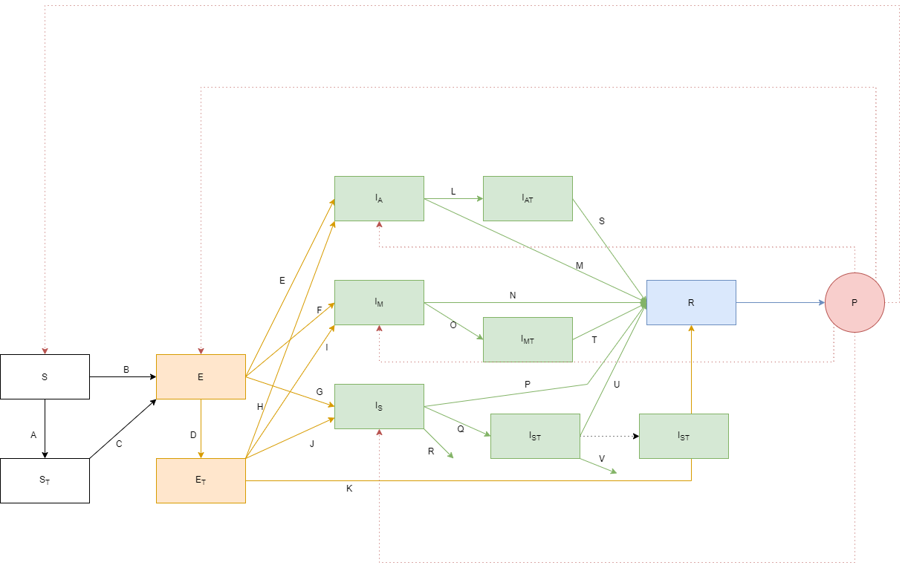

```{r setup, include=FALSE}
knitr::opts_chunk$set(echo = TRUE)
```


```{r, echo=FALSE, out.width = "70%"}

```

### Compartments  

$S$ = susceptibles  
$S_T$ = susceptible individuals that received plasma (with effective titer)  
$E$ = exposed  
$E_T$ = exposed individuals that received plasma (with effective titer)  
$I_A$ = infectious asymptomatic individuals  
$I_{AT}$ = infectious asymptomatic individuals that received plasma (with effective titer)  
$I_M$ = infectious individuals with mild symptoms  
$I_{MT}$ = infectious individuals with mild symptoms that received plasma (with effective titer)  
$I_S$ = infectious individuals with severe symptoms  
$I_{ST}$ = infectious individuals with severe symptoms that received plasma (with effective titer)  
$R$ = recovered individuals  
$P$ = plasma 

### Transition probabilities

$A = p_{St}$   
$B = foi_{prob} = 1 - exp( - \beta* WI / N * dw * delta.t)$, where $\beta$ = rate of infectiousness, $W$ = mixing matrix, $I$ = number of infectious individuals, $N$ = population size, $dw$ = stochastistic constant, and $delta.t$ = time interval     
$C = foi_{prob_{St}} = 1 - exp( - ef_{est} * \beta* WI / N * dw * delta.t)$, where $ef_{est}$ = scaling factor which reduces rate of infectiousness  
$D = p_{Et}$    
$E = exposed_{prob} * p_{asym}$, where $exposed_{prob} <- 1 - exp( - \sigma * delta.t)$, with $\sigma$ = latent period, $p_{asym}$ = proportion of infectious individuals that are asymptomatic     
$F = exposed_{prob} * p_{mild}$, where $p_{mild}$ = proportion of infectious individuals that have mild symptoms  
$G = exposed_{prob} * p_{severe}$, where $p_{severe}$ = proportion of infectious individuals that have severe symptoms  
$H = inf_{prob_{et}} * p_{asym}$, where $inf_{prob_{et}}=1 - exp( - \sigma * delta.t * prop_{eti})$, where $prop_{eti}$ = proportion of exposed individuals treated with effective plasma that move on to infected compartment  
$I = inf_{prob_{et}} * p_{mild}$  
$J = inf_{prob_{et}} * p_{severe}$  
$K = inf_{prob_t} = 1 - exp(- gamma_t * delta.t * (1-prop_{eti}))$, where $gamma_t$ is recovery rate for individuals that received plasma     
$L = p_{Iat}$  
$M = inf_{prob} = 1 - exp( - gamma * delta.t)$ , where $gamma$ = recovery rate for individuals that did not receive plasma 
$N = inf_{prob}$  
$O = p_{IMt}$  
$P = inf_{prob}$  
$Q = p_{Ist}$  
$R = death_{prob_I}= 1 - exp( - deaths_I * delta.t)$, where $deaths_I$ = rate of death from severe COVID-19   
$S = inf_{prob_t}$  
$T = inf_{prob_t}$  
$U = inf_{prob_t}$  
$V = death_{prob_{It}} = 1 - exp( - deaths_{It} * delta.t)$, where $deaths_{It}$ = rate of death from severe COVID-19 among severely ill individuals that received plasma  
  
Please note $p_{St}$, $p_{Et}$, $p_{Iat}$, $p_{Imt}$, and $p_{Ist}$ are probabilities of receiving plasma if individuals are in the respective compartments. 